# HelloAI —— 让不同厂商的 AI 组成一支团队

**一个开源的 A2A 协作平台：让 Qoder / Trae / Codex CLI / Claude Code 等异构 AI Agent 跨终端组成团队，协同完成复杂任务。**

<p align="center">
  
  
  
  
  
</p>

> **算力上限不取决于你的服务器，而取决于你有多少台终端。**

你在日常工作中是不是也遇到过这种情况：想让 AI 帮你完成一个稍微复杂的任务，但它要么中途"跑偏"，要么在某个环节反复出错，你必须全程盯着、反复纠正？

HelloAI 的思路不一样。你把需求告诉它，它**先追问澄清**你的真实意图，然后**把任务拆成带依赖的子任务**，跨终端派给最合适的 AI 并行执行——**不合格的 AI 质检员会带着具体修改意见打回重做**，最后整合成一份完整交付。全程你只说一次需求、点一次确认。

```
你说需求  →  Planner 澄清 + 拆解  →  跨终端多 AI 并行执行  →  AI 质检员验收  →  整合交付
```

**干活的 AI 不必是同一厂商、不必在同一台机器上、也不必改一行代码。** Qoder / Trae / Codex CLI / Claude Code——任何一台终端上的任何一款 AI 助手，经 MCP 协议接入后即成为平台里的"数字员工"。



---

## 💎 为什么是 HelloAI？

### 为什么需要一支 AI 团队？

随着 AI Agent 的快速发展，一个新的问题开始出现：

```text
一个 Agent
   │
   ├── 会写代码
   ├── 会搜索
   ├── 会分析
   ├── 会执行命令
   └── 会调用工具
```

但当任务进一步复杂：

```text
开发一个完整业务功能
        │
        ├── 需求分析
        ├── 技术方案
        ├── 数据库设计
        ├── Backend
        ├── Frontend
        ├── 测试
        └── Code Review
```

让一个 Agent 独立完成所有事情并不一定是最佳方案。

HelloAI 希望把多个 Agent 组织起来：

```text
                    Complex Task
                         │
                         ▼
                      Planner
                         │
              ┌──────────┼──────────┐
              │          │          │
              ▼          ▼          ▼
          Backend     Frontend    Research
           Agent        Agent       Agent
              │          │          │
              └──────────┼──────────┘
                         ▼
                      Reviewer
                         │
                         ▼
                    Final Result
```

这意味着：

> **AI 不再只是一个"聊天机器人"，而是一支可以被组织、调度、监督和复用的数字团队。**

### 行业分工：我们补的是最缺的那一段

| 层次 | 解决什么问题 | 现状 |
|---|---|---|
| Agent ↔ 工具 | 让 Agent 会查库、调 API、读写文件 | ✅ MCP 已成事实标准 |
| Agent ↔ Agent | 让不同厂商的 Agent 互相发现、通信、委派 | ⚠️ 协议已有，但落地机制仍缺 |
| **团队 ↔ 任务** | **让一群异构 Agent 像一支团队交付同一个任务** | ✅ **HelloAI 在这里** |

> **诚实说明**：HelloAI 不是 A2A 协议规范的实现，Agent 接入走 MCP。A2A 所需的语义（能力发现 / 任务委派 / 结果回执 / 长任务与人工介入）由平台自己的角色模型 + 子任务状态机 + 统一事件流承载。**我们补的是协作机制，不是又一个协议。**

### 算力形态：从"一台服务器"到"你的每一台终端"

| | 传统单机 / 容器化多 Agent | HelloAI 分布式终端调度 |
|---|---|---|
| **算力上限** | 单台服务器的 CPU / 显存 / JVM 堆 | **聚合 N 台终端的碎片化算力**，终端越多池越大 |
| **Agent 生态** | 框架内自研 Agent / 同生态节点 | **跨终端、跨产品**：Qoder / Trae / Codex CLI / Claude Code 免改造接入 |
| **扩容方式** | 升级硬件 / 改造成集群 | **多开一台终端 + 粘贴一段 SKILL 即完成"扩容"** |
| **协作方式** | 进程内调用，强绑定框架 | MCP 协议标准化通信（打卡 / 领任务 / 执行 / 提交 / 心跳） |
| **跨产品协作** | 各产品间互不相通 | 同一主任务的子任务可由**不同终端上的不同厂商 AI** 接力完成 |

### 与主流方案的定位差异

| | CrewAI / LangGraph | Dify | **HelloAI** |
|---|---|---|---|
| **关注点** | 如何**写** Agent（框架） | LLM 应用工作流编排 | **如何管 Agent**：调度、验收、审计 |
| **算力形态** | 单机 / 容器内 | 平台节点内 | **分布式终端聚合** |
| **技术生态** | Python | Python | **Java 企业级**（Spring Boot） |
| **外部 Agent 接入** | 按框架 API 开发 | 限于平台内节点 | **MCP 协议，CLI Agent 免改造接入** |
| **质量闭环** | 自行实现 | 工作流内自行拼装 | **内置 Reviewer 双轨审核 + 多轮驳回返工 + 死信兜底** |
| **执行可追踪** | 日志为主 | 流程编排视图 | **依赖 DAG / 时间线 / 时序图 / 质量看板** |
| **部署形态** | 库 / 服务 | SaaS / 私有部署 | **Docker Compose 完全私有化** |

---

## 🎬 它怎么工作？（30 秒版）

```
你：帮我实现一个订单支付模块

HelloAI：追问澄清 → 拆解为带依赖的子任务草案 → 你确认 → 跨终端派活

        API设计 ──→ Backend ──→ 测试 ──→ Review
         (Qoder)    (Codex)   (Claude)  (平台内 LLM)

        不合格 → 带着修改意见打回重做
        合格   → 整合为完整交付 + zip 下载
```

**你只需要做两件事**：描述需求 + 确认草案。其余全部自动流转。


**想看完整的工作方式？** → [Planner 双模对话](doc/design/Planner_Capability_Awareness.md) · [Reviewer 审核流程](doc/diagrams/reviewer-full-flow.svg) · [任务生命周期](doc/diagrams/subtask-state-machine.svg)

---

<a id="quick-start"></a>

## 🚀 快速开始

**环境要求**：JDK 17 · Maven 3.8+ · Node.js 18+ · Docker + Docker Compose · 建议 4C8GB

### 方式 A：源码开发（5 分钟）

```bash
# 1. 克隆
git clone https://gitee.com/undefined_404/helloai.git && cd helloai

# 2. 启动中间件
docker compose up -d

# 3. 启动后端（Flyway 自动建表）
mvn clean package -DskipTests
java -jar helloai-start/target/helloai-start-1.0.0-SNAPSHOT.jar

# 4. 启动前端
cd helloai-ui && npm install && npm run dev
```

访问 `http://localhost:6565/swagger-ui.html` 查看 API 文档。

### 方式 B：Docker 一键部署

适合服务器直接跑起来，详见 [`docker-compose.server.yml`](docker-compose.server.yml)。核心步骤：

```bash
# 1. 准备产物
mvn clean package -DskipTests
cd helloai-ui && npm run build

# 2. 生成 AES 密钥并写入 .env
openssl rand -base64 32  # 将输出写入 HELLOAI_CREDENTIAL_AES_KEY_BASE64

# 3. 启动
docker compose -f docker-compose.server.yml up -d
```

> ⚠️ **AES 密钥务必妥善保管**：`credential_vault` 表中的 API Key 均用此密钥加密，密钥变更将导致所有已配置 Provider 解密失败。

**配置 API Key**：推荐启动后在管理端「系统设置 → 模型配置」页面填写，加密落库、实时生效、无需重启。

---

## 📸 界面预览

| 需求澄清 | 依赖 DAG | 质量看板 |
|---|---|---|
|  |  |  |

更多截图见 [`doc/images/`](doc/images/)。

---

## 📚 文档导航

| 你想做什么 | 去哪里 |
|---|---|
| **了解架构设计** | [文档地图](doc/README.md) → 项目基线 / 目标架构 / 设计文档 |
| **接入外部 AI Agent** | [EXECUTOR 接入指南](.executor-onboarding.md) — SKILL 生成、MCP 连接、打卡流程 |
| **查外部 Agent 值守手册** | [值守手册](doc/manual/executor-duty/manual-assembled.md) — 值班 / 领任务 / 提交 / 心跳 / 排障 |
| **查看任务状态机** | [子任务状态机（11 态）](doc/diagrams/subtask-state-machine.svg) — 流转与异常路径 |
| **了解适用边界** | [诚实的能力边界](doc/HelloAI_项目介绍.md)（§2.6） |
| **参与开发** | [代码规范](doc/HelloAI_CODE_STYLE.md) · [项目基线](doc/HelloAI%20项目基线文档.md) |
| **查看迭代记录** | [doc/log/](doc/log/) — 按月归档的功能线汇总 |
| **English** | [README.en.md](README.en.md) |

---

## 🗺️ 路线图

**已交付 ✅**

- [x] 双模 Planner（CHAT / CLARIFY + 联网搜索）与自动任务拆解
- [x] 弹性调度：外部优先 + 空闲优先 + 值班优先 + LLM 保底 + 熔断降级
- [x] MCP 外部 Agent 接入（12 个工具）+ 值班租约 + 任务感知轮询
- [x] Reviewer 双轨纪律制 + 多轮驳回返工 + 双审共识 + 抽检复审
- [x] 生产级可靠性：Outbox 四态 + 三层幂等 + 死信人工兜底 + Reconcile
- [x] 全链路可视化：依赖 DAG / 时间线 / 时序图 / 事件流工作台 / 质量看板
- [x] 最终整合报告（四态防重）+ 交付物 zip 一键下载
- [x] Docker Compose 完全私有化部署

**待办 🔜**

- [ ] 领域模板市场（技术方案 / 代码审查 / 文档生成）
- [ ] 浏览器型 Agent（WEB_BROWSER）真实接入链路
- [ ] 多租户与权限隔离
- [ ] 调度核心多实例水平扩容（双锁体系已打底）
- [ ] 更多外部 Agent 适配器

> 完整路线图与历史迭代见 [doc/log/](doc/log/) 与 [项目基线](doc/HelloAI%20项目基线文档.md)。

---

## ❓ FAQ

**Q：A2A 是什么？HelloAI 和它是什么关系？**

A：MCP 让 Agent 会用工具，A2A 让不同厂商的 Agent 能互相协作。协议标准已经有了，但"谁拆活、派给谁、验收什么、失败怎么兜、事后怎么对账"这一层落地机制仍然缺——这正是 HelloAI 补的位置。严格说，HelloAI 不是 A2A 协议规范的实现（Agent 接入走 MCP），补的是协作机制。

**Q：与 CrewAI / LangGraph / Dify 有什么区别？**

A：一句话：它们解决"如何写 Agent / 编排应用"，HelloAI 解决"**如何管 Agent**"——任务拆解、弹性调度、验收审计、全链路可视化，且基于 Java 企业级技术栈。

**Q：必须部署 Java 环境吗？**

A：是。JDK 17 是项目红线，另需 Docker Compose 拉起 PostgreSQL / Redis / RabbitMQ / MinIO 基础设施，步骤见[快速开始](#quick-start)。

**Q：支持哪些大模型？**

A：DeepSeek 实测可用，Moonshot / MiniMax / DashScope 预置。启动后在管理端「系统设置 → 模型配置」填写 API Key 即可，加密存储、实时生效、无需重启。

**Q：接入外部 AI（Qoder / Trae / Codex CLI / Claude Code）要改它的代码吗？**

A：不用。管理端创建 Agent 后一键生成 SKILL 说明，粘贴给外部 AI 执行，即可自动完成注册鉴权 → MCP 连接 → 值班打卡 → 轮询值守。

**Q：数据会离开我的服务器吗？**

A：支持完全私有化部署，任务、产出物、审计记录全部落在你自己的数据库；LLM API Key 经 AES-GCM 加密存入凭证库。任务内容仅会发送给你自行配置 API Key 的大模型服务。

---

## 🤝 参与贡献

1. Fork 本仓库
2. 新建 `feat_xxx` 或 `fix_xxx` 分支
3. 改代码前必读 [`doc/HelloAI_CODE_STYLE.md`](doc/HelloAI_CODE_STYLE.md)；涉及调度 / 执行链改动先读 [`doc/design/Agent_Runtime.md`](doc/design/Agent_Runtime.md) 与 [`doc/design/Agent_Event_Stream.md`](doc/design/Agent_Event_Stream.md)
4. 提交前跑通与改动面相关的 `scripts/` 验证脚本，PR 附上脚本输出

---

## 🙏 致谢与参考借鉴

本项目在设计与实现过程中参考了以下开源项目（详细落点见归档文档）：

- **[OpenMOSS](https://github.com/undefined-404/OpenMOSS)** —— Agent 接入层 + 角色建模层 + Prompt/Skill 资产层
- **[AgentTeams](https://github.com/agentscope-ai/AgentTeams)** —— 调度内核 + 执行边界 + 状态收敛模型
- **[DeepSeek Harness](https://github.com/deepseek-ai/deepseek-harness)** —— `eng-*` 平台技能规范库与 Reviewer 双轨纪律制
- **[Vibe-Skills](https://github.com/foryourhealth111-pixel/Vibe-Skills)** —— 工作流运行时设计参考

许可兼容性以各上游 LICENSE 为准。

---

## 📄 许可证

本项目采用 [MIT 许可证](https://opensource.org/licenses/MIT) 开源，详见 [LICENSE](LICENSE)。

---

**Let AI Agents Work as a Team.**
