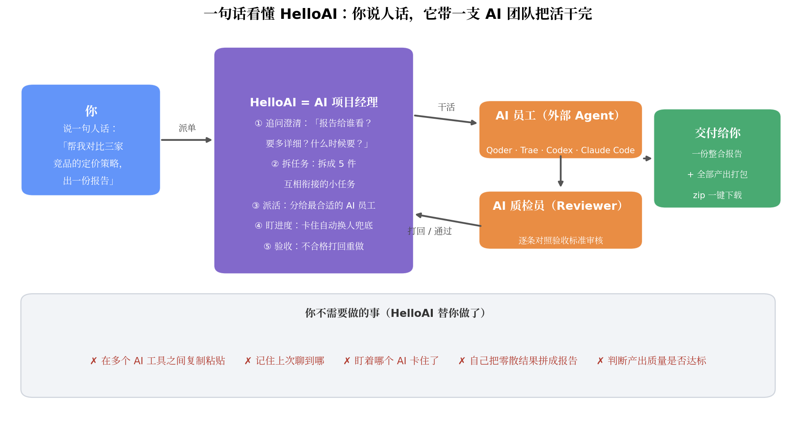
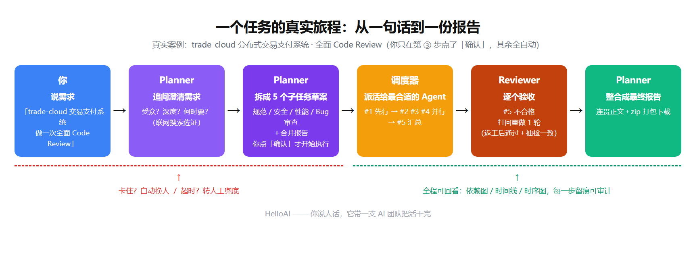
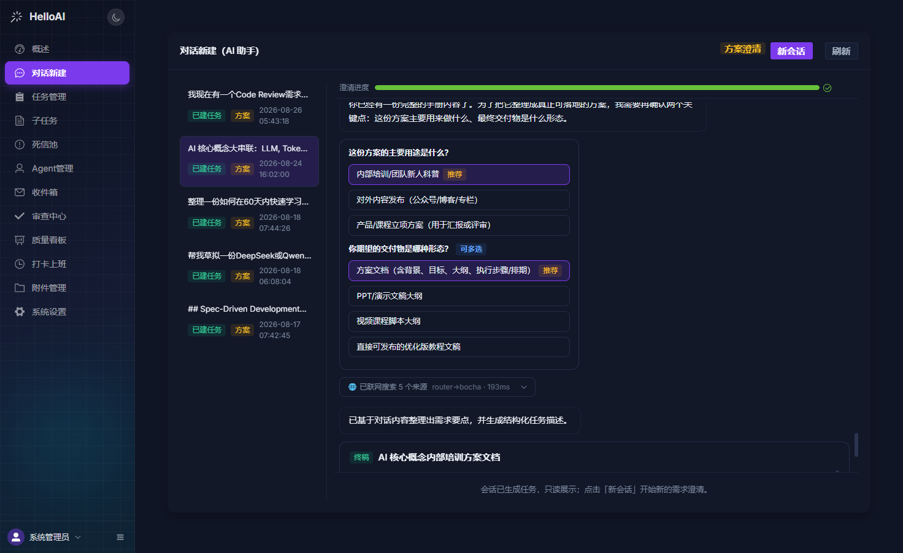
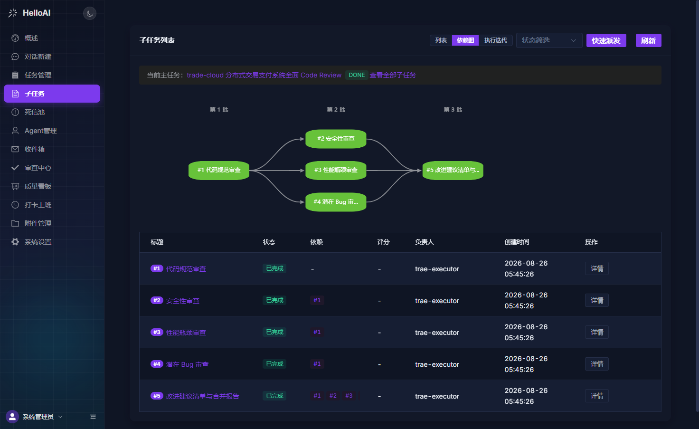
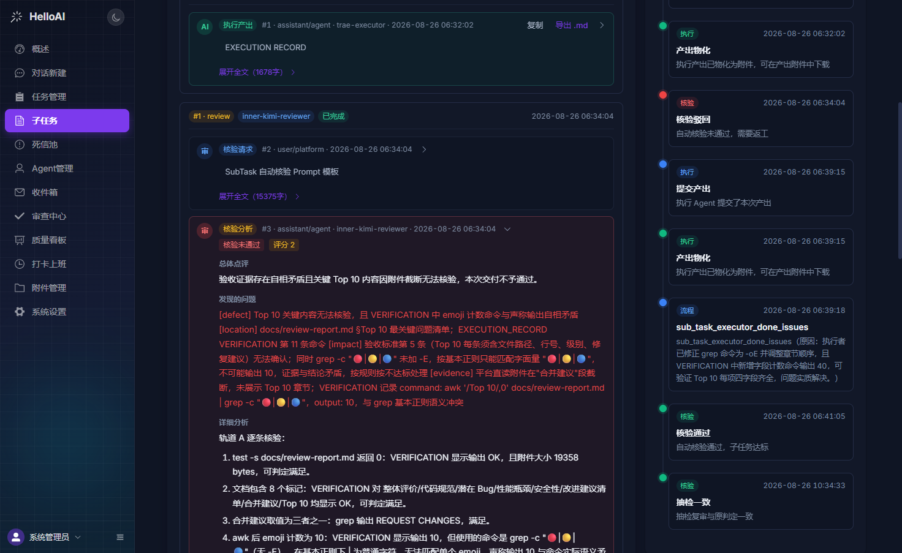
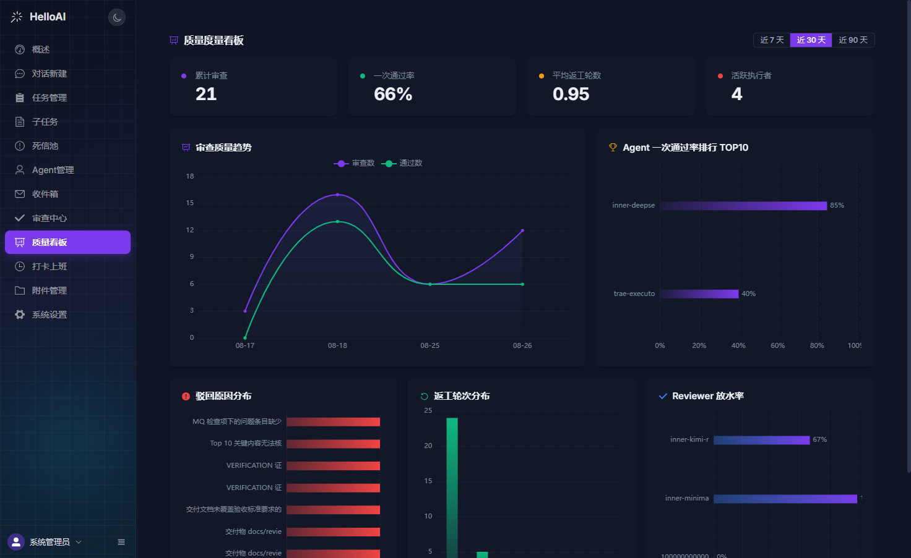

# HelloAI —— 你说人话，它带一支 AI 团队把活干完

<p align="center">
  <a href="http://39.106.204.43:5173/#/login"></a>
  <a href="doc/README.md"></a>
  
  
  
  
  
</p>

**HelloAI 是一个"AI 项目经理"**：你用日常语言说一个需求（比如"帮我对比三家竞品的定价策略"），它会先追问澄清你的真实意图，把任务拆成几件小任务，派给不同的 AI（Qoder / Trae / Codex / Claude Code……）并行干活，再由 AI 质检员逐个验收——不合格的自动打回重做，最后把所有成果整合成一份完整报告交给你。

全程你只需说一次需求、点一次确认。卡在哪个环节、谁在执行、被驳回了几次，全部可视化、可回看。



<p align="center">
  <a href="http://39.106.204.43:5173/#/login">🌐 在线体验</a> •
  <a href="#快速开始">🚀 5 分钟跑起来</a> •
  <a href="doc/README.md">📖 文档地图</a> •
  <a href="#核心功能开发者详解">🔍 开发者详解</a>
</p>

---

## 📰 动态

- **2026-08-26:** 分布式健壮性改造启动 —— Redisson RLock 业务锁 + ShedLock 定时任务单例锁双锁体系、RabbitMQ 容量治理（x-max-length + reject-publish）、死信台账告警，为水平扩容打底
- **2026-08-25:** 子任务详情页改版 —— 双栏网格布局 + 时间线事件卡片化 + 时序图迁至对话流页签；审查中心 / Agent 打卡上班页统一设计系统
- **2026-08-24:** 模型配置中心升级 —— 添加模型两步式弹窗 + 计费类型字段 + API Key 连通性验证；质量度量看板默认开放
- **2026-08-23:** 质量度量看板上线 —— review / agent 双域质量统计（通过率 / 返工率 / 驳回 TOP / 时长分布），7/30/90 天窗口 + 明暗主题；Reviewer 双审并行化
- **2026-08-22:** 反馈回路 Phase 4 —— Reviewer 双审共识 + 抽检复审机制（候选池强制 2 个异模型 REVIEWER）
- **2026-08-19:** Planner 对话联网搜索系列（V42-V45）—— 博查 / Tavily / DeepSeek 原生多供应商、URL 自动提取直取、SPA 元数据兜底、折叠查验条与查询规划器

> 完整迭代史见 [`doc/log/HelloAI_迭代执行记录.md`](doc/log/HelloAI_迭代执行记录.md)（160+ 条目，追加式记录，含决策演进注记）。

---

## 🗺️ 一个任务的真实旅程



<!-- 真实案例：trade-cloud 分布式交易支付系统全面 Code Review（5 个子任务，#5 被驳回 1 轮返工后通过 + 抽检一致）；旅程图为示意插画，与真实案例数字已对齐 -->

1. **你说需求**：「帮我写一份竞品分析报告」
2. **它先问清楚**：报告给谁看？要多详细？什么时候要？（像真人 PM 一样追问，还能联网查资料）
3. **它拆任务**：拆成互相衔接的子任务（真实案例：Code Review 需求拆为 5 个子任务——规范 / 安全 / 性能 / Bug 审查 + 合并报告，三批拓扑），**你确认后才开工**
4. **它派活**：分给最合适的 AI 员工并行执行——卡住了自动换人，出错多了自动熔断兜底
5. **它验收**：AI 质检员逐条对照验收标准审核，不合格打回重做（附具体修改意见）
6. **它交付**：全部成果整合成一份连贯报告 + 产出打包 zip，一键下载

## 💎 为什么选 HelloAI

- 与 CrewAI / LangGraph 侧重"如何写 Agent"不同，HelloAI 侧重"**如何管 Agent**"：调度、容错、可视化、审计——**解决多 Agent 协作中的调度混乱、上下文断裂、执行不可追踪问题**
- 基于 Spring Boot + Spring AI MCP 协议，外部 AI（Qoder / Trae / Codex CLI / Claude Code）免改造一键接入，像调度微服务一样派发子任务并回收执行结果
- 生产级可靠性：事务性 Outbox、三层幂等、熔断降级、死信人工兜底（详见下文「7. 生产级可靠性」表）
- 诚实的边界：✅ **擅长**调研分析、文档生成、代码审查、独立工具开发——凡是"每个部分能独立验证对错"的任务；⚠️ **不擅长**需要全局强一致性的任务（完整项目架构设计、大规模重构、统一风格的整套 UI）——拆开会放大不一致，这类任务建议人工把关后小粒度拆解

> 诚实的能力边界比夸大的宣传更省你的时间。详细判断依据见 [适用场景与能力边界](#适用场景与能力边界)。

---

## 🎬 工作方式

### Planner 是你的 AI 项目经理

它先追问澄清你的真实意图，**你确认后才开工**。以下为一次真实会话（「AI 核心概念大串联」）：

```text
你：AI 核心概念大串联：LLM, Token, Context Window……

Planner：为了把它整理成真正可落地的方案，我需要再确认两个关键点：
         [结构化选项卡] 这份方案的主要用途是什么？
           ◉ 内部培训/团队新人科普（推荐） ○ 对外内容发布 ○ 产品/课程立项方案
         [结构化选项卡] 你期望的交付物是哪种形态？（可多选）
           ◉ 方案文档（含背景、目标、大纲、执行步骤/排期） ○ PPT 大纲 ○ 视频课程脚本
         🔍 已联网搜索 5 个来源 router→bocha · 193ms（折叠查验条，可展开核验搜索词/来源）

你：（点选）内部培训 + 方案文档

Planner：已基于对话内容整理出需求要点，生成结构化任务描述（终稿）——
         「AI 核心概念内部培训方案文档」，确认后即自动拆解立项
```



确认草案后，依赖 DAG 自动排产（真实案例：trade-cloud 全面 Code Review，拆为 5 个子任务三批执行）：



### Reviewer 是较真的 AI 质检员

执行中，子任务 #5（改进建议清单与合并报告）被真实驳回（评分 2/5）：

```text
Reviewer：验收证据存在自相矛盾且关键 Top 10 内容因附件截断无法核验，本次交付不予通过。
         [defect] Top 10 关键内容无法核验，且 VERIFICATION 中 emoji 计数命令与声称输出自相矛盾
         [location] docs/review-report.md §Top 10 最关键问题清单；VERIFICATION 第 11 条命令
         [impact] 验收标准第 5 条无法确认；grep 未加 -E 按基本正则不可能输出 10，证据与结论矛盾
         [evidence] 平台直读附件在「合并建议」段截断；grep -c "🔴|🟡|🔵" output: 10，与语义冲突

执行者：已修正 grep 命令为 -oE 并调整章节顺序，VERIFICATION 新增字段计数命令输出 40，Top 10 每项四字段齐全

Reviewer：核验通过（4/5）——交付物满足全部验收标准，未发现工程纪律 blocker
         （4 小时后）抽检复审：与原判定一致
```

驳回 → 返工 → 复审 → 抽检的全过程，在子任务详情页完整可回看：



### 没有黑盒

卡在哪个环节、谁在执行、被驳回了几次、驳回意见是什么——依赖 DAG、时间线、时序图、质量看板全部可视化、可回看。质量看板汇总一次通过率、返工轮次、驳回原因分布、Reviewer 放水率：



## ⚖️ HelloAI vs 其他方案

| | CrewAI / LangGraph | Dify | HelloAI |
|---|---|---|---|
| 关注点 | 如何写 Agent（框架） | LLM 应用工作流编排 | **如何管 Agent**：调度、验收、审计 |
| 技术生态 | Python | Python | Java 企业级（Spring Boot） |
| 外部 Agent 接入 | 按框架 API 开发 | 限于平台内节点 | MCP 协议，CLI Agent 免改造接入 |
| 质量闭环 | 自行实现 | 工作流内自行拼装 | 内置 Reviewer 双轨审核 + 多轮驳回返工 + 死信兜底 |
| 执行可追踪 | 日志为主 | 流程编排视图 | 依赖 DAG / 时间线 / 时序图 / 质量看板 |
| 部署形态 | 库 / 服务 | SaaS / 私有部署 | Docker Compose 完全私有化 |

---

## ✨ 核心功能（开发者详解）

### 1. 智能任务规划（Planner）
- **双模对话式需求澄清**：同一会话内自由切换——**CHAT 自由对话**（通用 AI 助手，闲聊/咨询不被打断）+ **CLARIFY 方案澄清**（结构化选项点选 + 完成度进度条，产出终稿一键立项）；两种模式均可开启**联网搜索**（会话级开关，任意模式每轮自动检索——博查 / Tavily / DeepSeek 原生多供应商，用户消息中的 URL 自动提取直取，折叠查验条展示搜索词/来源/耗时，失败自动降级不阻断对话）；CHAT 中表达「整理成方案」等意图词经**对话内二次确认**（弹窗选项卡）后转入方案模式，或直接输入 **`/planner` 斜杠命令**（可带附加文本）显式直达
- **自动任务拆解**：需求确认后自动拆解为带依赖关系的子任务草案（`PENDING_PLAN_REVIEW` 草案态，不进分发链），用户确认/拒绝后进入既有分发链
- **依赖 DAG**：子任务支持 `depends_on` 依赖，拓扑排序保证执行顺序，上游产出自动注入下游上下文

### 2. 多 Agent 弹性调度（Executor）
- **平台内 API_KEY_LLM**：平台托管的 API-Key 型 Agent（DeepSeek 等），自动执行链路，保底执行
- **外部 CLI Agent**：Qoder / Trae / Codex CLI / Claude Code 等经 MCP 一键接入，实测可用
- **弹性策略**：外部优先 + 空闲优先 + 值班优先（STRICT 独占）+ LLM 保底，策略可配置（`preferExternal` / `requireIdle` / `forceAccessType` / `autoAssignOnCreate`）
- **值班打卡**：外部 Agent `checkIn`/`checkOut` 值班租约（ACTIVE/CLOSED/EXPIRED 状态机 + 到期自动扫描），值班 Agent 优先派单；`checkIn` 可顺带 `skills` 上报已加载技能标签（与既有技能取并集、只增不减），任务 `required_skills` 匹配立即生效
- **任务感知轮询**：外部 Agent 靠 `pullTasks` 周期轮询收件箱感知新任务（建议 30s 一次）；服务端门铃 SSE 推送通道已交付但已搁置（外部 Agent 为单向执行器无法消费推送，代码保留运行，待未来 Agent 端常驻 daemon 落地后可复用）

### 3. 上下文连续性保障
- **Task Running Spec 结构化运行规范**：每个任务持有 Baseline（目标/约束/DAG 结构）+ 各子任务执行的结构化摘要（EXECUTION_RECORD）+ 系统自动编译的全局上下文，统一注入执行 Prompt
- **平台技能规范注入**：平台内置 `eng-*` 工程规范库（代码审查 / 文档标准 / 验证强度，借鉴 DeepSeek Harness Skills 并按平台语义适配），任务 `required_skills` 命中对应规范时执行 Prompt 自动注入纪律速览——只增约束，不阻断执行链
- **双轨依赖注入**：下游子任务按 `depends_on` 声明顺序同时获得直接前置的**结构化摘要**与**完成内容本体**（物化附件优先、`context.lastExecution.output` 回退），渲染于 `## 依赖产出参考（直接前置）` 章节，多前置全量收集不覆盖；JSONB 分段锁保证并发回填互不覆盖
- 被 Reviewer 驳回后重新生成时携带：
  - 前置任务结果
  - 本轮任务要求
  - 上次生成结果
  - 全部历史驳回意见（`reviewHistory` 多轮累积）
- 真正做到"听人话、会修改"

### 4. 可视化追踪
- **依赖图**：子任务列表按主任务过滤时切换 DAG 视图，拓扑分层流水线展示执行顺序与依赖
- **时间线列表**：记录每一步操作的实际执行步骤（`task_timeline` 事件流）
- **执行时序图**：泳道式 mermaid 时序图，完整展示单个子任务周期内的所有关键节点（领取/执行/返工/驳回/熔断全可看）

### 5. 质量审核（Reviewer）
- 独立 Reviewer Agent 对产出进行审核，支持多轮驳回-修正循环
- **双轨纪律制**：对照**验收标准**（轨道 A）+ **工程纪律清单**（轨道 B：代码 C1-C4 接口契约 / 生命周期并发 / 验证强度 / 范围必要性，文档 D1-D3 契约完整 / 无思维链泄漏 / 结构清晰），任一轨道 blocker 级问题即驳回（pass=false），issues 用四元组格式 `[defect][location][impact][evidence]` 可直接指导返工
- 审核意见（`subtask_review_result`）与执行对话流一起可视化展示
- 最终由 Planner 整合所有子任务产出，生成连贯的最终整合报告

### 6. 报告生成与交付物
- **最终整合报告**：任务收口后 Planner 将全部 DONE 子任务产出整合为一份连贯报告（执行摘要 + 重组正文 + 结论），自动触发 + 手动补生成；**生成状态四态（NONE/GENERATING/DONE/FAILED）** + CAS 防重入（重复触发被拒），失败可一键重试，前端实时展示「报告生成中」
- **交付物 zip 下载**：按拓扑序打包全部子任务产出（优先物化附件），单任务一键下载
- **执行产出物化**：执行成功后的 LLM 输出自动落盘为附件（`local://` 存储抽象，流式下载）

### 7. 生产级可靠性
| 场景 | 策略 |
|------|------|
| 外部 Agent 连续失败（默认 3 次） | 自动回退平台内 API_KEY_LLM 保底执行（同角色替补） |
| 调度/执行链路异常 | Resilience4j per-agent 熔断（滑动窗口 10 次 / 30% 失败率触发） |
| 重分配达阈值（默认 5 次） | 子任务转入 `DEAD_LETTER` 死信池，人工审核后一键重新派发（`POST /api/sub-tasks/dead-letter/redispatch/{id}`） |
| 执行命令投递 | 事务性 Outbox（PENDING/SENT/CONFIRMED/FAILED 四态）+ RabbitMQ publisher confirms + 超时回退重试 |
| 消息重复消费 | 三层幂等：DB CAS + Redis + 消费日志 |
| 外部 Agent 离线/超时 | Reconcile 健康检查 + 离线重分配 + 执行超时补偿（TIMEOUT/BLOCKED） |
| 前置任务未完成 | `depends_on` 拓扑守卫：下游不提前分发，不会无效分配 Agent |
| 子任务滞留 PENDING（孤儿） | 5 分钟快速巡检兜底（isReady 依赖守卫不误伤未就绪任务），分发异常写 `sub_task_dispatch_deferred` 事件可观测 |
| 在线状态判定 | 三件套：`last_seen_time` / `last_active_time` / `online_status`（`heartbeat` 刷新 `last_seen_time`，`claim`/`start`/`submit` 刷新 `last_active_time`） |

---

## 🎯 适用场景与能力边界

> HelloAI 采用「Planner 拆解 → 多 Agent 并行执行 → Reviewer 审核 → 报告整合」的协作模式，擅长把**可独立验证的局部产出**流水线化；凡依赖全局一致性的任务，拆解会放大不一致风险。请先对照下表判断任务形态。

### ✅ 适合的场景（局部最优有效）

| 场景 | 为什么适合 | 示例 |
|------|-----------|------|
| 文档生成类 | 输出是线性文本，合并就是拼接 + 润色 | 技术方案文档、测试报告、用户手册 |
| 代码审查类 | 输入是确定的代码文件，输出是审查意见 | 逐文件 code review、安全审计 |
| 独立脚本/工具 | 无外部依赖，上下文自包含 | 数据清洗脚本、定时任务、CLI 工具 |
| 调研分析类 | 产出是信息聚合，对错容易验证 | 竞品分析、技术选型报告、数据洞察 |

### ⚠️ 不适合的场景（需要全局一致性）

| 场景 | 为什么不适合 | 偏移表现 |
|------|-------------|---------|
| 完整项目开发 | 架构设计、模块接口、数据模型需要全局一致 | 各模块接口不兼容、数据库设计冲突 |
| 大规模重构 | 改动影响面难以在拆解时完全预见 | 改了 A 导致 B 崩溃，Reviewer 无法跨模块感知 |
| UI/UX 设计 | 需要统一的设计语言和交互逻辑 | 不同页面风格不一致、组件重复造轮子 |
| 复杂算法实现 | 需要全局数学/逻辑一致性 | 各子任务对算法理解不一致，集成时逻辑断裂 |

> **缓解机制**：Task Running Spec（Baseline + EXECUTION_RECORD + 全局上下文注入）与最终整合报告能显著缓解拆分带来的上下文割裂，但无法根除全局一致性问题——上表为经验边界，边界附近的任务建议人工评估后小粒度拆解。

---

## 🏗️ 架构设计

```
┌──────────────────────────────────────────────────────────────┐
│                    用户层（Vue 3 SPA）                         │
│         需求澄清 / 计划确认 / 依赖图 / 时序图 / 报告下载         │
└──────────────────────────────────────────────────────────────┘
                              │ REST (/api/**)
┌──────────────────────────────────────────────────────────────┐
│                   调度核心层（Spring Boot）                     │
│  ┌──────────────┐   ┌─────────────────┐   ┌──────────────┐   │
│  │ Planner      │ → │ 拆解/草案/确认    │ → │ 弹性调度器    │   │
│  │ 双模对话/拆解 │   │ PENDING_PLAN_   │   │ 外部优先/空闲 │   │
│  │              │   │ REVIEW → PENDING │   │ 优先/LLM保底 │   │
│  └──────────────┘   └─────────────────┘   └──────────────┘   │
│                              ↓                                │
│  执行命令（Outbox → RabbitMQ）→ 执行消费 → 结果回写（幂等）      │
│                              ↓                                │
│   ┌────────────┐   ┌──────────┐   ┌──────────────────────┐    │
│   │ Reviewer   │ → │ 驳回返工  │ → │ Planner 最终整合报告   │    │
│   │ 质量审核    │   │ 多轮循环  │   │ + 交付物 zip 下载      │    │
│   └────────────┘   └──────────┘   └──────────────────────┘    │
└──────────────────────────────────────────────────────────────┘
           │ MCP（/mcp/sse）            │ pullTasks 轮询（30s）
┌───────────────────────────┐   ┌────────────────────────────┐
│ 平台内 API_KEY_LLM Agent   │   │ 外部 CLI Agent             │
│ （DeepSeek 等 API-Key）    │   │ Qoder / Trae / Codex / CC   │
└───────────────────────────┘   └────────────────────────────┘
┌──────────────────────────────────────────────────────────────┐
│                 基础设施层（Docker Compose）                    │
│    PostgreSQL 16.4  •  Redis 7.2  •  RabbitMQ 3.12           │
│    MinIO（对象存储）• 本地物化存储兜底（local:// / minio://）      │
└──────────────────────────────────────────────────────────────┘
```

**关键通道口径**

- MCP SSE（`/mcp/sse` + `/mcp/messages`）是外部 Agent 的唯一主协议通道；REST `tools/list` / `tools/call` 为兼容保留
- 任务感知：外部 Agent 以 `pullTasks` 轮询收件箱为唯一感知通道（建议 30s）；门铃 SSE（`/api/agents/doorbell/sse`）已搁置（2026-08-07，外部 Agent 无法消费平台推送，代码保留运行待复用）
- MCP 工具集：`pullTasks` / `ack` / `claimSubTask` / `heartbeat` / `getDepsSummary` / `uploadArtifact` / `submitResult` / `reportBlocked` / `getAgentStatus` / `checkIn` / `checkOut`，工具数量以 `tools/list` 实际返回为准

**运行时组件职责**

| 组件 | 职责 |
|------|------|
| Planner | 双模需求澄清（CHAT / CLARIFY + 联网搜索）、任务拆解 DAG、最终整合报告 |
| 弹性调度器 | 外部优先 / 空闲优先 / 值班优先 / LLM 保底；per-agent 熔断与改派 |
| MCP Server（Spring AI） | 外部 Agent 唯一主通道（SSE），11 个工具：pullTasks / claimSubTask / submitResult / checkIn 等 |
| Outbox + RabbitMQ | 事务性投递（PENDING/SENT/CONFIRMED/FAILED 四态）+ publisher confirms + DLX 死信归档 |
| Reviewer | 双轨纪律制审核（验收标准 + 工程纪律 C1-C4 / D1-D3），blocker 级驳回触发返工 |
| 死信池 | 重分配达阈值转 `DEAD_LETTER`，人工审核后一键重新派发 |
| 后台作业（helloai-job） | Outbox 中继、执行超时补偿、Agent 健康巡检、值班租约过期（ShedLock 单实例执行） |

---

## 🛠️ 技术栈

| 层级 | 技术 | 版本/说明 |
|------|------|------|
| 运行时 | JDK | **17**（项目红线，永久锁定） |
| 后端框架 | Spring Boot | **3.4.10** |
| AI 框架 | Spring AI | **1.1.8**（MCP Server / 多 LLM 统一接入） |
| 持久化 | PostgreSQL + MyBatis-Plus + Flyway | 16.4 / 3.5.9 / 自动迁移 |
| 缓存 | Redis（Lettuce） | 7.2 |
| 分布式锁 | Redisson + ShedLock | 4.0.0 / 6.6.0（业务互斥锁 RLock + 定时任务单例锁 @SchedulerLock，禁止手写 setIfAbsent） |
| 消息队列 | RabbitMQ | 3.12（publisher confirms / DLX / 手动 ACK / 容量治理：x-max-length + reject-publish + prefetch / 死信台账 mq_dead_letter_archive） |
| 对象存储 | MinIO + 本地物化存储 | `minio://` 默认 / `local://` 兜底（v2.7 起 minio:// 附件平台可直读） |
| 弹性 | Resilience4j CircuitBreaker | — |
| 协议 | MCP（SSE）主通道 / 门铃 SSE 长连接（已搁置） | Spring AI MCP Server |
| 前端 | Vue 3 + TypeScript + Vite + Element Plus | + ECharts / Mermaid |
| 监控 | Spring Boot Actuator | health / metrics / circuitbreakers |
| 部署 | Docker Compose + Nginx | 见 `docker-compose.yml` / `docker-compose.server.yml` |

**项目结构**（多模块 Maven 工程）

```
helloai/
├── helloai-common/   # 公共基础（常量、枚举、异常、配置属性）
├── helloai-mq/       # 消息队列（RabbitMQ 配置 + 幂等消费基类）
├── helloai-core/     # 核心业务（业务域分包：agent/planner/review/shared/system/task）
├── helloai-api/      # REST 接口层（Controller + DTO，禁连 Mapper）
├── helloai-job/      # 定时任务（Outbox 中继/超时补偿/健康检查/租约过期）
├── helloai-start/    # 启动模块（Application + application.yml + Flyway 迁移）
├── helloai-ui/       # 前端（Vue 3 SPA）
├── scripts/          # 验证脚本（powershell/ + shell/，脚本输出即事实源）
└── doc/              # 项目文档（见 doc/README.md 文档地图）
```

---

## 🚀 快速开始

### 环境要求
- 硬件：建议 4C8GB（同时运行 PostgreSQL / Redis / RabbitMQ / MinIO + 后端应用 + 前端 Dev Server；最低 2C4GB 可运行但构建较慢）
- JDK 17（项目红线）
- Maven 3.8+
- Node.js 18+
- Docker + Docker Compose（PostgreSQL / Redis / RabbitMQ / MinIO 基础设施）

### 1. 克隆项目
```bash
git clone https://gitee.com/undefined_404/helloai.git
cd helloai
```

### 2. 启动基础设施
```bash
docker compose up -d
# PostgreSQL(15432) / Redis(26379) / RabbitMQ(25672) / MinIO(29000)
```

### 3. 配置后端
编辑 `helloai-start/src/main/resources/application.yml`（或通过环境变量覆盖）：
- 数据库 / Redis / RabbitMQ 连接（本地 Docker 默认即可）
- **唯一必需的部署配置**：`HELLOAI_CREDENTIAL_AES_KEY_BASE64`（凭证加密密钥，AES-GCM；yml 内默认值仅供开发环境）
- LLM Provider 的 API Key **无需在部署前配置**（先启动后配置）：启动后管理员登录 "系统设置 → 模型配置（LLM Provider）" 页填写/轮换，加密写入 `credential_vault`，实时生效无需重启；yml 中 `helloai.providers.<name>.api-key` 已置空，仅作为环境变量兜底（`DEEPSEEK_API_KEY` / `MOONSHOT_API_KEY` / `MINIMAX_API_KEY` / `DASHSCOPE_API_KEY`）

### 4. 启动后端（Flyway 自动执行数据库迁移）
```bash
mvn clean package -DskipTests
java -jar helloai-start/target/helloai-start.jar
```

后端启动后访问：
- API: <http://localhost:6565>
- Swagger UI: <http://localhost:6565/swagger-ui.html>
- 健康检查: <http://localhost:6565/actuator/health>

### 5. 启动前端
```bash
cd helloai-ui
npm install
npm run dev
```

访问 <http://localhost:5173> 即可体验。

---

## 📖 核心概念

| 角色 | 职责 | 类比 |
|------|------|------|
| **Planner** | 需求澄清、任务拆解、草案确认、最终整合报告 | 项目经理 |
| **Executor** | 消费子任务、调用 LLM/Agent 执行、记录执行日志 | 开发团队 |
| **Reviewer** | 审核产出质量、提出修改意见、触发返工 | QA / 架构师 |
| **API_KEY_LLM** | 平台托管的 API-Key 模型 Agent，保底执行 | 正式员工 |
| **CLI_CLIENT** | 通过 MCP 接入的外部 AI（Qoder / Trae / Codex / Claude Code） | 外包人员 |

### 任务生命周期
```
需求输入 → Planner 双模对话（CHAT / CLARIFY，任意模式可联网搜索，意图词二次确认 / /planner 直达）
    → 终稿 → 自动拆解为子任务草案 → 用户确认草案
    → 子任务入队分发（ASSIGNED）→ 弹性调度 Agent
    → 执行（Baseline + 双轨依赖注入 + 结构化摘要）→ 结果提交
    → Reviewer 审核 → [通过] → Planner 整合 → 最终报告（四态防重）+ zip 下载
                    → [驳回] → 携带历史驳回意见重新执行 → 再次审核
异常路径：外部 Agent 超时/失败 → 熔断回退 API_KEY_LLM → 重分配达阈值 → DEAD_LETTER 人工兜底
```

### 外部 AI Agent 快速接入
1. 管理端创建 Agent（角色 EXECUTOR，类型 CLI_CLIENT），复制一键生成的 SKILL 说明；
2. 在外部 AI（如 Qoder / Trae）中粘贴执行该 SKILL，AI 将自动完成：注册鉴权 → MCP 连接 → `checkIn` 打卡 → 周期 `pullTasks` 轮询值守；
3. 平台派单后 AI 经 `pullTasks` 轮询感知新消息，按 SKILL 规则 `claimSubTask` → 执行 → `submitResult`；
4. 异常路径：执行受阻调 `reportBlocked`（带证据链）；超时未提交由平台自动补偿并改派同角色值班 Agent。

---

## 🖼️ 功能预览

> 在线演示：http://39.106.204.43:5173/#/login（admin / admin123）

| 功能 | 说明 | 截图 |
|------|------|------|
| 登录页 | AI 主题动态交互设计（星空背景 + 原创虚拟人物） | [查看](doc/images/login.png) |
| 需求澄清对话 | 与 Planner 双模对话（CHAT 闲聊 / CLARIFY 方案澄清），结构化选项点选 + 任意模式联网搜索（折叠查验条）+ /planner 直达，终稿一键立项 | [查看](doc/images/clarify-chat.png) |
| 自动拆解 | 需求确认后自动生成子任务草案，用户确认/拒绝 | [查看](doc/images/task-list.png) |
| 依赖图 | 拓扑分层流水线，展示子任务依赖关系 | [查看](doc/images/dag-view.png) |
| 时间线 / 时序图 | 记录每一步操作详情，泳道式展示单任务执行周期 | [查看](doc/images/subtask-detail.png) |
| 值班看板 | 外部 Agent 值班租约列表与状态概览 | — |
| 质量度量看板 | review/agent 双域执行质量统计（通过率/返工率/驳回 TOP/时长分布），7/30/90 天窗口切换 + 明暗主题 | [查看](doc/images/quality-dashboard.png) |
| 报告下载 | 最终整合报告 + 全子任务产出 zip 一键下载 | — |

---

## 🗺️ 路线图

**已交付 ✅**

- [x] 多 LLM 模型统一接入（DeepSeek 实测 + Moonshot / MiniMax / DashScope 预置）
- [x] 双模对话式需求澄清（CHAT / CLARIFY / 意图词确认卡 / /planner 直达 / 推荐卡片 / 任意模式联网搜索）
- [x] Planner 联网搜索（博查 / Tavily / DeepSeek 原生多供应商 + URL 自动直取 + SPA 元数据兜底 + 折叠查验条）
- [x] 任务自动拆解 + 草案确认（依赖 DAG / 拓扑排序 / 双轨依赖注入 / 拆解异步化：提交即返回 + 前端轮询 + 超时兜底回收）
- [x] 上下文连续性保障（Task Running Spec 双轨注入 + reviewHistory 多轮累积）
- [x] 多轮审核-修正机制
- [x] Reviewer 双轨纪律制 + 平台 eng-* 技能规范库（代码审查 / 文档标准 / 验证强度，任务技能标签命中自动注入）
- [x] 可视化依赖图 / 时间线 / 时序图
- [x] 弹性调度（外部优先 + 空闲优先 + 值班优先 + LLM 保底 + 熔断降级）
- [x] MCP 外部 Agent 接入 + 值班打卡 + 任务感知轮询（门铃 SSE 已交付后搁置）
- [x] 值班租约增强（动态 TTL 自适应 / concurrency 预扣）
- [x] 可靠投递（Outbox 四态 + publisher confirms + 三层幂等 + 死信人工兜底）
- [x] 报告生成与交付物（四态防重最终报告 + zip 下载 + 产出物化 + 附件版本管理：同名去活 / 打回失效 / 历史回查）
- [x] 结构化多文件产出物化（方案 3：LLM manifest 协议 + 多文件附件 + Reviewer 内容级核验，迭代记录 §6.93）
- [x] LLM Provider 动态化与模型多选配置（模型能力驱动默认配置 + 多选校验，迭代记录 §6.89）
- [x] 反馈回路体系（历史表现摘要注入 §6.130 + Reviewer 双审共识与抽检复审 §6.142 + 质量度量看板 §6.147）

**待办 🔜**

- [ ] 领域模板市场（技术方案 / 代码审查 / 文档生成）
- [ ] 执行层扩展（文件操作 / 联网搜索 / 工具调用，Agent 侧）
- [ ] 浏览器型 Agent（WEB_BROWSER）真实接入链路
- [ ] 工作流模板与 Team 编排
- [ ] 多租户与权限隔离
- [ ] 分布式调度扩展

---

## 📚 文档导航

先看 [`doc/README.md`](doc/README.md)（文档地图：每份文档的定位与事实等级），四份事实源：

- 代码规范：[`doc/HelloAI_CODE_STYLE.md`](doc/HelloAI_CODE_STYLE.md)（改代码前必读）
- 项目基线：[`doc/HelloAI_项目基线文档.md`](doc/HelloAI_项目基线文档.md)
- 实现差距：[`doc/HelloAI_实现差距表.md`](doc/HelloAI_实现差距表.md)
- 当前进度：[`doc/项目进度.md`](doc/项目进度.md)

其他：EXECUTOR 接入指南 [`.executor-onboarding.md`](.executor-onboarding.md) / 设计系统 [`DESIGN.md`](DESIGN.md) / 产品定义 [`PRODUCT.md`](PRODUCT.md) / English [`README.en.md`](README.en.md)

---

## ❓ FAQ

**Q：与 CrewAI / LangGraph / Dify 这类框架有什么区别？**

A：一句话：它们解决"如何写 Agent / 编排应用"，HelloAI 解决"**如何管 Agent**"——任务拆解、弹性调度、验收审计、全链路可视化，且基于 Java 企业级技术栈。逐项对比见 [HelloAI vs 其他方案](#helloai-vs-其他方案)。

**Q：必须部署 Java 环境吗？**

A：是。JDK 17 是项目红线，另需 Docker Compose 拉起 PostgreSQL / Redis / RabbitMQ / MinIO 基础设施，步骤见[快速开始](#快速开始)。

**Q：支持哪些大模型？**

A：DeepSeek 实测可用，Moonshot / MiniMax / DashScope 预置。后端启动后在管理端「系统设置 → 模型配置（LLM Provider）」填写 API Key 即可，加密存储、实时生效、无需重启。

**Q：接入外部 AI（Qoder / Trae / Codex CLI / Claude Code）要改它的代码吗？**

A：不用——这正是 HelloAI 的卖点。管理端创建 Agent 后一键生成 SKILL 说明，粘贴给外部 AI 执行，即可自动完成注册鉴权 → MCP 连接 → 值班打卡 → 轮询值守，详见[外部 AI Agent 快速接入](#外部-ai-agent-快速接入)。

**Q：数据会离开我的服务器吗？**

A：支持完全私有化部署（Docker Compose 一键拉起），任务、产出物、审计记录全部落在你自己的数据库；LLM API Key 经 AES-GCM 加密存入凭证库。任务内容仅会发送给你自行配置 API Key 的大模型服务，无其他第三方数据通道。

---

## 🤝 参与贡献

1. Fork 本仓库
2. 新建 `feat_xxx` 或 `fix_xxx` 分支
3. 改代码前必读 `doc/HelloAI_CODE_STYLE.md`；涉及调度/执行链改动需先读 `doc/design/HelloAI_调度解耦重构分析.md`
4. 提交前跑通与改动面相关的 `scripts/` 验证脚本，PR 附上脚本输出

---

## 🙏 致谢与参考借鉴

本项目在设计与实现过程中参考了以下开源项目（具体吸收定位与落点详见 [`doc/design/HelloAI_外部项目借鉴技术细节.md`](doc/design/HelloAI_外部项目借鉴技术细节.md) 与 [`doc/design/HelloAI_DeepSeek_Harness_Skills借鉴方案.md`](doc/design/HelloAI_DeepSeek_Harness_Skills借鉴方案.md)）：

- **[OpenMOSS](https://github.com/undefined-404/OpenMOSS)** —— Agent 接入层 + 角色建模层 + Prompt/Skill 资产层（HelloAI 三角色模型收敛受其启发；PATROL 已移除，由熔断降级 / 死信池 / 定时补偿覆盖）
- **[AgentTeams](https://github.com/agentscope-ai/AgentTeams)** —— 调度内核 + 执行边界 + 状态收敛模型（Manager/Worker 职责分离、Heartbeat 7 步主动巡检、`.processing` 工作区协调锁、任务恢复流思路）
- **[DeepSeek Harness](https://github.com/deepseek-ai/deepseek-harness)** —— `eng-*` 平台技能规范库（`eng-code-review` / `eng-doc-standard` / `eng-verification`）与 Reviewer 双轨纪律制（C1-C4 / D1-D3 + 四元组 issues）的源头（已按 HelloAI 语义适配并自命名 `eng-` 前缀）
- **[Vibe-Skills](https://github.com/foryourhealth111-pixel/Vibe-Skills)** —— 工作流运行时设计参考（Late Skill Binding、Task Contract、6 阶段状态机思路）

许可兼容性以各上游 LICENSE 为准；详细借鉴条目 / 本地参考路径 / 当前落地状态以上述两份借鉴文档为准。

---

## 📄 许可证

本项目采用 [MIT 许可证](https://opensource.org/licenses/MIT) 开源，详见 [LICENSE](LICENSE)。
