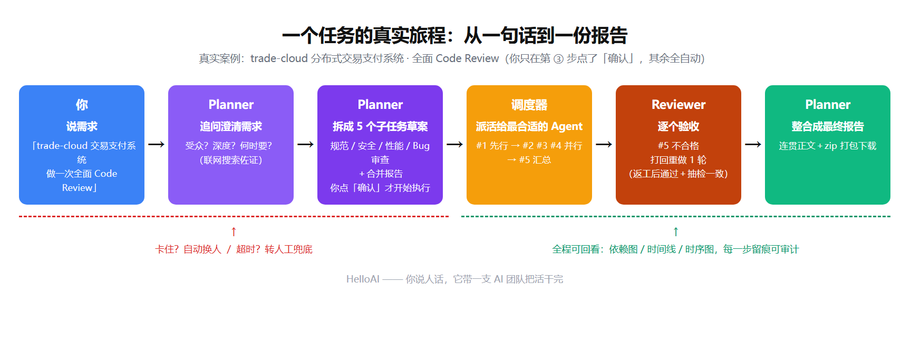
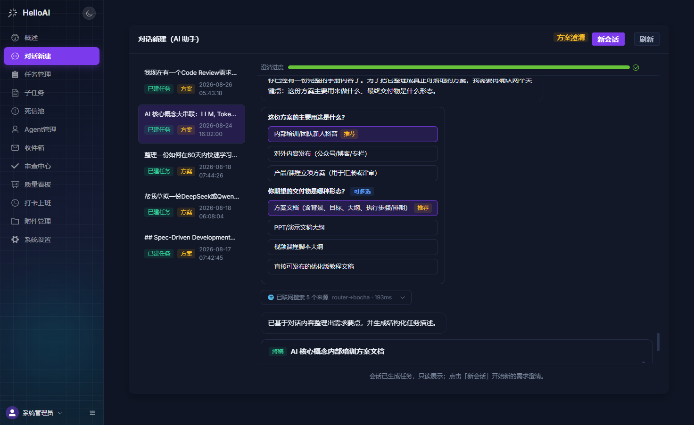
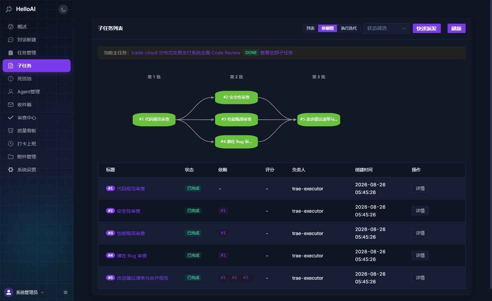
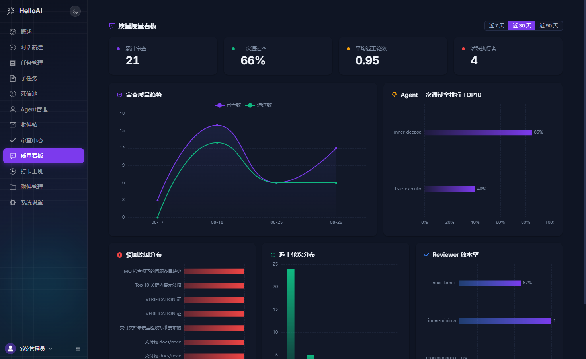

# HelloAI —— 让不同厂商的 AI 组成一支团队

**一个开源的 A2A 协作平台：让 Qoder / Trae / Codex CLI / Claude Code 等异构 AI Agent 跨终端组成团队，协同完成复杂任务。**

<p align="center">
  
  
  
  
  
</p>

> **算力上限不取决于你的服务器，而取决于你有多少台终端。**

你在日常工作中是不是也遇到过这种情况：想让 AI 帮你完成一个稍微复杂的任务，但它要么中途"跑偏"，要么在某个环节反复出错，你必须全程盯着、反复纠正？

HelloAI 的思路不一样。你把需求告诉它，它**先追问澄清**你的真实意图，然后**把任务拆成带依赖的子任务**，跨终端派给最合适的 AI 并行执行——**不合格的 AI 质检员会带着具体修改意见打回重做**，最后整合成一份完整交付。全程你只说一次需求、点一次确认。

```
你说需求  →  Planner 澄清 + 拆解  →  跨终端多 AI 并行执行  →  AI 质检员验收  →  整合交付
```

**干活的 AI 不必是同一厂商、不必在同一台机器上、也不必改一行代码。** Qoder / Trae / Codex CLI / Claude Code——任何一台终端上的任何一款 AI 助手，经 MCP 协议接入后即成为平台里的"数字员工"。



---

## 💎 为什么是 HelloAI？

### 为什么需要一支 AI 团队？

随着 AI Agent 的快速发展，一个新的问题开始出现：

```text
一个 Agent
   │
   ├── 会写代码
   ├── 会搜索
   ├── 会分析
   ├── 会执行命令
   └── 会调用工具
```

但当任务进一步复杂：

```text
开发一个完整业务功能
        │
        ├── 需求分析
        ├── 技术方案
        ├── 数据库设计
        ├── Backend
        ├── Frontend
        ├── 测试
        └── Code Review
```

让一个 Agent 独立完成所有事情并不一定是最佳方案。

HelloAI 希望把多个 Agent 组织起来：

```text
                    Complex Task
                         │
                         ▼
                      Planner
                         │
              ┌──────────┼──────────┐
              │          │          │
              ▼          ▼          ▼
          Backend     Frontend    Research
           Agent        Agent       Agent
              │          │          │
              └──────────┼──────────┘
                         ▼
                      Reviewer
                         │
                         ▼
                    Final Result
```

这意味着：

> **AI 不再只是一个"聊天机器人"，而是一支可以被组织、调度、监督和复用的数字团队。**

### 行业分工：我们补的是最缺的那一段

| 层次 | 解决什么问题 | 现状 |
|---|---|---|
| Agent ↔ 工具 | 让 Agent 会查库、调 API、读写文件 | ✅ MCP 已成事实标准 |
| Agent ↔ Agent | 让不同厂商的 Agent 互相发现、通信、委派 | ⚠️ 协议已有，但落地机制仍缺 |
| **团队 ↔ 任务** | **让一群异构 Agent 像一支团队交付同一个任务** | ✅ **HelloAI 在这里** |

> **诚实说明**：HelloAI 不是 A2A 协议规范的实现，Agent 接入走 MCP。A2A 所需的语义（能力发现 / 任务委派 / 结果回执 / 长任务与人工介入）由平台自己的角色模型 + 子任务状态机 + 统一事件流承载。**我们补的是协作机制，不是又一个协议。**

### 算力形态：从"一台服务器"到"你的每一台终端"

| | 传统单机 / 容器化多 Agent | HelloAI 分布式终端调度 |
|---|---|---|
| **算力上限** | 单台服务器的 CPU / 显存 / JVM 堆 | **聚合 N 台终端的碎片化算力**，终端越多池越大 |
| **Agent 生态** | 框架内自研 Agent / 同生态节点 | **跨终端、跨产品**：Qoder / Trae / Codex CLI / Claude Code 免改造接入 |
| **扩容方式** | 升级硬件 / 改造成集群 | **多开一台终端 + 粘贴一段 SKILL 即完成"扩容"** |
| **协作方式** | 进程内调用，强绑定框架 | MCP 协议标准化通信（打卡 / 领任务 / 执行 / 提交 / 心跳） |
| **跨产品协作** | 各产品间互不相通 | 同一主任务的子任务可由**不同终端上的不同厂商 AI** 接力完成 |

### 与主流方案的定位差异

| | CrewAI / LangGraph | Dify | **HelloAI** |
|---|---|---|---|
| **关注点** | 如何**写** Agent（框架） | LLM 应用工作流编排 | **如何管 Agent**：调度、验收、审计 |
| **算力形态** | 单机 / 容器内 | 平台节点内 | **分布式终端聚合** |
| **技术生态** | Python | Python | **Java 企业级**（Spring Boot） |
| **外部 Agent 接入** | 按框架 API 开发 | 限于平台内节点 | **MCP 协议，CLI Agent 免改造接入** |
| **质量闭环** | 自行实现 | 工作流内自行拼装 | **内置 Reviewer 双轨审核 + 多轮驳回返工 + 死信兜底** |
| **执行可追踪** | 日志为主 | 流程编排视图 | **依赖 DAG / 时间线 / 时序图 / 质量看板** |
| **部署形态** | 库 / 服务 | SaaS / 私有部署 | **Docker Compose 完全私有化** |

---

## 🎬 它怎么工作？（30 秒版）

```
你：帮我实现一个订单支付模块

HelloAI：追问澄清 → 拆解为带依赖的子任务草案 → 你确认 → 跨终端派活

        API设计 ──→ Backend ──→ 测试 ──→ Review
         (Qoder)    (Codex)   (Claude)  (平台内 LLM)

        不合格 → 带着修改意见打回重做
        合格   → 整合为完整交付 + zip 下载
```

**你只需要做两件事**：描述需求 + 确认草案。其余全部自动流转。



**想看完整的工作方式？** → [Planner 双模对话](doc/design/Planner_Capability_Awareness.md) · [Reviewer 审核流程](doc/diagrams/reviewer-full-flow.svg) · [任务生命周期](doc/diagrams/subtask-state-machine.svg)

---

## 🛠️ 技术概览

### 模块结构

| 模块 | 职责 |
|---|---|
| `helloai-api` | REST 接口层：澄清会话 / 任务 / Agent 管理 / 质量看板 / SSE 流式推送 |
| `helloai-core` | 领域核心：Planner 澄清与拆解 / 调度内核 / Agent 执行链 / Reviewer / 事件流 |
| `helloai-common` | 公共基础：统一响应 / 异常体系 / 配置模型 / 常量 |
| `helloai-start` | 启动装配：Flyway 迁移 / 配置加载 / 运行时入口 |
| `helloai-ui` | Vue 3 管理端：澄清对话 / 依赖 DAG / 时间线 / 时序图 / 质量看板 |

### 技术栈

| 层 | 选型 |
|---|---|
| 后端框架 | Spring Boot 3.4 · JDK 17 · MyBatis-Plus · Flyway · Sa-Token |
| 前端 | Vue 3 · Vite · TypeScript · Element Plus · ECharts · Pinia · Mermaid |
| 基础设施 | PostgreSQL · Redis · RabbitMQ · MinIO · Docker Compose 完全私有化 |
| AI 集成 | Spring AI · DeepSeek（实测）/ Moonshot / MiniMax / DashScope · MCP 协议接入外部 Agent |
| 关键机制 | SSE 流式对话 · 能力感知拆解 + 需求包准入 · Outbox 四态消息 · 三层幂等 · Reviewer 双轨纪律制 · 事件流工作台 · Sa-Token RBAC |

> 后端与前端独立构建部署；任务拆解 / 调度 / 验收等协作机制全部内置，不依赖任何商业平台。

---

<a id="quick-start"></a>

## 🚀 快速开始

先分清两条路径，**环境要求完全不同**：

| | 源码开发（本地跑） | 服务器部署（Docker 一键） |
|---|---|---|
| 需要 JDK 17 | ✅ 是 | ❌ 否（镜像内已带 JRE） |
| 需要 Maven 3.8+ | ✅ 是（构建用） | ❌ 否（构建在 Docker 容器内完成） |
| 需要 Node.js 18+ | ✅ 是（前端 dev） | ❌ 否（构建在 Docker 容器内完成） |
| 需要 Docker + Compose | ✅ 是（中间件） | ✅ 是 |
| 需要下载源码 | ✅ `git clone` 全量 | ✅ `git clone` 一次（`docker compose up -d --build` 在服务器本地构建镜像） |
| 建议配置 | 4C8GB | 4C8GB |

> 💡 **一句话**：JDK / Maven / Node 是**本地源码构建**才需要的；服务器一键部署**不需要装任何 Java/前端工具链**——`git clone` 后 `docker compose up -d --build` 会用仓库自带的多阶段 `Dockerfile` 在服务器本地构建好 jar 镜像与前端镜像，再一键拉起。

### 方式 A：源码开发（5 分钟）

面向本地开发、二次开发。**必须先 `git clone` 下载源码**，因为后端构建（Maven）、前端开发服务器（Node）都依赖源码树。

```bash
# 1. 克隆（启动的前提：mvn / npm 都需要源码）
git clone https://gitee.com/undefined_404/helloai.git && cd helloai

# 2. 启动中间件（PostgreSQL / Redis / RabbitMQ / MinIO）
docker compose up -d

# 3. 启动后端（Flyway 自动建表；默认 active 指向本地 local 配置）
mvn clean package -DskipTests
java -jar helloai-start/target/helloai-start-1.0.0-SNAPSHOT.jar

# 4. 启动前端
cd helloai-ui && npm install && npm run dev
```

访问 `http://localhost:6565/swagger-ui.html` 查看 API 文档。

> ⚠️ **后端默认激活 `dev` profile（云服务器联调）**：本地纯 Docker 开发请在启动参数加 `--spring.profiles.active=local`，或用 IDEA Run Configuration 指定 `local`（否则会连云上的 `application-dev.yml` 数据源）。

### 方式 B：Docker 一键部署（服务器）

适合**不装 Java/前端工具链**、直接在服务器上把服务跑起来。**只需要 `git clone` 一次**，之后 `docker compose up -d --build` 一条命令即可——后端 jar 与前端 dist 都由仓库里的多阶段 [`Dockerfile`](Dockerfile) 在服务器本地构建，**不需要任何预构建产物**。详见 [`docker-compose.server.yml`](docker-compose.server.yml) 头部注释（含纯 ASCII 约定与端口说明）。

#### 首次部署（一次性）

在**有 Docker + Docker Compose 的服务器**上：

```bash
# 1. 克隆（只需一次；构建依赖源码树）
git clone https://gitee.com/undefined_404/helloai.git /home/admin/helloai && cd /home/admin/helloai

# 2. 新建 .env（git 不跟踪，必须手建），5 个变量见下
```

部署目录结构（clone 后自动齐备，只需补 `.env`）：

```
/home/admin/helloai/
├── docker-compose.server.yml     # 服务器用；`docker compose` 会自动读同目录 .env
├── Dockerfile                    # 多阶段构建：Maven→jar→JRE 镜像 + Node→dist→nginx 镜像
├── deploy/init-rabbitmq.sh       # rabbitmq-init 容器初始化脚本（bind 挂载）
└── .env                          # 新建，见下
```

`.env` 需要 **5 个变量**（`.env` 是 Docker Compose 变量插值来源，应用容器内不直接读 `.env`；全部为运行时注入，镜像内不含任何密钥）：

```bash
# RabbitMQ 管理员（必须先手工创建，见下；不能用 guest）
RABBITMQ_ADMIN_USER=helloaiadmin
RABBITMQ_ADMIN_PASSWORD=<hex 密码，不要含冒号>
# RabbitMQ 业务账号（rabbitmq-init 创建；与 app 共享同一个密码）
HELLOAI_RABBIT_USER=helloai
HELLOAI_RABBIT_PASSWORD=<hex 密码>
# AES 密钥：必须与库中已有密文匹配（credential_vault 加密用）
HELLOAI_CREDENTIAL_AES_KEY_BASE64=<base64 密钥>
```

> ⚠️ **AES 密钥务必妥善保管**：`credential_vault` 表中的 API Key 均用此密钥加密，密钥变更将导致所有已配置 Provider 解密失败。**首次部署生成**用 `openssl rand -base64 32`；**若复用已有数据库**则必须沿用旧密钥，否则历史密文全部解不开。

> ⚠️ **RabbitMQ 前置步骤（必做，否则应用起不来）**：`rabbitmq-init` 一次性容器会用 `RABBITMQ_ADMIN_USER/PASSWORD` 调 Management API 创建 `/helloai` vhost 和业务账号。`RABBITMQ_DEFAULT_USER/PASS` 只在 broker **首次启动**时生效；**已有数据卷的 broker 会忽略它**，且 `guest` 仅允许本机回环登录（兄弟容器必然被拒）。因此 `up -d` 前必须先手工建一次管理员：
>
> ```bash
> docker compose up -d rabbitmq          # 先只起 broker
> docker exec helloai-rabbitmq rabbitmqctl add_user helloaiadmin '<hex 密码>'
> docker exec helloai-rabbitmq rabbitmqctl set_user_tags helloaiadmin administrator
> ```

#### 启动与更新

```bash
# 一键启动（先构建 app/web 镜像，再起全部服务；rabbitmq-init 成功后 app 才启动）
# 首次构建需拉取基础镜像 + 下载 Maven/Node 依赖，视网络 5~15 分钟
docker compose up -d --build

# 查看初始化日志（确认 vhost /helloai 与业务账号已创建）
docker compose logs rabbitmq-init

# 查看整体状态
docker compose ps

# 更新到最新代码：git pull 后重跑同一条命令（Docker 层缓存，增量构建）
git pull && docker compose up -d --build
```

**配置 API Key**：启动后在管理端「系统设置 → 模型配置」页面填写，加密落库、实时生效、无需重启。

> 💡 **升级兼容**：旧版（`1.0.0-SNAPSHOT` 手动传 jar/dist 的挂载方式）升级到 build 模式，只需 `git clone` + 迁移 `.env`（5 个变量同名）后执行 `docker compose up -d --build`，数据卷（PG/Redis/RabbitMQ/MinIO）不变，数据不丢。

### 方式 C：本地验证与 CI 门禁

> ⚠️ **两个高频踩坑**（2026-09-29 架构与质量审计实测）：
> 1. **默认 `JAVA_HOME` 可能指向会崩溃的 JDK**。本机实测 `ms-17.0.19` 必然触发 JVM `EXCEPTION_ACCESS_VIOLATION`，表现成「项目编译不了 / 测试跑不起来」——这其实是环境问题，不是代码问题。请改用 `ms-17.0.20.1`（或任一可用的 JDK 17）。
> 2. **`mvn test` 默认一个用例都不跑**。根 POM 为打包速度设了 `<skipTests>true</skipTests>`，**必须显式加 `-DskipTests=false`**，否则得到的是「0 用例通过」的假绿结论。

一条命令完成「构建 + 真实单测 + 用例数>0 + 架构漂移冻结 + 前端校验」：

```bash
# 全量（等价于 CI 所跑内容）
bash scripts/ci/ci-gate.sh

# 本地快速自检（单模块单测试类，且跳过前端）
bash scripts/ci/ci-gate.sh --quick --skip-ui

# 若默认 JAVA_HOME 不可用，显式指定可用 JDK
HELLOAI_JAVA_HOME="$HOME/.jdks/ms-17.0.20.1" bash scripts/ci/ci-gate.sh --quick --skip-ui
```

CI 配置：[`.workflow/helloai-ci.yml`](.workflow/helloai-ci.yml)（Gitee Go，对应本仓库远程）与 [`.github/workflows/ci.yml`](.github/workflows/ci.yml)（GitHub Actions，可移植备份）。两者都只是薄封装——**门禁语义全部在 `scripts/ci/ci-gate.sh`**，本地执行同一份脚本即可复现 CI 结论。

**架构红线守卫**：跨域反向依赖（`agent→task` / `planner→agent` / `task→agent`）计数**只降不升**，由 `scripts/ci/check-arch-freeze.sh` 把关。确需新增时，执行 `bash scripts/ci/check-arch-freeze.sh --update-baseline` 更新基线，并在评审中说明理由。

**CI 跑在哪台机器上**：`.workflow/helloai-ci.yml` 使用 `shell@agent` 在**自有主机组**执行（Gitee Go 官方计费规则下，自有主机执行**不消耗**每月免费核分）。换新主机时，先在该主机跑一次自检：

```bash
bash scripts/ci/host-prepare.sh                  # 只检测，不改系统（安全）
sudo bash scripts/ci/host-prepare.sh --install   # 安装缺失的 JDK17 / Maven / Node20
sudo bash scripts/ci/host-prepare.sh --swap 2G   # 4G 内存机器建议加 2G swap
```

> ⚠️ Gitee 的 Agent 会自带一份 JDK 8（`…/gitee_go_agent/jdk4agent`）。`scripts/ci/lib-jdk.sh` 已改为**实测 `java -version` 大版本必须为 17**，不会再把它误判为可用 JDK（旧实现只按路径黑名单判断，会在自有主机上踩这个坑）。
>
> ⚠️ 流水线需在 Gitee 侧打开该任务的「**是否克隆代码**」开关，主机上才会有仓库副本（前置：主机 SSH 公钥已加入 Gitee）。脚本在找不到仓库时会以非零码明确失败，**不会假绿**。

---

## 📸 界面预览

| 需求澄清 | 依赖 DAG | 质量看板 |
|---|---|---|
|  |  |  |

更多截图见 [`doc/images/`](doc/images/)。

---

## 📚 文档导航

| 你想做什么 | 去哪里 |
|---|---|
| **了解架构设计** | [文档地图](doc/README.md) → 项目基线 / 目标架构 / 设计文档 |
| **接入外部 AI Agent** | [EXECUTOR 接入指南](.executor-onboarding.md) — SKILL 生成、MCP 连接、打卡流程 |
| **查外部 Agent 值守手册** | [值守手册](doc/manual/executor-duty/manual-assembled.md) — 值班 / 领任务 / 提交 / 心跳 / 排障 |
| **查看任务状态机** | [子任务状态机（11 态）](doc/diagrams/subtask-state-machine.svg) — 流转与异常路径 |
| **了解适用边界** | [诚实的能力边界](doc/HelloAI_项目介绍.md)（§2.6） |
| **参与开发** | [代码规范](doc/HelloAI_CODE_STYLE.md) · [项目基线](doc/HelloAI%20项目基线文档.md) |
| **查看迭代记录** | [doc/log/](doc/log/) — 按月归档的功能线汇总 |
| **English** | [README.en.md](README.en.md) |

---

## 🗺️ 路线图

**已交付 ✅**

- [x] 双模 Planner（CHAT / CLARIFY）+ 联网搜索（总结 + 来源 + 补充检索）+ 自动任务拆解
- [x] 能力感知拆解：技能目录注入 + 三档粒度自适应（细 / 中 / 粗）+ 子任务级技能 / 约束显式化 + 草案人工修订
- [x] 需求包准入：目标 / 范围 / 排除项 / 假设 / 待确认五字段 + 不确定性分级（自证 / 上报人工裁决）
- [x] 弹性调度：外部优先 + 空闲优先 + 值班优先 + LLM 保底 + 熔断降级 + 多外部执行者同台按分排序
- [x] MCP 外部 Agent 接入（13 个工具）+ 值班租约 + 任务感知轮询 + 子任务上下文三通道供给
- [x] Reviewer 双轨纪律制 + 多轮驳回返工（缺失证据清单）+ 双审共识 + 抽检复审
- [x] V2 执行体系：统一事件流（Run / Turn / Step）+ AgentRuntime 八件套 + Replay / Audit 事件流工作台
- [x] 生产级可靠性：Outbox 四态 + 三层幂等 + 死信人工兜底 + Reconcile
- [x] 全链路可视化：依赖 DAG / 时间线 / 时序图 / 事件流工作台 / 质量看板
- [x] 最终整合报告（五态状态机 + 三级容错 L1/L2/L3 + 版本回滚）+ 交付物 zip 一键下载
- [x] RBAC 权限体系：Sa-Token 登录 + 用户 / 角色 / 菜单 / 部门 + 动作级权限码 + 数据权限
- [x] Docker Compose 完全私有化部署

**待办 🔜**

- [ ] Sandbox 真实隔离：Docker / Remote / K8s 执行环境（Provider 契约已就绪）
- [ ] Event 消费面补齐：Recovery 恢复 / Fork 分支消费
- [ ] Quality Gate 自动化门槛：Rule + Test + LLM 统一决策
- [ ] Agent Fleet 能力化选人：Health / Load / Cost 完整选路 + 外部执行成本回传
- [ ] Dynamic Workflow：动态分支与运行期编排（远期）
- [ ] 领域模板市场（技术方案 / 代码审查 / 文档生成）
- [ ] 浏览器型 Agent（WEB_BROWSER）真实接入链路
- [ ] 多租户（数据级租户隔离）
- [ ] 调度核心多实例水平扩容（双锁体系已打底）
- [ ] 更多外部 Agent 适配器

> 完整路线图与历史迭代见 [doc/log/](doc/log/) 与 [项目基线](doc/HelloAI%20项目基线文档.md)。

---

## ❓ FAQ

**Q：A2A 是什么？HelloAI 和它是什么关系？**

A：MCP 让 Agent 会用工具，A2A 让不同厂商的 Agent 能互相协作。协议标准已经有了，但"谁拆活、派给谁、验收什么、失败怎么兜、事后怎么对账"这一层落地机制仍然缺——这正是 HelloAI 补的位置。严格说，HelloAI 不是 A2A 协议规范的实现（Agent 接入走 MCP），补的是协作机制。

**Q：与 CrewAI / LangGraph / Dify 有什么区别？**

A：一句话：它们解决"如何写 Agent / 编排应用"，HelloAI 解决"**如何管 Agent**"——任务拆解、弹性调度、验收审计、全链路可视化，且基于 Java 企业级技术栈。

**Q：必须部署 Java 环境吗？**

A：是。JDK 17 是项目红线，另需 Docker Compose 拉起 PostgreSQL / Redis / RabbitMQ / MinIO 基础设施，步骤见[快速开始](#quick-start)。

**Q：支持哪些大模型？**

A：DeepSeek 实测可用，Moonshot / MiniMax / DashScope 预置。启动后在管理端「系统设置 → 模型配置」填写 API Key 即可，加密存储、实时生效、无需重启。

**Q：接入外部 AI（Qoder / Trae / Codex CLI / Claude Code）要改它的代码吗？**

A：不用。管理端创建 Agent 后一键生成 SKILL 说明，粘贴给外部 AI 执行，即可自动完成注册鉴权 → MCP 连接 → 值班打卡 → 轮询值守。

**Q：数据会离开我的服务器吗？**

A：支持完全私有化部署，任务、产出物、审计记录全部落在你自己的数据库；LLM API Key 经 AES-GCM 加密存入凭证库。任务内容仅会发送给你自行配置 API Key 的大模型服务。

---

## 🤝 参与贡献

1. Fork 本仓库
2. 新建 `feat_xxx` 或 `fix_xxx` 分支
3. 改代码前必读 [`doc/HelloAI_CODE_STYLE.md`](doc/HelloAI_CODE_STYLE.md)；涉及调度 / 执行链改动先读 [`doc/design/Agent_Runtime.md`](doc/design/Agent_Runtime.md) 与 [`doc/design/Agent_Event_Stream.md`](doc/design/Agent_Event_Stream.md)
4. 提交前跑通与改动面相关的 `scripts/` 验证脚本，PR 附上脚本输出

---

## 🙏 致谢与参考借鉴

本项目在设计与实现过程中参考了以下开源项目（详细落点见归档文档）：

- **[OpenMOSS](https://github.com/undefined-404/OpenMOSS)** —— Agent 接入层 + 角色建模层 + Prompt/Skill 资产层
- **[AgentTeams](https://github.com/agentscope-ai/AgentTeams)** —— 调度内核 + 执行边界 + 状态收敛模型
- **[DeepSeek Harness](https://github.com/deepseek-ai/deepseek-harness)** —— `eng-*` 平台技能规范库与 Reviewer 双轨纪律制
- **[Vibe-Skills](https://github.com/foryourhealth111-pixel/Vibe-Skills)** —— 工作流运行时设计参考

许可兼容性以各上游 LICENSE 为准。

---

## 📄 许可证

本项目采用 [MIT 许可证](https://opensource.org/licenses/MIT) 开源，详见 [LICENSE](LICENSE)。

---

**Let AI Agents Work as a Team.**
