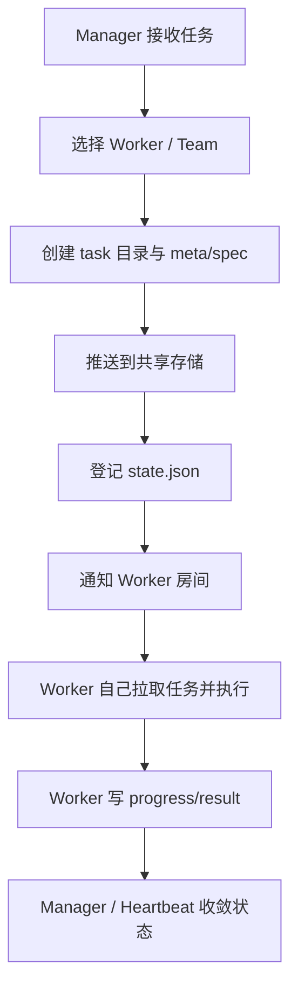
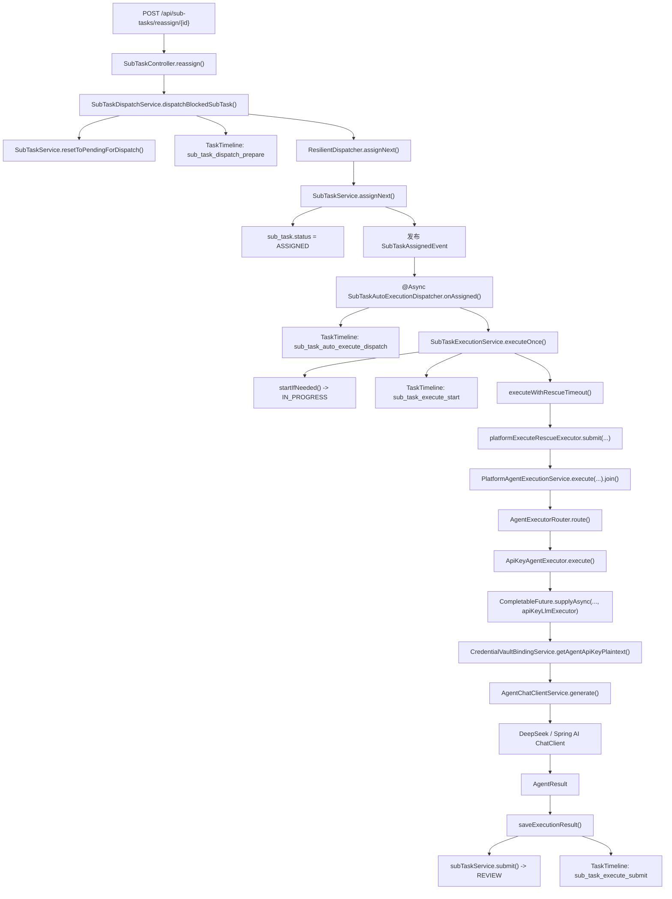
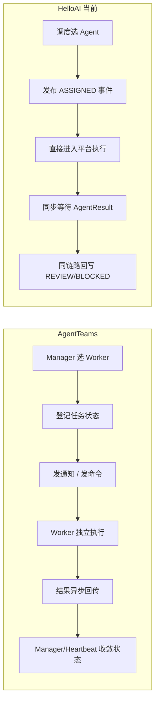
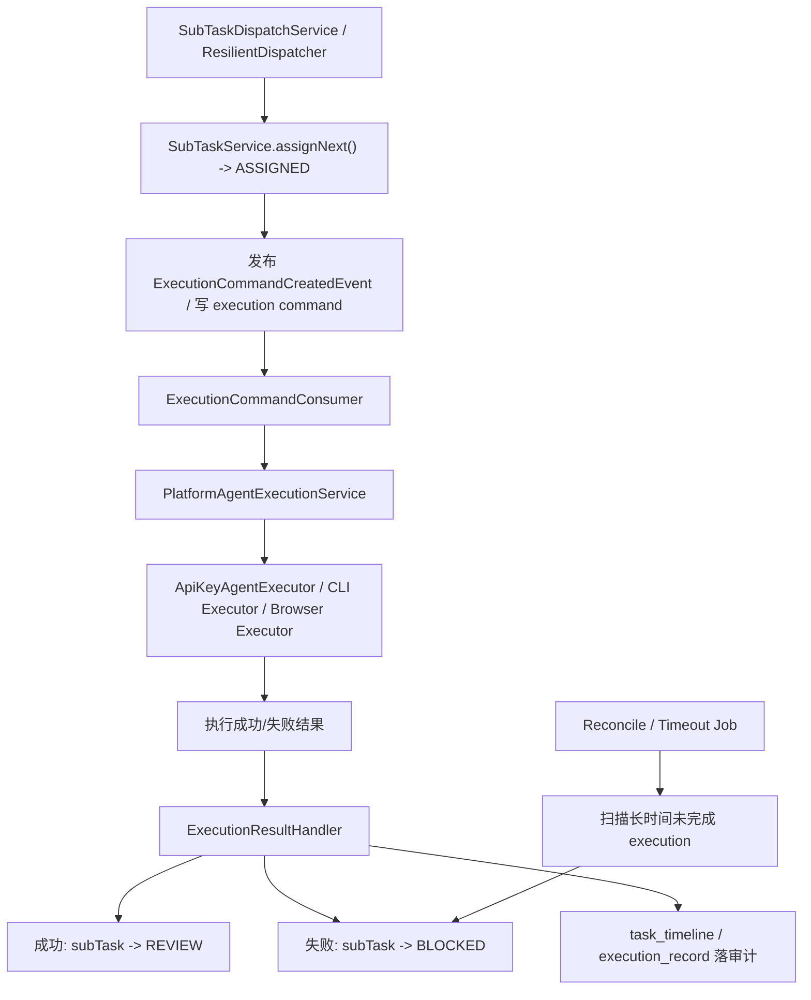

# HelloAI 调度解耦重构分析

> 编写日期：2026-07-10
> 目标：基于 `E:\workspace\AgentTeams-main` 的调度思想，对 HelloAI 当前调度/执行链进行职责拆解，并给出不推翻现有表结构的最小迁移路径。

---

## 1. 结论先行

当前 HelloAI 的主要问题不是“功能点不够”，而是**调度决策、执行触发、结果回写被揉成了一条长链**。  
这条长链跨越了 Controller、调度器、事件监听、异步线程池、平台执行器、Vault、LLM、状态回写多个层次，导致：

- `ASSIGNED -> IN_PROGRESS` 很容易发生
- 但 `IN_PROGRESS -> REVIEW/BLOCKED` 一旦中间某层不返回，就会出现静默卡死
- 外部只能看到 `sub_task_execute_start`，很难第一时间知道卡在“调度层”还是“执行层”

而 `AgentTeams-main` 的核心思路不是“调度后继续同步等待执行结果”，而是：

- Manager 只负责**选人、建任务、发命令**
- Worker 只负责**消费任务、执行、汇报结果**
- 状态靠**共享状态 + 消息回传 + 后续收敛**推进
- 整体采用**最终一致**，不要求跨链路强一致

所以 HelloAI 后续的重构方向应是：

1. 保留现有 `sub_task` / `task_timeline` / `agent_execution_record` 作为权威状态与审计
2. 把“自动执行”从当前同步-异步混合长链中拆出来
3. 让调度层只负责发出“执行命令”，执行结果再异步回流到状态机

---

## 2. AgentTeams 参考模型

参考文件：

- `manager/agent/skills/task-management/references/finite-tasks.md`
- `manager/agent/skills/task-management/references/state-management.md`
- `manager/agent/skills/task-management/references/worker-selection.md`
- `manager/agent/skills/task-management/scripts/manage-state.sh`
- `manager/agent/worker-agent/skills/task-progress/SKILL.md`

它的核心链路可以概括为：



这个模型有三个关键特征：

### 2.1 调度层只负责任务分发

Manager 不会在分发后继续同步等待 Worker 执行完成。  
它只负责：

- 选 Worker
- 生成任务描述
- 写入状态
- 发通知

### 2.2 执行层是独立消费者

真正执行任务的是 Worker。Worker 收到通知后：

- 拉取任务
- 执行
- 记录 progress
- 最终回传结果

Manager 不直接调用 Worker 的内部执行函数。

### 2.3 状态推进依赖最终一致

任务完成不是在“分发那一刻”同步确定的，而是靠：

- state.json
- task 目录中的 `meta.json` / `result.md`
- 进度日志
- heartbeat / manager 收敛逻辑

也就是说，**调度和执行天然被拆开了**。

---

## 3. HelloAI 当前类职责拆解图

### 3.1 现有主链路图



### 3.2 当前类职责表

| 类 | 当前职责 | 问题 |
|---|---|---|
| `SubTaskController` | 接口入口、触发重分配/执行 | 较薄，本身问题不大 |
| `SubTaskDispatchService` | blocked/offline 统一入调度链 | 合理，但下游进入的仍是一条重链 |
| `ResilientDispatcher` | 选人、熔断、fallback、分配 | 合理，适合作为纯调度层保留 |
| `SubTaskService` | 状态流转、事件发布、通知、心跳、部分调度约束 | 职责偏多，是核心耦合点之一 |
| `SubTaskAutoExecutionDispatcher` | 监听 `ASSIGNED` 事件后直接触发执行 | 把“事件边界”变成了“继续深入执行”的入口 |
| `SubTaskExecutionService` | start、组装 AgentTask、超时保护、结果/错误回写 | 同时承担执行编排和状态机推进，职责过重 |
| `PlatformAgentExecutionService` | 路由到执行器并执行 | 合理，但现在被上一层同步 `join` 绑定 |
| `ApiKeyAgentExecutor` | 取 vault、调 LLM、组装 AgentResult | 合理，但当前作为长链中的深层执行节点 |
| `CredentialVaultBindingService` | 解密托管凭证 | 合理 |
| `AgentChatClientService` | 构造 ChatClient 并发起调用 | 合理 |

### 3.3 当前真正的耦合点

当前问题不在每个类单独看有多糟，而在于这些类被串成了如下结构：

```text
调度决定
-> 立刻发布事件
-> 立刻异步执行
-> 立刻等待执行结果
-> 立刻推进状态到 REVIEW/BLOCKED
```

也就是说，系统实际上在做一件事：

**“调度成功” 和 “执行完成” 被绑定成了一次链式闭环。**

这会直接导致：

- 任何一个 Future / 线程池 / HTTP 调用卡住
- 都会让 `SubTaskExecutionService` 无法走到 `submit` 或 `failed`
- 外部看到的只剩 `IN_PROGRESS`

---

## 4. 现状与 AgentTeams 的核心差异

### 4.1 差异图



### 4.2 差异表

| 维度 | AgentTeams | HelloAI 当前 |
|---|---|---|
| 调度职责 | 只做分配与通知 | 分配后继续推动执行 |
| 执行主体 | Worker 独立消费任务 | 平台继续直接调用执行器 |
| 结果回写 | 异步回传后收敛 | 执行线程直接回写状态 |
| 一致性模型 | 最终一致 | 近似强一致链式推进 |
| 故障隔离 | Worker 卡住不拖死分配链 | 中间一层卡住就留下 `IN_PROGRESS` |
| 诊断方式 | 看 state/progress/result 即可分层定位 | 要跨事件、线程池、Future、LLM 多层追踪 |

### 4.3 为什么会“四不像”

HelloAI 当前同时带了三种风格，但都不纯：

1. 像同步 orchestrator  
   因为执行成功后想立即 `submit(REVIEW)`

2. 像事件驱动系统  
   因为用了 `SubTaskAssignedEvent` + `@Async`

3. 像 MQ/分布式执行系统  
   因为你的目标是“agent 接消息、消费消息、反馈结果”

结果是：

- 入口用了事件
- 中间用了线程池
- 核心仍然在等待结果
- 状态推进仍然依赖单链路完成

所以复杂度升高了，但解耦边界没有真正建立。

---

## 5. 按 AgentTeams 思想的目标结构图

这里不推翻现有表结构，仍然保留：

- `sub_task`
- `task_timeline`
- `agent_execution_record`

但重新划分职责，让“执行”成为真正独立的异步消费者。

### 5.1 目标结构图



### 5.2 目标职责边界

#### A. 调度层

只负责：

- 选哪个 Agent
- 把 `sub_task` 状态推进到 `ASSIGNED`
- 生成一条“执行命令”

**不负责等待执行结果。**

#### B. 执行消费层

只负责：

- 消费执行命令
- 调用 Vault / LLM / CLI / Browser
- 产出成功/失败结果

**不直接处理复杂调度。**

#### C. 结果处理层

只负责：

- 幂等处理执行结果
- 成功就推进到 `REVIEW`
- 失败就推进到 `BLOCKED`
- 记录 timeline / execution record

#### D. 收敛层

只负责：

- 扫描超时未回执的 execution
- 做兜底 block / retry
- 防止永久 `IN_PROGRESS`

---

## 6. 最小迁移路径：先改哪 3 个类

这一部分的目标不是“大重构”，而是**先建立新的边界，再逐步把旧链路迁走**。

### 第一步：先改 `SubTaskAutoExecutionDispatcher`

当前职责：

- 监听 `ASSIGNED`
- 直接调用 `SubTaskExecutionService.executeOnce()`

目标职责：

- 监听 `ASSIGNED`
- 不再直接执行
- 改为只创建“执行命令”

#### 建议改法

把：

```java
subTaskExecutionService.executeOnce(event.getSubTaskId());
```

改为类似：

```java
executionCommandService.enqueue(event.getSubTaskId(), event.getAgentId(), "assigned");
```

#### 改这个类的意义

这是最关键的一刀。  
它把现在的“事件边界”从“继续深入执行”改成“真正切到异步消费边界”。

### 第二步：再改 `SubTaskExecutionService`

当前职责过重：

- start
- 组装 AgentTask
- 超时保护
- 成功回写
- 失败回写

目标职责：

- 收缩为“执行结果应用器”或“执行编排工具类”
- 不再由 `ASSIGNED` 事件直接调用
- 由新的 `ExecutionCommandConsumer` 调用其内部执行能力

#### 建议拆成两个方向

1. `ExecutionCommandConsumer`
   - 负责消费命令
   - 调用平台执行器

2. `ExecutionResultHandler`
   - 负责 `saveExecutionResult / saveExecutionError / submit / block`

如果本轮不想新建太多类，也可以先把 `SubTaskExecutionService` 保留，但只让它对外暴露两个更清晰的方法：

- `executeCommand(command)`
- `applyExecutionResult(result)`

#### 改这个类的意义

它是当前“执行编排 + 状态回写”耦合的核心。  
只要不拆它，系统还是会倾向于继续走“长链直接收口”。

### 第三步：最后改 `SubTaskService`

当前它承担了太多横向职责：

- 状态机推进
- 事件发布
- AgentInbox/通知
- 心跳 active
- 某些系统路径还绕过状态机

目标不是重写，而是先明确它只保留两类职责：

1. **状态机权威入口**
   - `claim/start/submit/block/complete/...`

2. **纯状态查询/更新**
   - 供 `ExecutionResultHandler` 和 `ReconcileJob` 使用

#### 具体建议

- 不再让它隐式承担“自动执行触发器”的角色
- `ASSIGNED` 事件保留，但只作为“生成执行命令”的触发器
- 后续如果引入 MQ，这里可以只发领域事件，不直接推进执行

#### 改这个类的意义

它决定了系统未来是不是“状态中心”，还是继续做“巨型总管类”。

---

## 7. 推荐的第一阶段落地顺序

### 阶段 1：建立新边界，不推翻旧实现

目标：先把“调度”和“执行”之间插入真正的命令边界。

步骤：

1. 新增 `ExecutionCommandService`
   - 先不一定接 MQ
   - 可以先落 DB 表 / 内存队列 / 事件队列任一轻量实现

2. 修改 `SubTaskAutoExecutionDispatcher`
   - 从“直接执行”改为“写命令”

3. 新增 `ExecutionCommandConsumer`
   - 从命令中拉取
   - 调用 `PlatformAgentExecutionService`

4. 把 `SubTaskExecutionService` 里的回写逻辑收敛成结果处理器

### 阶段 2：再决定命令载体

这一步再根据工程约束决定“执行命令”到底走哪种载体：

- 先用 DB 表 + 定时 poll
- 或直接接现有 MQ

如果你后续本来就要引入 MQ 解耦，这一步自然就能衔接上。

### 阶段 3：最后做超时/重试/补偿

当命令边界建立后，超时问题会好处理很多：

- 某条命令超时未完成
- 直接由 Reconcile/Job 扫描
- 决定 block / retry / dead-letter

而不是像现在这样，在一条同步-异步混合链里想办法“拉回 catch”。

---

## 8. 对 blocked 卡点的直接启示

如果沿当前结构继续 patch，blocked 卡点后面还会反复冒出来，因为症状来自结构。

当前最准确的判断是：

- `reassign` 已经通
- `ASSIGNED` 已经通
- `IN_PROGRESS` 已经通
- **问题集中在“执行完成后如何回到状态机”**

这正是应该把“执行”独立成命令消费者的原因。

一旦按上面的目标结构拆开：

- 调度成功与否，看 `ASSIGNED`
- 命令是否发出，看 `execution command`
- 执行是否开始，看 consumer 日志/记录
- 结果是否回写，看 result handler / timeline

每层都能单独定位，不会再只剩一个模糊的 `IN_PROGRESS`。

---

## 9. 本轮建议

如果后续继续按这个方向推进，建议优先做以下三件事：

1. **先把 `SubTaskAutoExecutionDispatcher` 从“直接执行”改为“写执行命令”**
2. **再把 `SubTaskExecutionService` 拆成“执行消费”与“结果回写”两段**
3. **最后收紧 `SubTaskService`，只保留状态机与权威状态更新职责**

这是在**不推翻现有表结构**前提下，最符合 `AgentTeams-main` 思路、也最能降低 HelloAI 当前耦合度的迁移路径。

