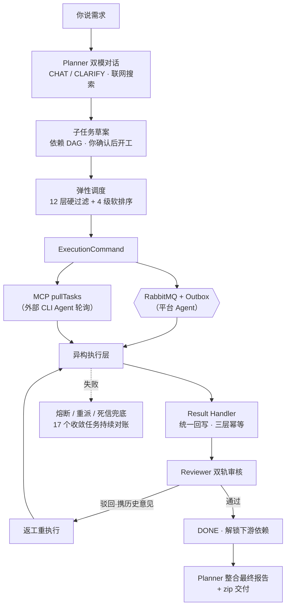
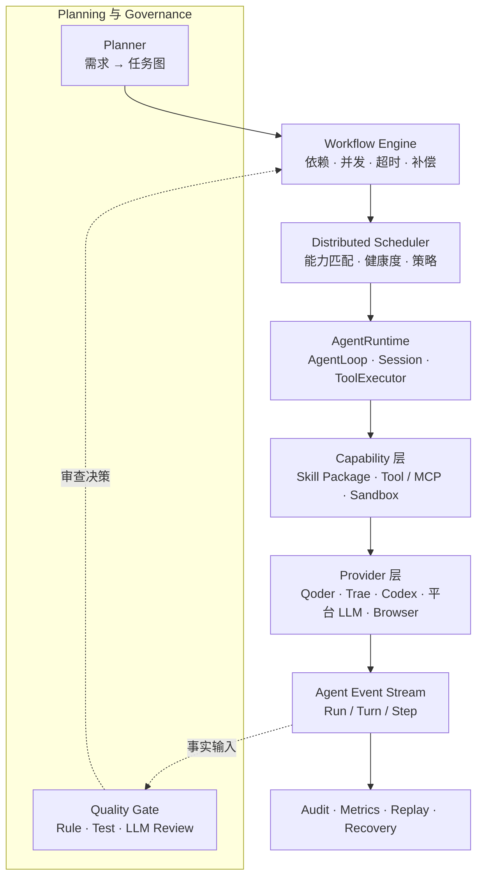
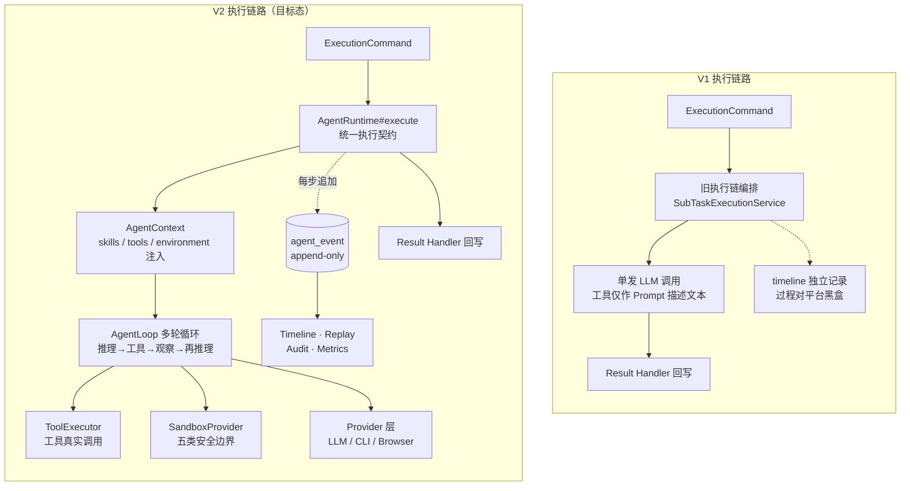
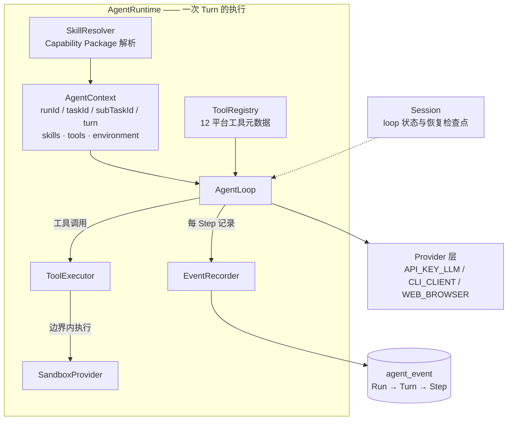
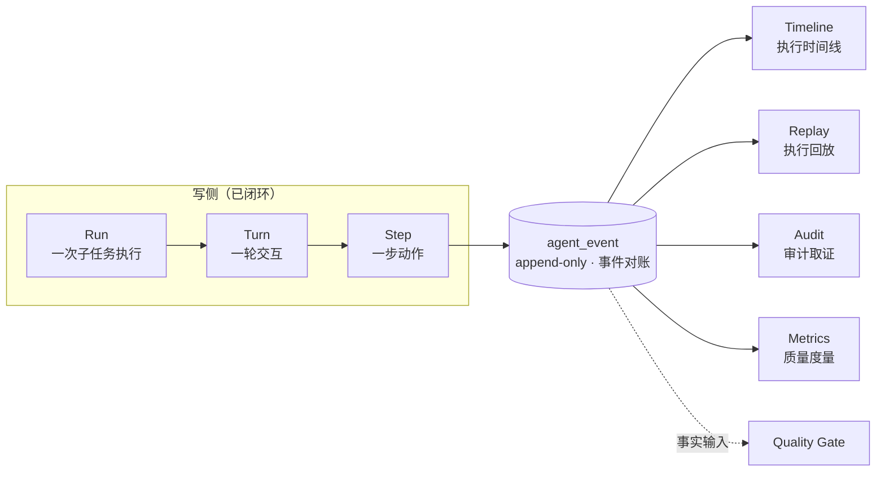
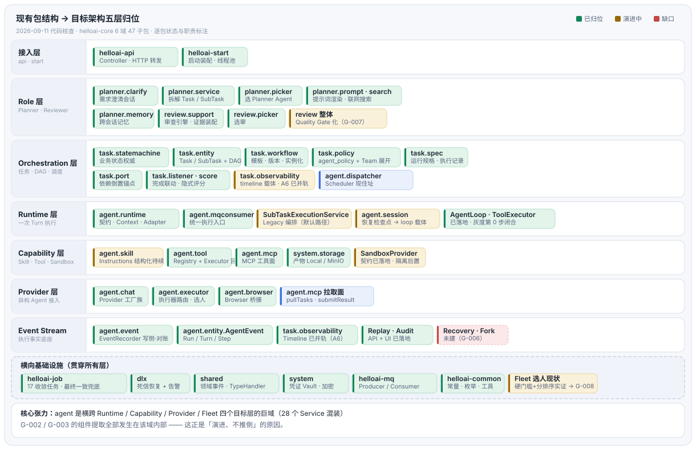

# HelloAI 项目介绍：V1 → V2 架构演进

> **文档性质：对外项目介绍（宣传口径）**
>
> 本文回答两个问题：V1 做成了一个什么产品；V2 基于 DeepSeek Harness 做怎样的改造升级。
> 技术事实以 `HelloAI 项目基线文档.md` 为准，目标边界以 `HelloAI 目标架构.md` 为准；本文不作为开发实施依据。
>
> 最后更新：2026-09-10（回填：外部执行者双轮全链闭环（Round2/Round3 实测）+ G-004 真实任务实测闭环 + G-006 增量 D + G-010 S4 / G-011 S1~S5 实测 PASS + 外部执行者手册交付）

---

# 1. HelloAI 是什么

> **HelloAI 是面向跨终端、跨厂商异构 AI Agent 的分布式任务编排与执行平台。**

它不重新实现底层 Coding Agent，而是让 Qoder、Trae、Codex、DeepSeek、浏览器 Agent、平台代理 LLM 这些**形态完全不同的执行主体**，在同一个平台上完成：

```text
Planning → Orchestration → Distributed Execution → Review → Governance
```

一句话：**用户提需求，平台拆任务、选 Agent、派执行、收结果、做审查、兜失败。**

## 核心数字（2026-09 代码事实）

| 维度 | 数字 |
|---|---|
| Maven 模块 | 6 后端模块 + helloai-ui 前端（Vue 3 SPA） |
| 子任务状态机 | 11 态，唯二终态（DONE / CANCELLED） |
| Agent 选人 | 12 层硬过滤 + 4 级软排序 |
| MCP 接入工具 | 11 个（pullTasks / claimSubTask / submitResult / checkIn …） |
| LLM Provider | 4 家动态接入（DeepSeek / Moonshot / MiniMax / DashScope） |
| 定时收敛任务 | 17 个（Outbox 中继 / 超时补偿 / 健康巡检 / 租约过期 …） |
| 数据库增量迁移 | 75 个（Flyway V1 → V75，已提交 DDL 永不修改） |
| 验证脚本 | 70 个（PowerShell，脚本输出即事实源） |
| 迭代执行记录 | 160+ 条目（追加式，含决策演进注记） |
| 代码规范 | 66 章（`HelloAI_CODE_STYLE.md`） |
| AI 协作规约 | 43 节开发生命周期规约 |

---

# 2. V1：分布式跨终端 AI Agent 调度平台

## 2.1 定位与核心差异化

> **HelloAI 把散落各处的 AI 助手与终端算力，组织成一支可调度、可验收、可审计的分布式工程团队。**

V1 的核心差异化是**分布式终端调度**：

- **任何一台终端上的任何一款 AI 助手**（Qoder / Trae / Codex CLI / Claude Code……）经 MCP 协议接入，即成为受平台调度的"数字员工"；
- **任何能跑 CLI Agent 的笔记本、台式机，都是平台的算力节点**——算力上限取决于你有多少台终端，而不是某台服务器的 CPU / 显存 / JVM 堆；
- 同一主任务的子任务，可由**不同终端上的不同厂商 AI** 接力完成。

| | 传统单机 / 容器化多 Agent | HelloAI 分布式终端调度 |
|---|---|---|
| 算力上限 | 单台服务器的 CPU / 显存 / JVM 堆 | **聚合 N 台终端碎片化算力**，终端越多池越大 |
| Agent 生态 | 框架内自研 / 同生态节点 | **跨终端跨产品**：CLI Agent 免改造接入 |
| 扩容方式 | 升级硬件 / 改造成集群 | 多开一台终端 + 粘贴一段 SKILL |
| 协作方式 | 进程内调用，强绑定框架 | MCP 协议标准化（打卡 / 领活 / 执行 / 提交 / 心跳） |

与 CrewAI / LangGraph 侧重"如何写 Agent"、Dify 侧重"应用工作流编排"不同，HelloAI 侧重"**如何管 Agent**"：调度、容错、可视化、审计。

调度之上，它像一个 **AI 项目经理**：你用日常语言说一次需求、点一次确认，它追问澄清意图、拆成带依赖的子任务、跨终端派给最合适的 AI 并行执行、AI 质检员逐个验收——不合格自动打回重做，最后整合成一份完整报告。

## 2.2 一个任务的真实旅程

以一次真实运行（「开源AI项目代码执行沙箱成熟经验调研」，2026-09 dev 环境，全链证据可在 task_timeline / agent_event 逐条对账）为例——从对话新建到终稿交付，**全程 14 分 21 秒、零人工介入**：

1. **你说需求**：「调研开源 AI 项目的代码执行沙箱成熟经验」
2. **它先问清楚**：CLARIFY 澄清对话 4 轮圈定范围（A 类智能体沙箱 / B 类沙箱基础设施）与验收口径，联网搜索佐证
3. **它拆任务**：拆为 5 个子任务的依赖 DAG——候选项目池定义 →（A 类深度调研 ∥ B 类深度调研）→ 四维经验归类 → 自研适用性整合，**你确认后才开工**
4. **它派活**：5 个子任务全部派给外部终端上的 TeleAgent（CLI_CLIENT 接入）——A / B 两条支线**并行派发（相差 0.9 秒、执行窗口重叠）**，依赖解锁亚秒级接力，全程零超时零重派
5. **它验收**：AI 质检员（inner-minimax）逐条对照验收标准审核——8 个项目案例卡四维度齐全、关键技术点可溯源至开源仓库，5 个子任务**全部一次通过**（评分 4/5，综合质量全 S 级 90 分；工程纪律审查连"轻微思维链泄漏"都被点名建议清理），收件箱逐条回执"审查通过"
6. **它交付**：31KB 结构化终稿自动生成（8 项目候选清单 / 四维经验 / 5 条可直接落地的自研建议），任务收口 DONE

哪个环节耗时多久、谁在执行、审查意见说了什么——时间线 / 执行时序图全程可视化、可回看。

> 注：本案例运行于 V2 改造后的后端（外部 Agent 契约零变化的实证）——V2 Harness 改造完整保留了 V1 的全部调度与交付能力。

## 2.3 V1 执行链路



## 2.4 V1 能力全景

### 任务体系与状态机

- `Task → SubTask` 两级模型，`depends_on` 依赖 DAG，拓扑排序保证执行顺序，上游产出自动注入下游；
- **11 态子任务状态机**（PENDING_PLAN_REVIEW → PENDING → ASSIGNED → IN_PROGRESS → REVIEW → DONE，含 PAUSED / BLOCKED / REWORK / DEAD_LETTER / CANCELLED 全部异常路径），**唯二终态 DONE / CANCELLED**——死信不自动重派，仅人工处置；
- 任务级策略（`agent_policy`：指定 Planner / Executor 白名单 / Reviewer / 难度）+ 技能要求（`required_skills`）+ SLA；
- **草案确认制**：拆解结果先进草案态，用户确认后才进分发链——人在环上。

### Planner：AI 项目经理

- **双模对话**：CHAT 自由对话（通用助手，闲聊不被打断）+ CLARIFY 方案澄清（结构化选项点选 + 完成度进度条），意图词二次确认或 `/planner` 斜杠命令直达；
- **联网搜索**：博查 / Tavily / DeepSeek 原生多供应商，用户消息 URL 自动提取直取，折叠查验条展示搜索词 / 来源 / 耗时（可核验），失败自动降级不阻断对话；
- **自动拆解**：需求确认后拆为带依赖的子任务草案，Kahn 环检测，拆解异步化（提交即返回 + 前端轮询 + 超时兜底回收）；
- **最终整合报告**：任务收口后将全部 DONE 子任务产出整合为连贯报告。

### 弹性调度：把活派给最合适的 AI

- **12 层硬过滤**（角色 / 白名单约束 / 在线心跳 / 空闲并发 / 凭证 / 熔断保护……）+ **4 级软排序**（值班 > 接入类型 > 质量画像 > score 评分）；
- **弹性策略**：外部优先 + 空闲优先 + 值班优先（STRICT 独占）+ LLM 保底，策略可配置；
- **值班打卡体系**：外部 Agent `checkIn` / `checkOut` 值班租约（ACTIVE / CLOSED / EXPIRED 状态机 + 动态 TTL 自适应 + 并发预扣），值班 Agent 优先派单，打卡可顺带 `skills` 上报；
- **任务感知**：外部 Agent 经 `pullTasks` 周期轮询收件箱（建议 30s）感知新任务。

### 上下文连续性：拆开也不散

- **Task Running Spec 结构化运行规范**：每个任务持有 Baseline（目标 / 约束 / DAG 结构）+ 各子任务执行的结构化摘要（EXECUTION_RECORD）+ 系统自动编译的全局上下文，统一注入执行 Prompt；
- **双轨依赖注入**：下游子任务按 `depends_on` 同时获得直接前置的**结构化摘要**与**完成内容本体**（物化附件优先），多前置全量收集不覆盖；
- **平台技能规范注入**：内置 `eng-*` 工程规范库，任务 `required_skills` 命中时自动注入纪律速览；
- **reviewHistory 多轮累积**：被驳回后重新生成时携带前置结果 + 任务要求 + 上次产出 + 全部历史驳回意见——真正"听人话、会修改"。

### Reviewer：较真的 AI 质检员

- **双轨纪律制**：轨道 A 对照验收标准 + 轨道 B 工程纪律清单（代码 C1-C4：接口契约 / 生命周期并发 / 验证强度 / 范围必要性；文档 D1-D3：契约完整 / 无思维链泄漏 / 结构清晰），任一轨道 blocker 级问题即驳回；
- **issues 四元组**：`[defect][location][impact][evidence]`——驳回意见直接可执行，不是一句"不通过"；
- **双审共识**：高难度任务由两个互异模型并行核验，分歧即停审转人工，候选不足自动降级单审；
- **抽检复审**：已通过记录按比例抽样复审（真实案例中 4 小时后抽检与原判定一致），分歧记为 Reviewer"放水"标记——只度量不放行。

### 可视化与交付

- **四件套可视化**：依赖 DAG 视图（拓扑分层流水线）、时间线事件流、泳道式执行时序图、质量度量看板（一次通过率 / 返工轮次 / 驳回原因分布 / Reviewer 放水率，7/30/90 天窗口）；
- **最终整合报告**：四态防重（NONE / GENERATING / DONE / FAILED）+ CAS 防重入 + 失败一键重试；
- **交付物体系**：拓扑序 zip 打包下载；LLM 产出自动物化为附件（`local://` / `minio://` 存储抽象）；结构化多文件产出物化（LLM manifest 协议）；附件版本管理（同名去活 / 打回失效 / 历史回查）。

### 异构接入：MCP 协议 + 12 个工具

| 接入类型 | 执行方式 | 典型代表 |
|---|---|---|
| `API_KEY_LLM` | 平台托管代理执行，模型工厂族统一适配 | DeepSeek / Moonshot / MiniMax / DashScope |
| `CLI_CLIENT` | 外部自驱：MCP `pullTasks` 拉取 → 本地执行 → `submitResult` 回报 | Qoder / Trae / Codex CLI / Claude Code |

- **MCP 工具集**（SSE 主通道）：`pullTasks` / `ack` / `claimSubTask` / `heartbeat` / `getDepsSummary` / `getSubTaskDetail` / `uploadArtifact` / `submitResult` / `reportBlocked` / `getAgentStatus` / `checkIn` / `checkOut`；
- **接入体验**：管理端创建 Agent 一键生成 SKILL 说明 → 粘贴给任意终端上的外部 AI → 自动完成注册鉴权 → MCP 连接 → 值班打卡 → 轮询值守，该终端即成为平台算力节点；
- **模型配置中心**：四家 Provider 的 API Key 动态配置 / 轮换，AES-GCM 加密落库、实时生效无需重启、添加模型触发连通性验证、模型能力锁定（`capability_skills` + 可选技能白名单）。

### 生产级可靠性

| 场景 | 策略 |
|---|---|
| 外部 Agent 连续失败 | 自动回退平台内 LLM 保底执行（同角色替补） |
| 调度 / 执行链路异常 | Resilience4j per-agent 熔断（滑动窗口 10 次 / 30% 失败率触发） |
| 重分配达阈值（默认 5 次） | 转 `DEAD_LETTER` 死信池，人工审核后一键重派 |
| 命令投递 | 事务性 Outbox（PENDING / SENT / CONFIRMED / FAILED 四态）+ RabbitMQ publisher confirms + 超时回退重试 |
| 消息重复消费 | 三层幂等：DB CAS + Redis + 消费日志 |
| Agent 离线 / 超时 | Lease / Heartbeat / Reconcile 健康检查 + 离线重分配 + 执行超时补偿 |
| 前置任务未完成 | `depends_on` 拓扑守卫：下游不提前分发，不无效分配 |
| 子任务滞留孤儿 | 5 分钟快速巡检兜底（依赖守卫不误伤未就绪任务） |
| 分布式并发 | Redisson 业务互斥锁 + ShedLock 定时任务单例锁（为水平扩容打底） |
| 兜底收敛 | helloai-job 17 个定时任务持续对账，最终一致 |

## 2.5 运行机制（工程视角）

四张流程图讲清楚一个子任务从诞生到终态的完整链路，**均按代码实际行为绘制**（含每一步的触发条件、异常出口与人工兜底）。矢量 SVG 可直接在下文阅读；`doc/diagrams/` 下另有无损缩放的完整 HTML 版本，浏览器打开可细看。

### 1. 子任务端到端协作流水线


Planner 结构化拆解（`planner-decompose.md` 提示词 → LLM JSON 数组 → Kahn 环检测 → 草案态 `PENDING_PLAN_REVIEW`）→ AgentSelector 选人并熔断降级 → Executor 异步执行（平台内走 Outbox → RabbitMQ；CLI Agent 跨终端走 MCP 拉取）→ Reviewer 规则门控 + LLM 双轨核验。驳回则补发执行命令返工，通过则 DONE 解锁下游依赖。

### 2. Agent 选人：12 层硬过滤 + 4 级软排序


候选池先过 12 层硬过滤（角色 / 白名单约束 / 在线心跳 / 空闲并发 / 凭证 / 熔断保护等），再按**值班 > 接入类型 > 质量画像 > score 评分**四级比较取最优；选定后经 ResilientDispatcher 双层熔断校验落库，任一环节失败即 fallback 换同角色替代者，重派达 5 次转死信池人工兜底。

### 3. 子任务全状态机（11 态）


主线 `PENDING_PLAN_REVIEW → PENDING → ASSIGNED → IN_PROGRESS → REVIEW → DONE`；异常路径覆盖 PAUSED（恢复 / 换人组合转移）、BLOCKED、REWORK、DEAD_LETTER 与 CANCELLED 级联取消。唯二终态：DONE / CANCELLED——死信不自动重派，仅人工指派或人工放弃。

### 4. Reviewer 审核全流程


三路触发容错（L1 事件 / L2 MQ / L3 孤儿扫描）→ 互斥锁 → 规则门控（fail-close：不确定即不改状态、停审等人工）→ 双审判定（`difficulty=HIGH` 且未指定 reviewer 时，双互异模型并行核验，候选不足自动降级单审）→ 核验执行（产出 + 附件正文 + 验收标准三方一致性核对）→ 通过 DONE / 驳回 REWORK。事后按 5% 比例抽检复审已通过的记录，分歧记为 Reviewer"放水"标记，只度量不放行。

## 2.6 诚实的能力边界

> 诚实的能力边界比夸大的宣传更省你的时间。

**✅ 擅长**（局部最优有效、产出可独立验证）：文档生成类、代码审查类、独立脚本 / 工具、调研分析类。

**⚠️ 不擅长**（依赖全局一致性，拆解会放大不一致）：完整项目开发、大规模重构、统一风格的 UI/UX 设计、复杂算法实现。

Task Running Spec 与最终整合报告能显著缓解拆分带来的上下文割裂，但无法根除全局一致性问题——边界附近的任务建议人工评估后小粒度拆解。

## 2.7 V1 的工程纪律

这个项目从第一天就按"可长期演进"的标准约束自己：

- **单一状态权威**：业务状态机唯一，观测数据只记事实；
- **跨域依赖方向管控**：task → agent 允许，agent → task 禁止（存量技术债登记台账，只减不增）；
- **迁移不可变**：Flyway 已提交 DDL 永不修改，只做增量；
- **每一步可验证**：70 个验证脚本覆盖主链，脚本输出即事实源，完成报告必须区分 PASS / FAIL / NOT RUN；
- **文档治理**：当前事实 / 目标架构 / 差距 / 计划 / 决策五层职责分离，历史全部归档可追溯。

## 2.8 V1 埋下的 Harness 伏笔

值得注意的是，V1 期间已经完成了对 DeepSeek Harness 的**第一轮借鉴**（Skill 规范层面）：

- `eng-*` 工程规范库（`eng-code-review` / `eng-doc-standard` / `eng-verification`），按平台语义适配——Skill 开始从隐式 Prompt 拼接向显式输入迁移；
- Reviewer 双轨纪律制（C1-C4 / D1-D3 + 四元组 issues）的源头亦来自 Harness。

但这一轮借鉴止步于"规范注入"：Skill 仍是静态 Markdown 文本，执行过程对平台仍是黑盒，执行环境没有隔离承诺——这三点正是 V2 要结构性解决的。

---

# 3. V2：基于 DeepSeek Harness 的执行体系升级

## 3.1 升级动因

V1 已经从 Harness 吸收了 Skill 规范注入（`eng-*` 库与双轨纪律制，见 §2.8），但那轮借鉴止步于 Prompt 层。三个结构性问题在规模化时暴露：

| 问题 | V1 现状 | 后果 |
|---|---|---|
| **执行过程黑盒** | 平台知道"分了什么、收了什么"，不知道 Agent "怎么干的" | 无法复盘、无法审计、无法回放 |
| **能力与执行体耦合** | Skill 是 Prompt 文本拼接，Tool 是元数据描述 | 能力不可组合、不可版本化、不可验证 |
| **执行环境不可控** | "在哪执行"有标签（Environment），"安全隔离"没有边界 | 文件 / 网络 / 凭证无隔离承诺 |

## 3.2 为什么借鉴 DeepSeek Harness

DeepSeek Harness 是一个成熟的 Agent Runtime 参考架构，恰好在这三个问题上给出了经过验证的答案。但 HelloAI 与它的定位不同——**HelloAI 是异构多 Agent 编排平台，不是单一 Coding Agent**，所以：

> **借鉴原则：吸收架构思想，不复制实现。不做 Harness Clone。**

明确吸收三个点：

| # | 吸收点 | V1 现状 | V2 目标 |
|---|---|---|---|
| 1 | **Event / Trajectory 统一化** | 执行记录分散，Timeline 独立载体 | `Run → Turn → Step` 三层事件模型，append-only，全链路统一写侧；消费侧 Timeline / Replay / Audit 逐步接入 |
| 2 | **Skill → Capability Package** | requiredSkills → Markdown 文本 | 结构化能力包：元数据 + 版本 + Instructions + RequiredTools + Schema，Markdown 兼容保留 |
| 3 | **Sandbox Provider 抽象** | 执行场所标签（Environment） | 显式沙箱契约：文件 / 网络 / 进程 / 资源 / 凭证五类边界 |

> 除 DeepSeek Harness 外，项目还参考了 OpenMOSS（三角色建模）、AgentTeams（调度内核与状态收敛模型）、Vibe-Skills（工作流运行时设计）——完整借鉴定位与落点见仓库 README 致谢部分。

## 3.3 V2 目标架构：五层 + Event Stream



五层职责边界（与 `HelloAI 目标架构.md` 一致）：

| 层 | 职责 | 回答的问题 |
|---|---|---|
| **Role 层** | Planner / Reviewer / Quality Gate | 业务处理逻辑是什么 |
| **Orchestration 层** | Workflow / Scheduler / DAG / 依赖 / 并发 | 整体怎么运行 |
| **Runtime 层** | AgentRuntime / Context / Session / AgentLoop / ToolExecutor | 一次 Turn 怎么执行 |
| **Capability 层** | Skill Package / Tool / MCP / Sandbox | 能获得什么能力、在什么环境执行 |
| **Provider 层** | 统一 Provider Contract 接入异构 Agent | 谁来执行 |

Event Stream 是贯穿底座：**Event 记录发生过什么，业务状态机记录当前是什么状态**——两者职责分离，不搞 Event Sourcing 推翻状态机。

## 3.4 AgentRuntime 目标形态

```text
AgentRuntime
├── AgentContext        ← 已落地
├── EventRecorder       ← 已落地
├── Session             ← 已落地（恢复检查点，演进为 loop 状态载体）
├── SkillResolver       ← 已落地（resolve → matched 元数据消费面）
├── ToolRegistry        ← 已落地（元数据面）
├── ToolExecutor        ← 已落地（G-003 Phase 2：执行回路真身）
├── AgentLoop           ← 已落地（G-003 Phase 3：手动工具循环）
└── SandboxProvider     ← 契约已落地（G-005 Phase 4：五边界策略，隔离后置）
```

Runtime 明确不负责：全局调度、Workflow 全局状态、Planner / Reviewer 决策、Fleet 路由——**边界即架构**。

## 3.5 改造主线

```text
Event Stream 统一 → Dual Executor 迁移 → AgentRuntime 收敛
→ Skill Capability 演进 → Sandbox 解耦 → Governance
```

每一步都有明确的差距登记（G-001 ~ G-009）与验证口径，改造是**演进式的**：旧执行链通过 LegacyExecutorAdapter 接入新契约，组件从旧链逐步提取，不推倒重来。

## 3.6 V2 期间同步交付的编排扩展

执行体系主线之外，V2 批次同时清账了编排类能力缺口。共同纪律是**复用现有调度链，克制扩展**：

| 能力 | 交付内容 | 边界 |
|---|---|---|
| **Workflow 模板** | 模板 / 版本 / 实例化状态聚合，实例一次性物化为现有 task / sub_task | 不建第二套运行时 |
| **Team 编排** | 团队定义 + 成员角色槽位，展开为任务级策略 | 不做嵌套 Team / 第二调度器 |
| **Browser Agent** | `WEB_BROWSER` 第三种接入类型：会话登记 + 推式桥接执行器 | 复用现有调度 / 选人 / 产物链 |
| **跨会话记忆** | Planner 澄清会话记忆归档与复用 | 只存摘要，不做对话全量记忆 |
| **Planner 能力感知（G-010）** | 技能目录注入 + 执行者画像 / 难度感知 + 三档粒度自适应 + 子任务级技能指派与执行约束 + 草案确认人工修订 | 不建第二套规划运行时；粒度 rule-based 矩阵，LLM 自判后置 |

## 3.7 V1 → V2 升级点对照

十一个维度的机制级对照（不是功能清单，是同一件事在两个版本里的不同做法）：

| 维度 | V1（已交付） | V2（改造中 / 规划） | 进度 |
|---|---|---|---|
| **执行契约** | 执行命令直连旧执行链 | `AgentRuntime#execute` 统一契约，全部执行路径单轨接入 | ✅ 已落地 |
| **执行过程观测** | 结果回写可见，过程黑盒（timeline 独立载体） | `Run → Turn → Step` Event Stream 全程记录，append-only | ✅ 写侧闭环 |
| **事件消费** | timeline 单点展示 | Timeline / Replay / Audit / Metrics 统一消费面 | 🔶 Timeline 并轨（A6）+ Replay / Audit 读侧（A7）+ API / UI 工作台（C1）+ 外部认领埋点（C2）+ 任务/子任务维度端点与工作台增强（D，2026-09-10）已落地；Recovery / Fork 待建（G-006） |
| **Skill** | `eng-*` Markdown 规范注入 | Capability Package（元数据 + 版本 + Instructions + Schema） | 🔶 元数据层 + 联动接线 + 拆解通路已落地（SkillPackage 8 字段 + eng-* 三包物化；requiredTools→tools 双链并集、SKILL_RESOLVED 携带版本、required_skills 进拆解 Prompt 四段贯通）；真实任务行使已实证（2026-09-10 Round2 硬门槛准入 / Round3 技能分布派单）；Instructions 结构化待续（G-004） |
| **Planner 拆解（G-010）** | 任务级技能透传（纯 Prompt 拼接，无平台能力感知） | 能力感知拆解：技能目录注入 + 执行者画像 / 难度感知 + rule-based 三档粒度 + 子任务级技能指派与执行约束（V74 新列）+ 草案确认人工修订；G-011 需求包准入（goal / scope / outOfScope / assumptions / openQuestions）与不确定性分级登记（V75 新列） | 🔶 G-010 S1~S4 已落地：S4 双场景实测 PASS（平台内链 2026-09-09 + 外部执行链 2026-09-10 双轮全链闭环）；G-011 S1~S5 已落地（实测 PASS，外部链含审查者引用 uncertainties 申报作驳回依据实证） |
| **Tool** | Prompt 里的描述文本 | ToolRegistry 元数据 + ToolExecutor 真实调用回路 | ✅ 已落地（G-003 Phase 2，dev 灰度联调已通过） |
| **执行循环** | 单发 LLM 调用（一次请求一次产出） | AgentLoop 多轮循环：推理 → 工具调用 → 观察 → 再推理 | ✅ 已落地（G-003 Phase 3，dev 灰度联调已通过） |
| **执行环境** | 场所标签（RemoteAgent / LocalProcess） | SandboxProvider：文件 / 网络 / 进程 / 资源 / 凭证五类边界 | 🔶 契约已落地（Phase 4）；Docker / K8s 隔离后置（G-005） |
| **选人策略** | 12 层硬过滤 + 4 级软排序（角色槽位优先） | Capability Match + Health + Cost + 历史成功率打分 | ⏳ G-008 |
| **质量审查** | 双轨纪律制 + 双审 + 抽检 | Quality Gate：Rule + Test + LLM Review → 结构化 Decision | ⏳ G-007 |
| **编排能力** | 固定 DAG + Workflow 模板物化 | Workflow DSL + Engine 动态分支（LLM 只在特定节点决策） | ⏳ 远期 G-009 |

## 3.8 V2 运行机制（工程视角）

与 §2.5 对应，V2 的机制图展示执行体系的结构性变化。前两张为**改造目标态**（组件标注了落地进度），第三张为**已闭环事实**。

### 1. V1 → V2 执行链路对照（同一子任务的两种走法）



结构性变化有三：**契约统一**（执行命令不再直连旧链，全路径经 Runtime——此项已落地）；**过程透明**（黑盒单发变为逐步记事的循环，Event 只追加不改写）；**能力真实**（工具从“纸上描述”变为可调用回路，环境从“标签”变为“边界”）。

### 2. AgentRuntime 内部机制（八件套协作）



落地进度：八件套已全部落地——AgentContext / EventRecorder / SkillResolver / ToolRegistry / Session 先期就位（Session 现为恢复检查点，随 Loop 落地演进为循环状态载体）；ToolExecutor（G-003 Phase 2 执行回路真身）与 AgentLoop（G-003 Phase 3 手动工具循环，循环内 TOOL_CALL 事件成对）与 SandboxProvider 契约（G-005 Phase 4 五边界 ExecutionPolicy，诚实策略不标 ISOLATED）于 2026-09-07 补齐。真身经 `RuntimeTurnExecutor` 组装，受 `runtime-enabled` 开关控制（默认 `false`=Legacy 零变化）；真实 provider 工具循环已于 2026-09-08 dev 灰度联调通过（真身点亮 / 回滚零差异 / 外部 Agent 回归通过）。

### 3. Event Stream 三层模型与消费面



三层模型是 Event Stream 的骨架（ADR-001）：Run 承载一次子任务执行，Turn 承载一轮交互，Step 承载一步具体动作（含 SKILL_RESOLVED / TOOL_RESOLVED / ENVIRONMENT_RESOLVED 等类型槽位）。**Event 只记录发生过什么，业务状态机仍是状态权威**——两者职责分离，不搞 Event Sourcing 推翻状态机。写侧与对账已闭环；消费侧已落地——Timeline 并轨（A6，经既有 `/timeline` API + UI 时间线视图对外暴露）+ Replay（`traceByRunId` / `traceByTaskId` / `traceBySubTaskId`）/ Audit（`pageAuditByTaskId`）读侧 API 已暴露（`/api/agent-events`）+ UI 事件流工作台已上线（`/event-stream`：Replay 轨迹时间线 + Audit 分页表格 + run 级汇总卡 + 任务/子任务选择器 + Agent 名称解析 + payload 结构化展开 + 事件流深链）；外部执行轨迹经认领埋点（AGENT_STARTED）加厚为「认领 → 完成 → 审查」四事件链。Recovery / Fork 消费面为 G-006 后续项。

---

# 4. 现有代码包结构 → 目标架构五层归位

## 4.1 模块级定位

| 模块 | 职责 | 架构归位 |
|---|---|---|
| helloai-common | 常量 / 枚举 / 工具 / 加密原语 | 全局基础库 |
| helloai-api | 36 个 Controller，纯 HTTP 转发（编排不进 Controller） | 接入层 |
| helloai-start | 启动装配 / 线程池 / Flyway / 初始化 | 接入层 |
| helloai-mq | Producer / Consumer 声明封装 | 横向基础设施 |
| helloai-job | 17 个定时收敛任务 | State Convergence |
| helloai-core | 6 大业务域 47 个子包 | 五层主体 |

## 4.2 五层归位全景图



图中逐包标注状态与职责：**绿色 = 职责与目标层一致**；**黄色 = 职责正确但待搬家或深化**（标注 G 项锚点）；**红色虚线 = 目标层缺口**（如 Recovery / Fork 消费面、Sandbox 隔离实现等未建项；AgentLoop / ToolExecutor、SandboxProvider 契约已随 P0 收官由缺口转绿 / 黄，Replay / Audit 消费面（API + UI）已随 P1 增量转绿，见 §6）；**蓝色 = 跨层关键住址**（agent.dispatcher 是 Scheduler 的实际住址、MCP 拉取面是外部 CLI Agent 的接入通道）。底部两条带：横向基础设施（17 收敛任务 / 死信 / Vault / Fleet 选人现状）与「agent 巨域横跨四层」的核心张力说明。

> 交互版（可缩放、逐包完整职责标注）：[package-architecture-mapping.html](diagrams/package-architecture-mapping.html)

## 4.3 归位明细

**planner 域 → Role 层**：clarify（需求澄清会话）/ service（拆解 Task / SubTask）/ picker（选 Planner Agent）/ prompt（拆解提示词）/ search（联网搜索路由）/ memory（跨会话记忆）。

**review 域 → Role 层**：support（审查引擎 ReviewExecutionEngine、裁决解析 VerdictParser、证据装配 EvidenceAssembler）/ picker（选审）/ mqconsumer（审查命令消费）。双审与熔断转死信已闭环；G-007 Quality Gate 在其上叠决策门。

**task 域 → Orchestration 层**：statemachine（SubTaskStateMachine，业务状态权威）/ entity（Task / SubTask + depends_on DAG）/ workflow（模板 / 版本 / 实例化 / 状态聚合）/ policy（agent_policy + Team 展开）/ spec（运行规格 / 执行记录契约）/ port（ReviewPort / DispatchPort 跨域依赖倒置）/ listener（完成联动）/ observability（timeline 载体，A6 已并轨 agent_event，表保留独立）。

**agent 域 → 横跨四层**（V2 改造主战场，见 4.4）。

**dlx / shared / system → 横向基础设施**：死信恢复与告警；事务内领域事件 / 门铃 / TypeHandler；凭证 Vault + 加密 + 产物存储。

## 4.4 两个关键观察

1. **agent 是横跨四个目标层的巨域**。Runtime（runtime / mqconsumer / SubTaskExecutionService / session）、Capability（skill / tool / mcp）、Provider（chat / executor / browser / MCP 拉取面）、Fleet 现状（AgentSelector + quality 画像 + 心跳统计）全部住在 `com.helloai.core.agent` 下，28 个 Service 按域内聚集而非按层聚集。**G-002 / G-003 的全部提取工作都发生在这个域内部**——这正是"演进不推倒"的原因：不搞大搬家，从旧链逐件摘组件。
2. **State Convergence 没有独立代码层，住址是 helloai-job**。17 个定时任务（Lease 对账 / 超时 / 补偿 / 孤儿 / Outbox 转发 / 事件对账）就是收敛层的全部实现；依赖、超时、补偿、重派语义分散在 job 任务与 task 域守卫中，未来 Workflow Engine 增强（G-009）的素材全部在此。

---

# 5. 架构调整后期望的结构（V2 目标态）

## 5.1 目标态逻辑结构

> 标注：**[已就位]** 包结构与职责已稳定；**[演进中]** 包不动、内部长真身；**[新增]** 待建组件（挂 G 编号）。

```text
helloai/
├── helloai-common/                [已就位] 全局基础库
├── helloai-api/                   [已就位] 接入层：HTTP 转发
├── helloai-start/                 [已就位] 启动装配
├── helloai-mq/                    [已就位] MQ 封装
├── helloai-job/                   [已就位] 收敛层定时任务
└── helloai-core/
    └── com.helloai.core/
        ├── planner/               [已就位] Role 层：Planner
        ├── review/                [已就位] Role 层：Reviewer
        │   └── (+Quality Gate 决策门 [G-007])
        ├── task/                  [已就位] Orchestration 层
        │   └── (timeline 已并轨 Event Stream [A6 ✅ 已完成])
        ├── agent/
        │   ├── runtime/           Runtime 层（P0-B 已落真身）
        │   │   ├── AgentRuntime / AgentContext          [已就位]
        │   │   ├── RuntimeTurnExecutor（八件套组装真身） [已就位]
        │   │   ├── RuntimeAgentRuntimeRouter（灰度开关）  [已就位 · 默认 Legacy，dev 灰度第 0 步已闭合]
        │   │   ├── ExecutionEnvironment / Provider       [已就位]
        │   │   ├── loop/ AgentLoop（手动工具循环）        [已就位 G-003 ✅]
        │   │   ├── sandbox/ SandboxProvider（契约+诚实策略）[已就位 G-005 · 真隔离后置]
        │   │   └── Session（→ loop 状态载体）             [演进中]
        │   ├── skill/             Capability 层
        │   │   └── SkillPackage 元数据 + 联动接线（requiredTools→tools / 携带版本）[元数据层+联动+拆解通路已落地 · Instructions 结构化待续 G-004]
        │   ├── tool/              Capability 层
        │   │   ├── ToolRegistry（元数据面）               [已就位]
        │   │   └── ToolExecutor + 执行回路（与 Registry 同源）[已就位 G-003 ✅]
        │   ├── mcp/               Capability 层（MCP 工具面）[已就位]
        │   ├── chat/              Provider 层（模型工厂族 + ChatModel 出口）[已就位]
        │   ├── executor/          Provider 层
        │   │   ├── AgentExecutor / Router                [已就位]
        │   │   └── AgentSelector 能力化选人               [演进中 G-008]
        │   ├── browser/           Provider 层（Browser 桥接）[已就位]
        │   └── event/             Event Stream
        │       ├── 写侧（AgentEventRecorder：Run / Turn / Step + 对账）[已就位]
        │       └── 消费侧（Timeline ✅ / Replay · Audit 读侧 API+UI 已暴露）[演进中 G-006 · Recovery / Fork 待建]
        └── dlx/ shared/ system/   [已就位] 横向基础设施
```

> 落位说明：ToolExecutor 落在 `tool/`（与 ToolRegistry 同包同源，符合「无平行类」规范，Capability 层归属与 §4.2 归位图一致）；AgentEventRecorder 落在 `event/`（与读侧查询、事件对账同住）。`TurnLlmCaller`（主链 Legacy↔Runtime 切换缝）现住 `agent/service/`，随旧链解剖完成后迁 runtime。
>
> Session 位置注记：目标位在 `runtime/` 下（见树形），实际暂居 `agent/session/` 独立包（entity / mapper / service 四件套，2026-09-08 核查）；语义已是「执行快照 / 中断点 / 恢复上下文载体」（Phase 1 Step 3 + N-007 B1），「并轨 runtime/loop 成为循环状态载体」为后续迁移项，不改变 [演进中] 标注。

## 5.2 关键迁移锚点

| 现住址 | 目标形态 | 改动类型 | 差距项 |
|---|---|---|---|
| agent.service.SubTaskExecutionService（Legacy 编排） | 组件化拆入 agent.runtime（ToolExecutor ✅ / AgentLoop ✅ 已提取，剩余 Session 协调与旧链解剖） | 提取 | G-003 |
| LegacyExecutorAdapter（Runtime 唯一实现，转发旧链） | Runtime 真身逐步承接，Adapter 退化为历史接缝 | 演进 | G-002 |
| agent.skill（KNOWN_SPECS 标签 → 文本） | 结构化 Skill Package 元数据（✅ 元数据层 + 联动接线 + 拆解技能通路已落地 2026-09-08：SkillPackage 8 字段 + eng-code-review / eng-doc-standard / eng-verification 三包物化 + listPackages / resolvePackages 消费面 + requiredTools→tools 双链并集 + SKILL_RESOLVED 携带版本 + required_skills 进拆解 Prompt；Instructions 结构化 / 真实任务行使待续） | 增强 | G-004 |
| ExecutionEnvironment（场所标签） | SandboxProvider 五类边界（文件 / 网络 / 进程 / 资源 / 凭证） | 新增契约 ✅ 已落（EnvironmentSandboxProvider，真隔离后置） | G-005 |
| task.observability（timeline 独立载体） | 从 Event Stream 消费 | 迁移 ✅ 已完成（A6 收口） | A6 / G-006 |
| review 域（双审收敛链） | Quality Gate（Rule + Test + LLM Review → Decision） | 叠加 | G-007 |
| AgentSelector（角色槽位优先） | Capability Match + Health + Policy 打分选人 | 演进 | G-008 |
| helloai-job 收敛任务 + task 域守卫 | Workflow Engine 语义集中（依赖 / 并发 / 超时 / 补偿） | 远期 | G-009 |

## 5.3 迁移策略：演进，不推倒

1. **契约先行**：先立接口（AgentRuntime / Event 契约 / Port），旧实现通过 Adapter 接入——当前全部执行路径已统一经 `AgentRuntime#execute` 单轨契约；
2. **组件提取**：从 Legacy 编排链逐件提取（ToolExecutor 先于 AgentLoop），每件提取后旧链与新组件行为对齐、验证脚本跟进；
3. **单一事实源**：业务状态机始终是状态权威，Event 只追加事实；不建第二套 Scheduler / Workflow Runtime / 状态机。

---

# 6. 改造进度速览（2026-09）

| 主线 | 差距项 | 状态 |
|---|---|---|
| Event Stream 写侧（Run / Turn / Step + 对账） | G-001 | ✅ 已闭环（A1~A7 全落地，验收全量成立） |
| Runtime 契约统一（全路径经 AgentRuntime#execute） | G-002 | ✅ P0 收官：契约单轨 + Runtime 真身 + 主链接线注入（`runtime-enabled` 开关，默认 `false`=Legacy 零变化）；2026-09-08 灰度第 0 步闭合（真身点亮/回滚零差异/外部 Agent 回归通过） |
| ToolExecutor / AgentLoop | G-003 | ✅ P0-C 八件套齐：ToolExecutor（Phase 2 执行回路）+ AgentLoop（Phase 3 手动循环）+ Sandbox 契约（Phase 4）；真实 provider 循环 2026-09-08 联调通过（无边界问题） |
| Skill Capability Package | G-004 | 🔶 元数据层 + 联动接线 + 拆解技能通路已落地（2026-09-08：SkillPackage 8 字段 + 三技能包物化；requiredTools→tools 双链并集、SKILL_RESOLVED 携带版本、task.required_skills 创建→拆解→派发→执行四段贯通）；真实任务 required_skills 实测已闭环（2026-09-10：Round2 全任务 eng-doc-standard 硬门槛准入 / Round3 技能分布派单与 135:20 分排序实证）；Instructions 结构化待续 |
| Sandbox Provider | G-005 | 🔶 契约已落地（五边界 ExecutionPolicy，诚实策略无 ISOLATED）；Docker / K8s 隔离后置 |
| Event 消费侧（Timeline → Replay / Audit） | G-006 | 🔶 Timeline 并轨（A6，已暴露 API + UI）+ Replay / Audit 读侧 API + UI 工作台已暴露（增量 C1：/api/agent-events + /event-stream 事件流）+ 外部认领埋点 AGENT_STARTED 与 Replay 汇总卡（增量 C2，外部轨迹加厚为四事件）+ 任务/子任务维度端点与工作台增强（增量 D，2026-09-10）；Recovery / Fork 待建 |
| Planner 能力感知与自适应粒度 | G-010 | 🔶 S1~S4 已落地：2026-09-09 S1~S3（V74 子任务级技能/约束新列 + 技能目录注入与三档粒度 + mergeSkills 传递链与草案确认编辑 UI）；S4 双场景实测 PASS（平台内链 2026-09-09 + 外部执行链 2026-09-10 双轮全链闭环） |
| 需求包准入与不确定性显式管理 | G-011 | 🔶 S1~S5 已落地（V75 子任务 uncertainties + 会话 final_package 双列；澄清五字段结构化终稿 / 拆解继承与降级审计 / 执行注入与审查核验 / REST + inbox + 草案 UI 传递链）；S5 实测 PASS（平台内链 2026-09-09 + 外部执行链 2026-09-10 双轮全链闭环） |
| Quality Gate | G-007 | ⏳ 规划 |
| Agent Fleet 能力化选人 | G-008 | ⏳ 规划 |
| Workflow Engine 增强 | G-009 | ⏳ 远期 |

---

# 7. 一页总结

**V1 做成了什么：**一个分布式跨终端 AI Agent 调度平台——把散落各处的 AI 助手与终端算力组织成可调度、可验收、可审计的工程团队，任何能跑 CLI Agent 的终端都是算力节点。你说一次需求、点一次确认：Planner 双模对话澄清并拆解为依赖 DAG，弹性调度跨终端派给最合适的 AI（12 层过滤 + 4 级排序 + 值班优先 + LLM 保底），Reviewer 双轨纪律审核（四元组驳回意见、双审共识、抽检复审），最终整合报告 + zip 交付。底座是事务性 Outbox、三层幂等、熔断降级、死信兜底的分布式可靠性体系。

**V2 在升级什么：**借鉴 DeepSeek Harness 的三个核心思想，把平台从"能调度"升级为"执行过程可观测（Event Stream 统一）、能力可组合（Skill Capability Package）、环境可控（Sandbox Provider）"。改造走五层目标架构（Role / Orchestration / Runtime / Capability / Provider），以 AgentRuntime 收敛为中心，演进式推进——**P0 主线已收官**：Event Stream 写侧闭环，Runtime 真身组装并注入主链（`runtime-enabled` 开关灰度，默认走 Legacy；dev 灰度第 0 步已闭合），八件套全部落地；**P1 主体已落地**：Replay / Audit 消费面全链暴露（含任务/子任务维度端点与工作台增强，增量 C1/C2/D）、外部执行轨迹加厚，Skill 真实任务实测闭环，**Planner 从"闭眼拆解"升级为"能力感知拆解"（G-010 S1~S4：技能目录注入、三档粒度自适应、子任务级技能与约束显式化、草案人工修订）+ 需求包准入与不确定性显式管理（G-011 S1~S5）**——2026-09-10 外部执行者双轮全链闭环（Round2 四层 DAG / Round3 三执行者同台竞态与 135:20 分排序印证）。剩余：Instructions 结构化 / Sandbox 隔离实现 / Recovery · Fork 消费面 / 技能回流规范。

**这个项目的独特价值：**不是又一个 Agent 框架，而是**让异构 Agent 在同一套状态机、同一条事件流、同一个质量门下协同工作的分布式平台**——借鉴 Harness 的执行体系思想，但服务的是多 Agent 编排的更大图景。
