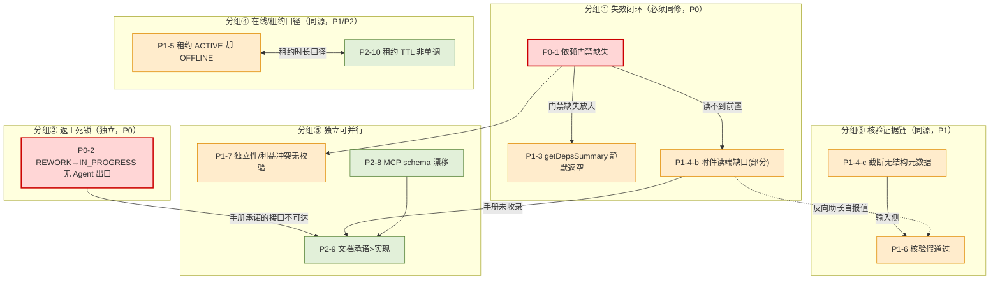

# HelloAI 外部 Agent 执行通道缺陷修复方案

> **文档定位**：本阶段**仅做代码级根因分析与修复实施计划**，不修改任何生产代码 / 测试 / Migration / 配置 / 手册。
>
> **缺陷来源**：《HelloAI 平台问题与漏洞分析报告_2026-09-24（v2）》，外部 Agent `workBuddy-executor` 在真实多智能体任务链（11 子任务 / 2 Agent）实测。核心现象：**「后续任务都独自执行，没有参考前置内容」**。
>
> **依据规约**：`doc/HelloAI_AI开发协作规约.md`（§10/§13/§25/§31/§40）、`doc/HelloAI_CODE_STYLE.md` V2.0（§6/§7.1/§9/§14/§15/§16/§17/§21/§23–25）、`doc/HelloAI 基础架构调整实施计划.md`（§10 红线）、`doc/HelloAI 项目基线文档.md`、`doc/HelloAI 实现差距表.md`。
>
> **复核口径**：凡结论均标注 `[代码事实]`（已逐行定位）或 `[分析判断]`（推断，未运行验证）。工作区只读，未改动 git 工作区（已知未提交改动：`scripts/sql/backfill-timeout-reassign-timeline.sql`、`deploy/app/`、`deploy/middleware/`、`tools/`、`scripts/powershell/executor-config.public.json`、`scripts/powershell/wait-verdict.ps1`，均未触碰）。
>
> **最后更新**：2026-09-24（架构师 高见远）

---

## A. 现状基线与根因（逐条 10 项）

### A.0 复核方法与关键更正

对主理人侦察结论逐条复核后，**有 3 处需要更正/收窄**（详见下表备注与 §C 对应项）：

1. **P1-4-b 部分不成立**：Agent 通道**并非完全没有附件读取接口**。已存在 `AttachmentController`（`/api/attachments`），且**无鉴权注解、不在 `/api/admin/**` 下**，外部 Agent 持 `Authorization: Bearer <API_KEY>` 可直达；该能力已被 `scripts/powershell/verify-attachment-version.ps1` 实测、并在 `doc/manual/helloai-integration-guide/02-task-interface.md` 登记为 `[CONFIRMED]`。真正缺口是：**MCP 工具面无附件读取**、**子任务详情无 attachmentId（不可发现）**、**`/api/attachments` 无归属授权（越权读）**、**executor-duty 手册未收录**。故降级为「部分确认」。**另：复核中新增确认——`AttachmentController` 四端点方法体内亦无归属校验（`@GetMapping` 无注解、方法内无 `assignedAgentId` 比对），「任意有效 Agent Key 可读任意子任务附件正文」的越权读为代码事实，须作独立安全项（详见 §A.1 P1-4-b、§C-4）。**
2. **P1-3 描述需收窄**：`GetDepsSummaryResult.DepItem.content/summary` 在缺失时**保持 null（而非空串）**——`summary` 仅在非空白时 set（`McpToolServiceImpl.java:746-748`），`content` 仅在非空白时 set（`:749-758`），未命中分支不赋值。核心缺陷（`degraded` 语义混淆）仍成立。
3. **P1-5 机制需更正**：报告称「其余 MCP 工具只调 `refreshDutyLease()`，不刷 `last_seen_time`」**不准确**——`heartbeatService.active()` 内部**复用 `seen()`**（`HeartbeatServiceImpl.java:155`），而 `claimSubTask`（`:270`）、`submitResult`（`:462`）、`changeStatus`（`SubTaskServiceImpl.java:342`）都会调 `active()`，即**这些工具会（经受节流地）刷 `last_seen_time`**。真正不刷的是一批**只读/登记类工具**（pullTasks/ack/getSubTaskDetail/getDepsSummary/getAgentStatus/uploadArtifact/reportBlocked/checkOut）。**缺陷结论仍成立**（租约 ACTIVE 与 OFFLINE 可并存），但影响面与修复点不同。

### A.1 总览表

| # | 报告结论 | 代码复核结论 | 代码位置（文件:行） | 根因 | 与其它缺陷的组合关系 |
|---|---|---|---|---|---|
| **P0-1** | 依赖门禁缺失：可认领/认领/提交均不校验 `dependsOn` 就绪 | **确认缺陷** | `SubTaskServiceImpl.java:222-227`（`listAvailable` 仅 status=PENDING）；`McpToolServiceImpl.java:213-288`（`claimSubTask` 无依赖校验）；`:399-472`（`submitResult` 无依赖校验）；`SubTaskController.java:399`（`/listAvailable`） | 依赖就绪判定 `isReady`（`SubTaskServiceImpl.java:255`，deps 全 DONE 计数比对）**只被内部分发链复用**（`SubTaskDispatchServiceImpl.java:85/:128`、`SubTaskPendingOrphanTask.java:130`），**外部 Agent 通道完全旁路**；外部 Agent 可直接认领并执行「前置未完成」的子任务 | 与 **P1-3、P1-4-b** 构成「失效闭环」：门禁缺失 → Agent 认领未就绪任务 → `getDepsSummary` 读不到内容（前置未 DONE）→ 只能独立执行 |
| **P0-2** | REWORK→IN_PROGRESS 在 Agent 通道无出口（返工死锁） | **确认缺陷** | `SubTaskController.java:261-266`（`startById` 带 `@SaCheckPermission("subtask:execute")`）；`AuthInterceptor.java:44-56`（Bearer Agent 不进 Sa-Token 会话）；`WebMvcConfig.java:60-75`（全局 `SaInterceptor`）；`SubTaskStateMachine.java:27`（REWORK→{IN_PROGRESS,CANCELLED,DEAD_LETTER}） | 手册/SKILL 要求 Agent 返工前调 `POST /api/sub-tasks/startById`（`00-manual-contract.md:87/105/260/265`、`SKILL.md:110/795/864/898`），但该方法带动作码注解；Agent 通道无 Sa-Token 会话 → **必然 401**。MCP 工具面 12 工具（`AgentMcpServerServiceImpl.java:54-67`）**无 startById** | 与 **P1-6、P1-7** 无直接耦合；与 **P2-9** 强耦合（手册承诺的接口在 Agent 通道不可达） |
| **P1-3** | `getDepsSummary` 静默返空：`degraded` 入口写死 false | **确认缺陷（描述收窄）** | `McpToolServiceImpl.java:701-775`（`:715` 入口 `setDegraded(false)`；`:772` 仅 catch 置 true）；`DepItem` 字段未命中为 **null**（`:746-758`）；`DEP_CONTENT_MAX_CHARS=4000`（`:86`）与 `SubTaskExecutionServiceImpl.java:89` 同值 | `degraded` 只表达「采集异常」，**不表达「前置未就绪/无内容」**；`loadedCount=0 && degraded=false` 无法与「无前置」区分；`DepItem.status` 虽已下发但消费方无「就绪/缺失」判据 | P0-1 的下游放大器：门禁缺失导致必然 `loadedCount=0`，而 `degraded=false` 又让 Agent 误以为「无前置」 |
| **P1-4-a** | 附件写端正常 | **不成立（非缺陷）** | `ArtifactUploadController.java:32/:42`（`/api/artifacts` 仅 `POST /upload`） | 写端 `POST /api/artifacts/upload` + MCP `uploadArtifact` 均正常，与报告一致 | — |
| **P1-4-b** | 读端：Agent 通道无任何附件读取接口 | **部分确认**（更正见 §A.0-1；**含独立安全项**） | 读接口已存在：`AttachmentController.java:33/:42/:50/:60/:84`（无注解、非 admin）｜工具面缺口：`McpToolService.java:134-162`（`SubTaskDetail` 无 attachmentId）；`AgentMcpServerServiceImpl.java:54-67`（无 artifact 读工具）；手册缺口：`doc/manual/executor-duty/00-manual-contract.md:11` 未收录 `/api/attachments`。**独立安全项（代码事实）**：`AttachmentController` 全文（102 行）`list/getById/downloadById/previewById` 四端点**方法体内亦无任何归属校验**（仅调用 `attachmentService`，无 `assignedAgentId` 比对），故「任意有效 Agent API Key 可凭 attachmentId 读取任意子任务附件正文」的**越权读**成立——非推断，须作独立安全项处理（T04 非可选） | 能力在 REST 存在但**不可发现（详情页不返回 attachmentId）**、**MCP 工具面缺失**、**executor-duty 手册未登记**、且 **`/api/attachments` 无归属授权（越权读，安全项）** | 与 **P0-1/P1-3** 同闭环；与 **P1-6** 反向耦合（读不到 → 写方只能用自报值，助长假通过） |
| **P1-4-c** | 核验端超限只给自然语言标记，不回传结构化元数据 | **确认缺陷** | `ReviewEvidenceAssembler.java:37-56`（限额 4000/8000/24000）；`:198-219`（截断后仅 append「（部分附件内容已截断至限额）」/「（附件内容总计超出限额…）」） | 截断**不携带** `truncated/renderedChars/totalChars/fileId` 等结构化信号；核验 Prompt 无法精确知道「哪些字节不可见」 | 与 **P1-6 同源**（核验假通过的输入侧成因） |
| **P1-5** | 在线状态陷阱：租约 ACTIVE 但被判 OFFLINE | **确认缺陷（机制更正见 §A.0-3）** | `HeartbeatServiceImpl.java:78-118`（`seen` 才刷 `last_seen_time`；`:186-198` 5 分钟三态）；`seen()` 调用点：`McpToolServiceImpl.java:330`（heartbeat）、`:555`（checkIn）、`DoorbellServiceImpl.java:117`；`active()` 复用 `seen`（`:136-166`，带 `activeThrottleMs` 节流）。只读工具仅 `refreshDutyLease`（`McpToolServiceImpl.java:895-904`）。影响链：`AgentSelector.java:183-209`（心跳新鲜度过滤）、`AgentMapper.java:52-56`（标离线 SQL）、`ExternalAgentFailureTracker.java` | 「连接存活」与「业务活跃」两个时钟耦合：`refreshDutyLease`→`adaptiveRenew` 可把租约续到 **240 分钟**（`helloai-common/src/main/java/com/helloai/common/config/AgentDutyLeaseProperties.java:39`），而 `last_seen_time` **5 分钟**即老化 → **租约 ACTIVE 与 OFFLINE 同时成立**，语义冲突 | 与 **P2-10** 同源（租约时长与在线判定口径不一致）；放大选人误判（`AgentSelector`） |
| **P1-6** | 核验越界判定（假通过）：截断部分被核验模型用提交方自报值补全 | **确认缺陷** | 核验 Prompt 拼装：`helloai-core/src/main/java/com/helloai/core/review/support/ReviewExecutionEngine.java:142-162`（`{{ATTACHMENT_CONTENT}}` 注入）；模板 `helloai-core/src/main/resources/prompts/subtask-review.md:33/48/51`（提及「已按限额截断」但**无「不可见部分判受限/要求补证据」指令**）；输入侧 `ReviewEvidenceAssembler.java:214-219` | Prompt 只说「已按限额截断」，**未要求对不可见部分保守判定/要求补充证据**；叠加 P1-4-c 无结构元数据 → 模型倾向用自报值补全 | 与 **P1-4-c 同源**；与 **P1-4-b** 反向耦合 |
| **P1-7** | 任务独立性与利益冲突无校验 | **确认缺陷（能力边界需澄清）** | 直接指派（`SubTaskDispatchService*`/Planner 指派）与 `McpToolServiceImpl.java:213`（`claimSubTask`）均无冲突校验；`McpToolService.java:134-162`（`SubTaskDetail` 无 `contributors`） | 平台无「任务独立性/利益冲突」模型，也无「产出归属」可视图；`Attachment` 实体（`Attachment.java:13-32`）**无 uploader 字段**，归属事实只能从 `sub_task.assigned_agent_id` / `agent_execution_record.agent_id` 推导 | 独立缺陷，可作为 P1 观测补强；完整冲突校验需产品定义 |
| **P2-8** | MCP 工具 schema 与文档不一致（required 全 None / checkIn 缺字段） | **确认缺陷（需区分双通道）** | REST JSON-RPC `tools/list` 内联 Map：`McpController.java:231-273`（**无 `required` 数组**；`checkIn` 仅 `workMode/maxConcurrent/ttlMinutes`，`:267-269`）；SSE `@Tool` 面：`McpMcpServer.java`（`@ToolParam(required=…)`，由 spring-ai 生成 schema） | REST 别名通道的 JSON-RPC `tools/list` 是**手写 Map**，与 SSE 通道（由注解生成）不同源 → 漂移；`checkIn` schema 缺 `skills`（`McpMcpServer.java:394` 已有 `skills` 参数） | 仅影响工具自描述，不阻塞执行；与 **P2-9** 同属「文档/Schema 一致性」 |
| **P2-9** | 文档承诺但平台不存在的接口 | **确认缺陷（分类处置；SKILL 制品定位已收准）** | 外部 Agent 实际拿到的 SKILL 制品即**本仓库内** `helloai-core/src/main/resources/skills/executor/SKILL.md`（924 行），由 `/api/tools/cli` 的 `skill` 子命令下发（该文件自述 `python task-cli.py --key <API_KEY> skill`）。对它的实测：①**全文未提及核验端 8000/24000 限额**（报告指控**成立**）；②内部口径矛盾：`:574`「`truncated=true`：该前置内容超 **4000** 字被截断」（与 `DEP_CONTENT_MAX_CHARS=4000` 一致，正确）vs `:624`「前置产出超长时截断至 **2000** 字」（**错误值**）；③`:871`「写 blocked 日志（REST）」——**全仓无该端点**（`grep` 确认）；④已知坑表「`startById` MCP 工具返 500 → 改用 REST `POST /api/sub-tasks/startById/{id}`」——对 Agent 必然 401（P0-2 直接诱因）。另 `doc/manual/executor-duty/**` 是**另一份较新手册**（`00-manual-contract.md:87/105/260/265` 含 `startById`、`03-result-submission.md:52` 已写明 4000/8000/24000），二者**不同源且不同步**。`skills-lock.json` 仅锁定 `design-taste-frontend`（与本议题无关），**不可**作为该 SKILL 版本依据 | 「执行者 SKILL 制品」与「executor-duty 手册」为**双制品不同源、不同步**（真正问题）；SKILL 制品自身存在 4000/2000 口径矛盾与「承诺 > 实现」项 | 与 **P0-2** 强耦合（startById）；修法须逐项明确「改代码」还是「改文档」 |
| **P2-10** | 租约 TTL 与 `leaseExpiresAt` 非单调 | **确认缺陷** | `AgentDutyLeaseServiceImpl.java:155-169`（`startLease`：`expireTime=now+ttlMinutes`）；`:210-223`（`renewLease`：`expireTime=now+ttlMinutes` **每次重算**）；`:296-306`（`adaptiveRenew`：有在跑子任务取 `max(max,min)=240`，否则 `resolveTtlMinutes(agentId, null)`）；`:244-283`（`resolveTtlMinutes` 显式优先，但 `adaptiveRenew` **传 null**）；`helloai-common/src/main/java/com/helloai/common/config/AgentDutyLeaseProperties.java:31/39/47`（min=5/max=240/default=30） | 续约**总是** `expireTime = now + 本次计算 TTL`，且**丢弃 checkIn 显式 TTL**（续约传 null）；当「在跑子任务」消失后窗口从 240min 收缩到动态值 → **到期时刻倒退（非单调）**。实测 14399s≈240min（在跑）→ 3359s≈56min（空闲）与 `maxTtlMinutes=240` 吻合 | 与 **P1-5** 同源（租约时长口径） |

### A.2 「失效闭环」根因链（P0-1 + P1-3 + P1-4-b）

```
外部 Agent 轮询 pullTasks → 收到 sub_task.assigned
        │
        ▼
GET /api/sub-tasks/listAvailable      ── 只按 status=PENDING 过滤（无 dependsOn 就绪门禁）
        │
        ▼
claimSubTask(subTaskId)               ── 不校验 dependsOn（内部 isReady 被旁路）
        │
        ▼
getDepsSummary(subTaskId)             ── 前置未 DONE → DepItem.content=null
        │                                degraded=false（入口写死）→ 无法区分「无前置」
        ▼
【现象】Agent 得不到前置上下文 → “后续任务都独自执行，没有参考前置内容”
        │
        ▼（叠加 P1-4-b：详情不返回 attachmentId、MCP 无附件读工具）
Agent 也读不到前置/自身的附件产出 → 只能凭自报值执行
```

---

## B. 缺陷分组与依赖关系

### B.1 缺陷耦合图（Mermaid）



### B.2 分组与修复顺序

| 分组 | 缺陷 | 关系 | 修复顺序 |
|---|---|---|---|
| ① 失效闭环 | P0-1 + P1-3 + P1-4-b | **必须同批修**，否则单修 P0-1 后 Agent 仍读不到前置/附件 | 组内先 P0-1（门禁），再 P1-3（元数据），再 P1-4-b（读端） |
| ② 返工死锁 | P0-2 | **独立**，可与分组①并行 | 与①并行 |
| ③ 核验证据链 | P1-4-c + P1-6 | **同源**，P1-6 依赖 P1-4-c 的元数据 | 先 P1-4-c 后 P1-6 |
| ④ 在线/租约 | P1-5 + P2-10 | **同源**，可同批 | 同批 |
| ⑤ 独立 | P1-7 / P2-8 / P2-9 | 可并行；P2-9 依赖 P0-2 与 P1-4-b 的结论落地 | P2-9 最后 |

**总体顺序**：先解锁阻断项（P0-1、P0-2）→ 再补观测与证据（P1-3/4/5/6/7）→ 最后文档与 schema（P2-8/9/10）。

---

## C. 修复方案（逐条）

> 硬约束（贯穿所有方案）：**复用优先**（`isReady` / `refreshDutyLease` / `seen` / `changeStatus` 的 `@Version` CAS / `AttachmentService` / Agent 事件）；**不得新增第二套状态机 / Event Stream / Scheduler / Review Runtime**（§40）；**不得跨域直捅 Mapper**（§7.1）；**禁止新增 `agent → task`** 依赖（CODE_STYLE §6.1）；**Agent 通道方法不得加鉴权注解**（§10 红线）。

### C-1（P0-1）依赖门禁：外部 Agent 通道复用 `isReady`

**候选方案对比**

| 方案 | 做法 | 评价 |
|---|---|---|
| A 最直接 | 在 `listAvailable()` 与 `claimSubTask()` 内联调 `subTaskService.isReady(subTask)` | 改动最小，但 `listAvailable` 会对每个 PENDING 逐条发 count 查询 → **N+1**（CODE_STYLE §18/§19 预警） |
| B 最小变更（推荐） | 复用 `isReady` 语义：`listAvailable` 改为**批量就绪过滤**（一次取 PENDING 候选集合 → 批量取全部 dependsOn → Map 分组判定），`claimSubTask` 对已加载的单体直接调 `isReady` | 复用既有就绪定义（deps 全 DONE），不新增抽象；消除 N+1 |

**推荐**：**B**（`listAvailable` 批量 + `claimSubTask` 单体复用 `isReady`）。理由：`isReady` 是既有单一权威（内部分发链已复用于 `SubTaskDispatchServiceImpl:85/:128`、`SubTaskPendingOrphanTask:130`），外部通道与其对齐即可，无需新状态机/门禁引擎。

**改动文件清单**

| 文件 | 修改/新增 | 说明 |
|---|---|---|
| `helloai-core/.../task/service/impl/SubTaskServiceImpl.java` | 修改 | `listAvailable()` 增加 `isReady` 过滤（建议新私有批量方法 `filterReady(List<SubTask>)`） |
| `helloai-core/.../task/service/SubTaskService.java` | 修改（可选） | 若新增批量方法则补接口声明；只改实现无契约变更可不动接口 |
| `helloai-core/.../agent/service/impl/McpToolServiceImpl.java` | 修改 | `claimSubTask()` 在 claim 前加 `if (!subTaskService.isReady(subTask)) return claimed=false, reason="dependency_not_ready"`；`submitResult()` 加**软**守卫（可选，返回 `dependency_not_ready`，见风险） |

- **DB Migration**：无。
- **MQ**：无。
- **API 契约**：`GET /api/sub-tasks/listAvailable` 结果集**收窄**（PENDING→PENDING 且就绪）；`claimSubTask` 新增 reason 值 `dependency_not_ready`（**additive**）。
- **向后兼容**：reason 为字符串，新增取值不破坏旧解析；仅语义收窄。手册需同步「可认领列表 = PENDING **且依赖就绪**」。
- **风险**：① 存量测试/脚本假定 `listAvailable` 返回全部 PENDING（`SKILL.md:108`、`00-manual-contract.md:84` 需同步）；② 若前置是跨任务外部依赖（`dependsOnIdList` 不存在实体），`isReady` 的 count 比对可能误判——**沿用既有 `isReady` 口径即接受该既有行为**（`PlannerDecomposeAsyncServiceImpl.java:624` 已注明「不存在依赖恒判未就绪」的已知语义），不在本任务扩大处理。
- **并发/幂等（§31）**：门禁是**读侧前置校验**，真正落库仍走 `subTaskService.claimAtomic`（DB 条件更新 `WHERE status='PENDING'`）；门禁减小竞态但不替代原子性。

### C-2（P0-2）REWORK→IN_PROGRESS：新增 Agent 通道工具（不改红线）

**候选方案对比**

| 方案 | 做法 | 评价 |
|---|---|---|
| A 新增 MCP 工具（推荐） | 新增 `startSubTask` 工具：`McpToolService.startSubTask(agentId, subTaskId)` + `McpMcpServer` `@Tool` + `McpController` REST 别名 + `DEFAULT_EXECUTOR_TOOLS` | 与既有 Agent 通道一致（无注解，红线合规）；可被 SSE/REST 双通道发现（解决 P2-9 的 startById 缺失）；归属校验落在 Service |
| B 让 `submitResult` 自动推进 REWORK | 在 `submitResult` 中把 `REWORK` 也自动 `start`（对齐 ASSIGNED 分支） | 改动更小，但**改变语义**（隐藏返工确认步骤），且与手册「REWORK 须先 startById」冲突，可观测性下降 |
| C 新增专用 Agent REST 控制器 | 新建无注解控制器映射 `POST /api/agent/sub-tasks/{id}/start` | 引入新通道/新路径，与既有 `/api/mcp/tools/*` Agent 通道重复，违反「不新增平行实现」 |
| D 去掉 `startById` 的注解 | 直接删 `@SaCheckPermission` | **破坏人机同端点授权**（平台账号失去动作码），违反 §43，禁止 |

**推荐**：**A**。理由：完整贴合 §10 红线（Agent 通道零注解）、复用既有 `McpToolService`+`subTaskService.changeStatus`（含 `@Version` CAS），并使手册/SKILL 承诺的 `startById` 语义转为**平台账号链路保留 + Agent 走新工具**，双通道各归其位。

**越权防护**：`startSubTask` 在 Service 内强制 `subTask.getAssignedAgentId() != null && agentId.equals(assignedAgentId)`，且仅允许 `status ∈ {ASSIGNED, REWORK, PAUSED}`（`REWORK→IN_PROGRESS`、`PAUSED→IN_PROGRESS` 均为合法状态机转换，`SubTaskStateMachine.java:23/27`），否则返回拒绝原因，**不得**由请求体传入 agentId。

**并发（§31）**：`changeStatus` 内 `updateById(entity)` 依赖 `SubTask.@Version` 乐观锁（`SubTaskServiceImpl.java:328`）——CAS 失败抛「并发修改，请重试」，天然幂等防护；重复 `startSubTask`（已是 IN_PROGRESS）应幂等返回 ok。

**附带修复（REWORK→BLOCKED）**：`reportBlocked` 在 REWORK 态必败——`block()` 前置**允许** REWORK（`SubTaskServiceImpl.java:970-973`），但状态机 `REWORK` 目标集**不含 BLOCKED**（`SubTaskStateMachine.java:27`）。建议**为 `REWORK` 目标集补 `BLOCKED`**（`Set.of(IN_PROGRESS, BLOCKED, CANCELLED, DEAD_LETTER)`），使 REWORK 期阻塞上报可用；此为**状态机合法转换补充**（非新增状态机），风险低，但需在 §31 口径下书面登记。

**改动文件清单**

| 文件 | 修改/新增 | 说明 |
|---|---|---|
| `helloai-core/.../agent/service/McpToolService.java` | 修改 | 新增 `startSubTask(agentId, subTaskId)` 与结果 DTO（或复用 `ClaimSubTaskResult` 简版） |
| `helloai-core/.../agent/service/impl/McpToolServiceImpl.java` | 修改 | 实现：归属校验 + 状态白名单 + 复用 `subTaskService.start()`/`changeStatus` |
| `helloai-api/.../controller/McpController.java` | 修改 | REST 别名 `POST /tools/startSubTask` + `TOOL_NAMES` + JSON-RPC `tools/list` 增项 |
| `helloai-core/.../agent/mcp/McpMcpServer.java` | 修改 | `@Tool(name="startSubTask")`（含【何时使用】【Gotchas】） |
| `helloai-core/.../agent/service/impl/AgentMcpServerServiceImpl.java` | 修改 | `DEFAULT_EXECUTOR_TOOLS` 增 `startSubTask`（`isToolEnabled` 对新工具自动补默认行） |
| `helloai-core/.../task/statemachine/SubTaskStateMachine.java` | 修改 | `REWORK` 目标集补 `BLOCKED`（可选，随本任务一并修 reportBlocked） |

- **DB Migration / MQ**：无。
- **API 契约**：**纯新增**（新工具、新 reason），无破坏性变更；`/api/sub-tasks/startById` 保留供平台账号使用。
- **向后兼容**：`DEFAULT_EXECUTOR_TOOLS` 从 12 → 13，`isToolEnabled` 的默认补齐逻辑保证存量 Agent 首次调用即自动启用（幂等）。
- **风险**：① 工具数变化需同步 P2-8（schema）与工具矩阵校验（`verify-tool-matrix.ps1`）；② 状态机补 `BLOCKED` 后需回归 `verify-subtask-redispatch-auto-execution.ps1`（阻塞→重派链）。

### C-3（P1-3 + P1-4-c）依赖/附件截断的**结构化元数据**

**候选方案对比**

| 方案 | 做法 | 评价 |
|---|---|---|
| A 仅改 `degraded` 语义 | `loadedCount==0 && depCount>0` 时置 `degraded=true` | 语义过载：把「前置未就绪」与「采集异常」混为一谈，消费方仍无法区分 |
| B 新增显式字段（推荐） | `GetDepsSummaryResult` 增 `ready`（全部前置 DONE）、`notReadyCount`；`DepItem` 增 `loaded`/`contentChars`/`truncatedAt`；`ReviewEvidenceAssembler` 在截断处输出**结构化标注行**（如 `> [TRUNCATED] file=… shown=8000 total=… bytes`） | 不改变 `degraded` 既有含义（异常），新增正交维度；核验侧可精确知「哪些字节不可见」 |

**推荐**：**B** 用于 `getDepsSummary`；**B（结构化标注行）** 用于 `ReviewEvidenceAssembler`（保持 String 注入不变，附加机器可读标记行，核验 Prompt 可引用）。

**改动文件清单**

| 文件 | 修改/新增 | 说明 |
|---|---|---|
| `helloai-core/.../agent/service/McpToolService.java` | 修改 | `GetDepsSummaryResult`/`DepItem` 增字段（additive） |
| `helloai-core/.../agent/service/impl/McpToolServiceImpl.java` | 修改 | 计算 `ready/notReadyCount`；逐条 `loaded` |
| `helloai-core/.../review/support/ReviewEvidenceAssembler.java` | 修改 | 截断处输出结构化标注行（替代/补充自然语言标记） |

- **DB / MQ**：无。**API**：additive 字段。**兼容**：旧消费方忽略新字段。
- **风险**：核验 Prompt 模板需引用新标注（属 P1-6），二者需**同批发布**以免产生「标注存在但 Prompt 未消费」的空转。

### C-4（P1-4-a/b）附件读端：可发现 + 可读 + 授权

**候选方案对比**

| 方案 | 做法 | 评价 |
|---|---|---|
| A 新增 MCP `listArtifacts` 工具 | `McpToolService.listArtifacts(agentId, subTaskId)` 返回 `listActive` 元数据 | 补齐 MCP 工具面，但 Agent 仍需先知道 subTaskId（认领后已知，够用） |
| B `getSubTaskDetail` 内联附件（推荐） | `SubTaskDetail` 增 `attachments[]`（id/fileName/fileType/fileSize/status/loadable） | **一站式可发现**：认领详情即得附件 id，免二次调用；复用 `AttachmentService.listActive` |
| C 文档 + 授权修复（推荐，必做） | executor-duty 手册收录 `/api/attachments`；`AttachmentController` 增**归属授权** | 修复越权读；消除「不可发现」 |

**推荐**：**B + C**（工具面内联 + 文档/授权）；A 可选（若外部 Agent 偏好显式列举工具，可一并加，但非必需，避免工具膨胀）。

> **❗独立安全项（非可选，随 T04 必做且优先）**：`AttachmentController` 的 `list/getById/downloadById/previewById` **方法体内亦无归属校验**（全文 102 行仅调用 `attachmentService`），即「任意有效 Agent API Key 可凭 `attachmentId` 读取任意子任务附件正文」的**越权读**——代码事实，非推断。该修复**不得**作为 T04 的可选项，应作为**独立安全修复项优先完成**（授权对齐后再放开 `SubTaskDetail.attachments`，避免扩大可枚举面）。

**授权设计（安全项）**：`AttachmentController.list/getById/downloadById/previewById` **方法体内亦无归属校验（代码事实）**——任何有效 Agent Key 可凭 `attachmentId` 读任意子任务附件正文。修复：在 Controller 取 `_authId`（Agent 通道）后校验 `attachmentService` 归属（附件所属子任务 `assignedAgentId == agentId`），或对平台账号（admin）放行。注意**不得加 `@SaCheckPermission`**（§10 红线），须以「请求属性 + 服务层归属校验」实现。

**改动文件清单**

| 文件 | 修改/新增 | 说明 |
|---|---|---|
| `helloai-core/.../agent/service/McpToolService.java` | 修改 | `SubTaskDetail` 增 `attachments` 列表 DTO |
| `helloai-core/.../agent/service/impl/McpToolServiceImpl.java` | 修改 | `buildSubTaskDetail` 填充 `listActive`（复用 `AttachmentService`） |
| `helloai-core/.../agent/mcp/McpMcpServer.java` | 修改 | `getSubTaskDetail` description 增附件字段说明 |
| `helloai-api/.../controller/AttachmentController.java` | 修改 | 归属授权（Agent 通道读自有子任务附件） |
| `doc/manual/executor-duty/00-manual-contract.md` 等 | 修改（后续阶段） | 收录 `/api/attachments` 只读能力 |

- **DB / MQ**：无。**API**：`SubTaskDetail` additive；`/api/attachments` 由「无授权」→「归属授权」（**行为收窄**，可能影响现以任意 Key 读取的脚本，属安全修复）。
- **风险**：`verify-attachment-version.ps1` / `verify-minio-artifact.ps1` 若用**非归属** Key 读附件，授权收紧后会 403 → 需核对脚本用的 Key 是否为该子任务归属者。

### C-5（P1-5）在线状态语义：消除「租约 ACTIVE 却 OFFLINE」

**候选方案对比**

| 方案 | 做法 | 评价 |
|---|---|---|
| A 扩大 `seen` 刷新范围 | 让只读类工具也调 `seen()` | 治标：REST 只读接口（无 `agentId` 归属）仍不刷；且「连接存活」语义被滥用 |
| B 引入「租约 ACTIVE ⇒ 视为在线」软口径（推荐） | `checkOnlineStatus`/`AgentSelector` 在判定 OFFLINE 前，若有**ACTIVE 租约**则至少判 IDLE（不判 OFFLINE），并统一 offline_reason 语义 | 从**语义层**消除冲突：租约是「Agent 声明在岗」，与心跳同为存活证据；复用 `AgentDutyLeaseService` |
| C 缩短租约窗口 | 把 `maxTtlMinutes` 降到 ≤5min | 治标且加剧续约开销，与自适应设计冲突 |

**推荐**：**B**（以「ACTIVE 租约」作为**在线判定的一等证据**，与 `last_seen_time` **取或**），并**统一文案/字段**。理由：`AgentSelector.isHeartbeatFresh`（`AgentSelector.java:183`）与 `HeartbeatServiceImpl.checkOnlineStatus`（`:186`）是选人与状态展示的唯一权威，收敛到一处比散点刷新 `seen()` 更稳。

**改动文件清单**

| 文件 | 修改/新增 | 说明 |
|---|---|---|
| `helloai-core/.../agent/service/impl/HeartbeatServiceImpl.java` | 修改 | `checkOnlineStatus` 结合 ACTIVE 租约（需注入/解耦 `AgentDutyLeaseService`，注意**避免构造器环**——`AgentDutyLeaseServiceImpl` 已依赖 `SubTaskService`，需评估依赖方向） |
| `helloai-core/.../agent/executor/AgentSelector.java` | 修改 | `isHeartbeatFresh` 对持 ACTIVE 租约的 CLI_CLIENT 放宽 |
| `doc/manual/executor-duty/00-manual-contract.md:13` | 修改（后续阶段） | 更正「heartbeat 是唯一刷新 last_seen_time 的调用」表述（与 `active()` 复用 `seen()` 的事实不符） |

- **DB / MQ**：无。**API**：`getAgentStatus.computedOnlineStatus` 语义变化（不再出现「租约在岗却 OFFLINE」）。
- **风险**：`HeartbeatServiceImpl` 引入 `AgentDutyLeaseService` 可能形成 `agent` 域内循环依赖（`AgentDutyLeaseServiceImpl` 依赖 `SubTaskService`）→ 建议以 `ObjectProvider` 懒解析或定义轻量只读 Port（若必须，须走 §7.2 Port 反转，**不得**直捅 Mapper）。

### C-6（P1-6 + P1-7）核验 Prompt 越界判定 + 产出归属可见性

**P1-6 候选方案对比**

| 方案 | 做法 | 评价 |
|---|---|---|
| A Prompt 硬化（推荐） | `prompts/subtask-review.md` 增条款：**「不可见/被截断部分视为未提供证据，不得以提交方自报值补全；缺失即判不达标或要求补充证据」**；引用 C-3 的结构化标注行 | 改动小、直达根因；符合「判定依据=可见证据」原则 |
| B 分段核验 | 按附件分片多次核验 | **禁止**（§40「不得创建第二套 Review Runtime」） |
| C 改核验预算 | 提高 24000 限额 | 治标（内容可更长，仍会截断）；可作为 A 的辅助但非根因 |

**P1-7 候选方案对比**

| 方案 | 做法 | 评价 |
|---|---|---|
| A `contributors` 可见性（推荐先做） | `SubTaskDetail` 增 `contributors[]`（从 `agent_execution_record.agent_id` + `sub_task.assigned_agent_id` + Agent 事件 `AGENT_STARTED` 推导） | 低风险、复用既有事实源；为后续冲突校验提供数据 |
| B 冲突校验 | 在 `claimSubTask`/指派链加「独立性/互斥」判定 | 需产品定义冲突模型（哪些任务互斥、允许重复贡献否）→ **列入待明确** |
| C 文档声明限制 | 手册写明「平台暂不校验独立性」 | 兜底，可并行 |

**推荐**：P1-6 → **A（+ 引用 C-3 元数据）**；P1-7 → **A 先落地可视性 + C 声明限制，B 待产品定义**。

**改动文件清单**

| 文件 | 修改/新增 | 说明 |
|---|---|---|
| `helloai-core/src/main/resources/prompts/subtask-review.md` | 修改（后续阶段） | 增「截断/不可见部分从严」条款 |
| `helloai-core/.../agent/service/McpToolService.java` | 修改 | `SubTaskDetail.contributors` |
| `helloai-core/.../agent/service/impl/McpToolServiceImpl.java` | 修改 | 组装 contributors（复用 `AgentExecutionRecordService`） |

- **DB / MQ**：无。**API**：`SubTaskDetail` additive。
- **风险**：生成式 Prompt 改动属**业务行为变更**（CODE_STYLE §55），须配套 `SubTaskReviewServiceTest` 断言「含不可见部分时不得判 pass」。

### C-7（P2-8）MCP 工具 schema 补齐

**候选方案对比**

| 方案 | 做法 | 评价 |
|---|---|---|
| A 手写补 `required`（推荐，最小） | `McpController.java:231-273` 的 JSON-RPC `tools/list` 补 `required` 数组 + `checkIn` 补 `skills` | 改动最小；但存在与注解面**漂移**风险 |
| B 单一事实源生成 | 从 `McpMcpServer` `@ToolParam` 反射生成 REST `tools/list` | 根治漂移，但改动面大、成本高 |

**推荐**：**A**（本轮），并把「REST 别名通道 schema 与 SSE 注解面同源」登记为**技术债**（后续 P2 收敛到 B）。理由：本轮目标是消除 MCP 客户端参数校验误导，成本收益比 A 最优；`checkIn` 补 `skills` 与 `McpMcpServer.java:394` 对齐。

**改动文件清单**：`helloai-api/.../controller/McpController.java`（`tools/list` schema）。
- **DB / MQ / API 契约**：仅自描述 schema，**非破坏性**。**风险**：`required` 加严可能使**未传必填参数的旧客户端**被 MCP 客户端本地拒绝——需与 `McpMcpServer` 的 `required` 取值逐项对齐，避免「服务端宽松、schema 严格」不一致。

### C-8（P2-9）文档与代码一致性：逐项定性处置

| 承诺项 | 出处 | 处置（**必须二选一，不可含糊**） | 理由 |
|---|---|---|---|
| `startById`（REWORK 前必调） | `00-manual-contract.md:87/105/260/265`、`SKILL.md:110/795/864/898` | **改代码**（C-2 新增 MCP `startSubTask`）+ **改文档**（指向新工具；平台账号仍走 `startById`） | Agent 通道无法满足动作码，代码侧才算真修复 |
| 「写 blocked 日志（REST）」 | `SKILL.md:871` | **改文档**（删除该承诺；阻塞上报统一 `reportBlocked` MCP） | `grep` 全仓无 blocked-log REST 端点；新增端点属能力扩张，非必需 |
| 「附件管理页回查」 | `McpMcpServer.java:199` | **改文档**（明确为**人工管理页**；Agent 读能力见 C-4 `/api/attachments`） | 原文指平台 UI，非 Agent API |
| 核验端限额（**执行者 SKILL 制品**） | `helloai-core/src/main/resources/skills/executor/SKILL.md`（924 行，由 `/api/tools/cli` 的 `skill` 子命令下发） | **改文档（主）**：①在该 SKILL.md 补写核验端限额章节（**附件每份 8000 字符 / 总量 24000 字符 / `output` 4000 字符摘要**）；②修正内部矛盾——`:624`「截断至 **2000** 字」应为 **4000**（与 `:574`、`DEP_CONTENT_MAX_CHARS=4000` 对齐）；③并**同步核对** `doc/manual/executor-duty/`，两制品同源化或明确主从关系 | 报告指控**成立**：该 SKILL.md **全文未提核验端限额**（非「旧版制品」）；`skills-lock.json` 仅锁 `design-taste-frontend`，**不作**该 SKILL 版本依据；两份文档不同源才是真正问题 |

**改动文件清单（主）**：`helloai-core/src/main/resources/skills/executor/SKILL.md`（补限额章节 + 修 `:624` 2000→4000 + 删 `:871` blocked 日志承诺 + 修已知坑表 `startById` 指引）；**（辅/一致性）** `doc/manual/executor-duty/00-manual-contract.md`、`05-troubleshooting.md`、`03-result-submission.md`、`doc/manual/executor-duty/manual-assembled.md`（经 `scripts/powershell/assemble-manual.ps1` 重装），并做 SKILL.md ↔ executor-duty 手册一致性核对。（**移除** `skills-lock.json` —— 其不锁定该 SKILL，不作依据。）
- **DB / MQ / API**：无。**兼容**：仅文档；但「删除 blocked-log 承诺」需确认外部 Agent 未硬依赖。

### C-9（P2-10）租约 TTL 单调性与显式 TTL 保留

**候选方案对比**

| 方案 | 做法 | 评价 |
|---|---|---|
| A 显式 TTL 持久化 | 新增 `ttl_minutes` 列，`renewLease` 复用 | 根治「checkIn 显式 TTL 被后续覆盖」，但需 **DB Migration** |
| B 到期时刻单调（推荐，最小） | `renewLease` 改 `expireTime = max(existingExpireTime, now + ttlMinutes)`（同租约内只增不减） | 无需 Migration；消除「到期时刻倒退」观测异常 |
| C 文档声明非单调 | 手册说明 TTL 为建议值、可伸缩 | 兜底，不修根因 |
| D 续约尊重显式 TTL | `adaptiveRenew` 在租约由显式 TTL 创建时保留原窗口 | 需持久化「是否显式」→ 依赖 A |

**推荐**：**B（本轮，无 Migration）** + **C（文档澄清）**；**A/D 列为后续可选**（如产品要求「显式 TTL 一旦设定即固定」再引入 Migration V93+）。

**改动文件清单**

| 文件 | 修改/新增 | 说明 |
|---|---|---|
| `helloai-core/.../agent/service/impl/AgentDutyLeaseServiceImpl.java` | 修改 | `renewLease` 单调钳制（`max(原 expire, now+ttl)`） |
| `helloai-core/.../agent/mapper/AgentDutyLeaseMapper(.xml)` | 修改（若续约走 SQL） | 确认无需改；`renewLease` 走 `updateById` |
| `doc/manual/executor-duty/04-heartbeat-and-lease.md` | 修改（后续阶段） | TTL 语义澄清（自适应窗口、非单调风险已消除） |

- **DB / MQ**：方案 B **无 DB 变更**；方案 A 需 Migration。**API**：`heartbeat.remainingTtlSeconds`/`leaseExpiresAt` 语义更稳定。
- **风险**：单调钳制会使「Agent 表现变差/空闲」时租约**不会立即收缩**（最长等到原窗口自然到期）→ 回收延迟增大；需评估 `DutyLeaseExpirationTask` 回收及时性，必要时以 `max` + 上限（不超过 `maxTtlMinutes`）双重约束。

---

## D. 任务分解（有序 + 依赖 + 实施顺序）

> 排序原则：**先解锁阻断项（P0）→ 再补观测与证据（P1）→ 最后文档与 schema（P2）**。规模：S（≤0.5 人日）/ M（1–2 人日）/ L（≥3 人日）。

| 任务号 | 标题 | 对应缺陷 | 改动文件（路径级） | 前置任务 | 规模 | 验收标准 |
|---|---|---|---|---|---|---|
| **T01** | 外部 Agent 依赖门禁（复用 `isReady`） | P0-1（+ 承接 P1-3 触发点） | 改：`SubTaskServiceImpl.java`、`McpToolServiceImpl.java`、`SubTaskService.java`(可选) | 无 | M | `listAvailable` 不返回未就绪项；`claimSubTask` 对未就绪返回 `dependency_not_ready`；单测覆盖「多前置未全 DONE」；`verify-deps-context-e2e.sh` PASS |
| **T02** | Agent 通道返工出口（新增 `startSubTask` 工具 + 状态机补 BLOCKED） | P0-2 | 改：`McpToolService.java`、`McpToolServiceImpl.java`、`McpController.java`、`McpMcpServer.java`、`AgentMcpServerServiceImpl.java`、`SubTaskStateMachine.java` | 无 | M | REWORK 子任务可由 Agent 经 MCP/REST 推进 IN_PROGRESS（非归属者被拒）；REWORK 下 `reportBlocked` 可达 BLOCKED；`verify-tool-matrix.ps1` PASS |
| **T03** | 依赖/附件截断结构化元数据 | P1-3 + P1-4-c | 改：`McpToolService.java`、`McpToolServiceImpl.java`、`ReviewEvidenceAssembler.java` | 无 | M | `getDepsSummary` 区分「无前置/未就绪/采集异常」；截断输出含结构化标注；`verify-artifact-content-review.ps1` PASS |
| **T04** | 附件读端可发现 + 授权（**含独立安全项：`/api/attachments` 越权读，非可选，优先修**） | P1-4-b | 改：`McpToolService.java`、`McpToolServiceImpl.java`、`McpMcpServer.java`、`AttachmentController.java` | T01（依赖门禁语义对齐） | M | **先修越权读**（非归属者读附件被拒，`AttachmentController` 四端点归属校验）；再放开 `getSubTaskDetail.attachments[]`；`verify-attachment-version.ps1`/`verify-minio-artifact.ps1` PASS |
| **T05** | 在线状态语义收敛（租约=存活证据） | P1-5 | 改：`HeartbeatServiceImpl.java`、`AgentSelector.java` | 无 | M | 持 ACTIVE 租约的 Agent 不再被判 OFFLINE；`verify-agenthub-duty-e2e.ps1`、`verify-dashboard-duty-leases.ps1` PASS |
| **T06** | 核验 Prompt 越界判定 + 产出归属可见性 | P1-6 + P1-7 | 改：`prompts/subtask-review.md`、`McpToolService.java`、`McpToolServiceImpl.java` | T03 | M | 核验对「不可见部分」不判 pass；`getSubTaskDetail` 返回 `contributors[]`；`SubTaskReviewServiceTest` PASS |
| **T07** | MCP 工具 schema 补齐 | P2-8 | 改：`McpController.java` | T02（工具集变更后对齐） | S | JSON-RPC `tools/list` 含 `required`；`checkIn` 含 `skills`；`verify-mcp.ps1`/`verify-mcp-e2e.ps1` PASS |
| **T08** | 文档一致性与租约 TTL 单调 | P2-9 + P2-10 | 改：`AgentDutyLeaseServiceImpl.java`、`helloai-core/src/main/resources/skills/executor/SKILL.md`、`doc/manual/executor-duty/*` | T02、T04、T07 | M | ①`leaseExpiresAt` 同租约不倒退；②SKILL.md 中 `4000`/`2000` 口径矛盾消除、核验端限额（8000/24000/4000）已写明、`:871` blocked 日志承诺已删除、已知坑表 `startById` 指引已修正；③SKILL.md 与 `doc/manual/executor-duty/` 无相互矛盾表述；④`assemble-manual.ps1` 重装通过 |

**并行性**：T01、T02、T05 可**完全并行**；T03 → T06 串行；T04 依赖 T01；T07 依赖 T02；T08 依赖 T02/T04/T07（收尾）。

> 说明：本任务清单按**缺陷簇（工作流）**聚合（每簇含多文件），符合「按功能模块分组、每任务≥3 相关文件、配置类文件不分散」的分解纪律。

---

## E. 验证方案（逐缺陷）

> 原则：**优先复用既有脚本**（规约 §23/§26）；`.tmp` 脚本仅作诊断，**不得**作为正式验证；确认缺失时明确「为何必须新增」。

### E.1 单元/集成测试

| 缺陷 | 测试类（新增/修改） | 方法与断言意图 |
|---|---|---|
| P0-1 | `McpToolServiceTest`（改） | `claimSubTask_未就绪依赖_返回dependency_not_ready`；`claimSubTask_就绪_成功`；`listAvailable_过滤未就绪` |
| P0-2 | `McpToolServiceTest`（改）+ 新增 `SubTaskStateMachineTest`（若无） | `startSubTask_归属者REWORK_推进IN_PROGRESS`；`startSubTask_非归属_拒绝`；`validate(REWORK,BLOCKED) 通过` |
| P1-3 | `McpToolServiceTest`（改） | `getDepsSummary_前置未DONE_ready=false且loaded=0`；`getDepsSummary_异常_degraded=true` |
| P1-4-b | `McpToolServiceTest`（改）+ `AttachmentService/Controller` 集成测试 | `getSubTaskDetail_含attachments`；`附件读取_非归属_403` |
| P1-5 | `HeartbeatServiceImpl` 单测 | `checkOnlineStatus_持ACTIVE租约_不判OFFLINE` |
| P1-6 | `SubTaskReviewServiceTest`（改） | `核验_附件被截断_不得判pass`；Prompt 渲染含「不可见从严」条款 |
| P1-7 | `McpToolServiceTest`（改） | `getSubTaskDetail_含contributors` |
| P2-8 | `McpController` 契约测试（若存在）或手工 JSON-RPC 断言 | `tools/list` 各工具含 `required` |
| P2-10 | `AgentDutyLeaseServiceImpl` 单测 | `renewLease_窗口收缩_expireTime不倒退` |

> 既有资产：`helloai-core/src/test/java/.../agent/mcp/McpToolServiceTest.java`、`.../review/SubTaskReviewServiceTest.java`、`.../agent/execution/SubTaskExecutionServiceTest.java`。

### E.2 PowerShell / Shell 验证脚本（三档）

| 缺陷 | Required（必跑，通过为完成前提） | Regression（回归） | Diagnosis（诊断，可选） |
|---|---|---|---|
| P0-1 | `scripts/shell/verify-deps-context-e2e.sh`（既有，**依赖注入 e2e 权威**） | `verify-execution-dispatch-guard.ps1`、`verify-step9b-depends-on.ps1`、`verify-subtask-redispatch-auto-execution.ps1` | `.tmp` 诊断脚本（临时） |
| P0-2 | `verify-tool-matrix.ps1`、`verify-mcp-e2e.ps1` | `verify-mcp.ps1`、`verify-mcp-auth.ps1`、`verify-c3-route.ps1` | `.tmp` 诊断脚本 |
| P1-3 | `scripts/shell/verify-deps-context-e2e.sh` | `verify-step9b-depends-on.ps1` | `.tmp` 诊断脚本 |
| P1-4-b | `verify-attachment-version.ps1`、`verify-minio-artifact.ps1`（+ `.sh`） | `verify-artifact-content-review.ps1` | `.tmp` 诊断脚本 |
| P1-4-c/P1-6 | `verify-artifact-content-review.ps1`、`verify-reviewer-dual.ps1` | `verify-quality-profile.ps1` | `.tmp` 诊断脚本 |
| P1-5 | `verify-agenthub-duty-e2e.ps1`、`verify-dashboard-duty-leases.ps1` | `verify-onboarding-heartbeat.ps1`、`verify-agent-llm-connectivity.ps1` | `.tmp` 诊断脚本 |
| P1-7 | 无既有脚本（**须新增或以 `.tmp` 诊断**） | `verify-reviewer-dual.ps1` | 需说明新增理由（见下） |
| P2-8 | `verify-mcp.ps1`、`verify-mcp-e2e.ps1` | `verify-mcp-session-e2e.ps1`、`verify-tool-matrix.ps1` | `.tmp` 诊断脚本 |
| P2-9 | `verify-contract-first.ps1`（+ `helloai-core/src/main/resources/skills/executor/SKILL.md` 文档断言：限额章节存在、`:624` 口径=4000、无 blocked 日志承诺） | `scripts/powershell/assemble-manual.ps1`（重装）+ SKILL.md ↔ `doc/manual/executor-duty/` 一致性人工核对 | `.tmp` 诊断脚本 |
| P2-10 | `verify-agenthub-duty-e2e.ps1` | `verify-dashboard-duty-leases.ps1` | `.tmp` 诊断脚本 |

**架构守卫（全任务回归必跑）**：`verify-contract-first.ps1`、`verify-dependency-direction.ps1`、`verify-code-style-p0-layer.ps1`、`verify-code-style-p1-paths.ps1`。

**「为何必须新增」**：仅 **P1-7（贡献者/冲突）** 与 **P2-10（租约单调）** 无精确对应的既有正式脚本。P2-10 可由 `verify-agenthub-duty-e2e.ps1` 间接覆盖（观察 `remainingTtlSeconds` 不倒退）；P1-7 若需 E2E 断言 `contributors`，**建议不新增正式脚本**，改由单测（`McpToolServiceTest`）覆盖，避免脚本膨胀（规约 §23）。**禁止**用 `.tmp` 脚本冒充正式验证（§26）。

### E.3 完成标准（规约 §27）

必须区分 `PASS / FAIL / NOT RUN / BLOCKED / NOT APPLICABLE`，禁止以「代码看起来正确」代替验证；涉及 DB/MQ/Spring 配置的改动**必须**做启动/集成验证（CODE_STYLE §48）。

---

## F. 影响面与风险

### F.1 影响面矩阵

| 维度 | 影响 | 说明 |
|---|---|---|
| **DB** | **无 Migration（本轮）** | P2-10 方案 B / P0-1 / P0-2 / P1-3/4/5/6/7 / P2-8 均无需改表；若后续采用 P2-10 方案 A（显式 TTL 持久化）需新增 V93+ |
| **MQ** | **无** | 全部修复走同步状态机/读侧，不新增 Producer/Consumer/Outbox 事件 |
| **API 契约** | **非破坏性为主** | additive：`SubTaskDetail.attachments/contributors`、`GetDepsSummaryResult.ready/notReadyCount`、新工具 `startSubTask`、新 reason `dependency_not_ready`；**行为收窄（需通告）**：`listAvailable` 过滤未就绪、`/api/attachments` 增归属授权；`tools/list` schema 加 `required`（对旧客户端可能偏严） |
| **兼容性** | 中 | `DEFAULT_EXECUTOR_TOOLS` 12→13、`isToolEnabled` 幂等补默认；旧 Agent 无感升级；手册/SKILL 需同步 |
| **性能** | 低 | `listAvailable` 批量就绪过滤需避免 N+1（方案 B 已消除）；`getSubTaskDetail` 增一次 `listActive` |
| **选人/调度** | 低–中 | P1-5 放宽 OFFLINE 判定会**扩大可选池**（持租约 Agent 不再被判死）→ 需回归选人与重派链 |

### F.2 回滚方案

| 任务 | 回滚 |
|---|---|
| T01 | 回退 `listAvailable` 过滤 + `claimSubTask` 守卫（纯代码回滚，无数据影响） |
| T02 | 回退 `startSubTask` 工具（工具面收窄）；状态机 `REWORK→BLOCKED` 回退（注意：若已有 REWORK 已转 BLOCKED 数据，回退后该数据不受影响，仅新转换受限） |
| T03/T04/T06 | `SubTaskDetail`/`GetDepsSummaryResult` additive 字段可保留（无副作用）；Prompt 改动回退模板即可 |
| T05 | `checkOnlineStatus` 逻辑回退；无数据变更 |
| T07 | schema 回退（删除 `required`） |
| T08 | TTL 单调回退；文档回退（`git` revert 手册/SKILL） |

**总原则**：变更以「读侧判定 + additive 契约」为主，**无破坏性 DDL**，均可代码级回滚。

### F.3 已知未覆盖项

- **P1-7 冲突校验本体**：本轮仅补 `contributors` 可见性，**未实现**独立性/利益冲突**强制校验**（依赖产品定义，见 §G）。
- **P1-6 分段核验**：明确**不做**（§40 红线）。
- **P2-8 schema 单一事实源**：本轮手写补齐，REST/SSE 漂移风险**列为技术债**（未根治）。
- **P2-9 blocked-log REST**：选择「改文档删除承诺」，**不新增端点**。
- **P2-9 双制品不同步（技术债）**：`helloai-core/src/main/resources/skills/executor/SKILL.md`（由 `/api/tools/cli` 下发）与 `doc/manual/executor-duty/**` 为**两份不同源制品**，内容与限额口径不同步；本轮仅做一致性核对，**未合并为单一事实源**，登记为技术债。
- **P0-1 跨任务/不存在依赖**：沿用 `isReady` 既有语义（不存在依赖恒判未就绪），**未扩展**。

---

## G. 待明确事项（需用户/产品决策）

| # | 事项 | 影响 | 选项与兼容策略 |
|---|---|---|---|
| G1 | **`listAvailable` 收窄是否会破坏存量外部 Agent 契约？** | 有 Agent 可能依赖「拿到全部 PENDING」自决顺序 | 选项：① 直接收窄（推荐，语义正确）；② 新增 `onlyReady` 查询参数，默认 true；③ 保留 `listAvailable` 原语义 + 新增 `listReady`。**兼容策略**：若采用②，查询参数默认 `true` 仍为行为变更，需在手册显式登记 |
| G2 | **`/api/attachments` 归属授权收紧** | 现任意有效 Agent Key 可读任意子任务附件（越权）；收紧后可能影响既有脚本 | 选项：① 仅允许「子任务归属者」读（推荐）；② 允许「归属者 + 同任务参与者」；③ 保留 admin 全量。**兼容策略**：先按①，并核对 `verify-attachment-version.ps1` 等脚本用的 Key 归属 |
| G3 | **8000/24000 限额：取消 还是 改「按子任务总预算」？** | 直接影响核验可见证据量 | 选项：① 保持现状 + Prompt 硬化（推荐，成本低）；② 提高限额；③ 改「按子任务总预算 + 关键段优先」。**兼容策略**：②③ 属改写核验行为，需回归 `verify-artifact-content-review.ps1` |
| G4 | **核验是否改为分段核验？** | 会引入 Review Runtime 变更 | **建议维持单次核验**（§40 禁止第二套 Review Runtime）；仅做 Prompt 硬化 |
| G5 | **`SubTaskDetail` 增 `attachments` 是否足够，是否还需独立 MCP `listArtifacts` 工具？** | 影响工具面扩张 | 选项：① 仅内联（推荐，工具不膨胀）；② 内联 + 独立工具。**兼容策略**：① 已可发现，② 属可选 |
| G6 | **租约 `status` 字段是否改名 `leaseStatus`？**（涉及 API 契约**破坏性**变更，**必须单独决策**） | `checkOut.currentStatus` / 看板字段命名与语义冲突（task status vs lease status） | 选项：① **不改名**（推荐，避免破坏）；② 新增 `leaseStatus` 并保留 `status`（deprecated 过渡）；③ 直接改名（**破坏性**，需版本化公告 + 双写过渡期）。**兼容策略**：若必须改，采用②双字段过渡，公告 ≥1 个版本后移除 `status` |
| G7 | **P2-10 是否需要「显式 TTL 一旦设定即固定」？** | 决定是否引入 `ttl_minutes` Migration | 选项：① 仅单调钳制（推荐，无 Migration）；② 追加显式 TTL 持久化（V93+） |
| G8 | **`startById` 在 Agent 通道的最终形态** | 决定是否保留 `@SaCheckPermission("subtask:execute")` | 选项：① 平台账号保留注解 + Agent 走新 `startSubTask`（推荐）；② 另开 `/api/agent/**` 无注解通道（不推荐，重复通道） |

---

## 附：本阶段产出边界与回填建议

- **本阶段仅新增本文档**：`doc/design/HelloAI_外部Agent执行通道缺陷修复方案.md`。**未**修改任何生产/测试代码、Migration、配置、手册（符合任务纪律）。
- **回填建议（实施后）**：
  - `doc/HelloAI 实现差距表.md`：新增/更新对应缺陷条目（状态：本轮 `DESIGNING`）。
  - `doc/HelloAI 项目基线文档.md`：若采纳 P1-5/P2-10 的租约语义，需更新「当前可靠性能力」段落。
  - `doc/HelloAI 基础架构调整实施计划.md`：若状态机补 `REWORK→BLOCKED`，在变更记录登记。
- **证据口径**：本文结论中，`[代码事实]` 均给出 `文件:行`；`[分析判断]`（如影响面、风险）未运行验证，实施时须以实测为准（规约 §27）。
