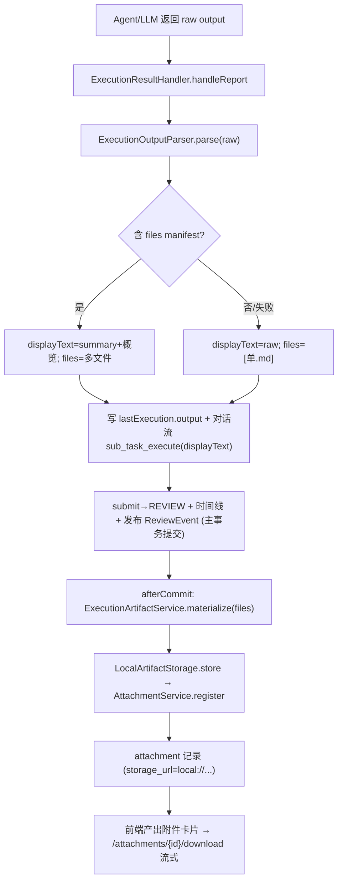

# HelloAI 执行产出物化与结构化多文件产出方案（方案2 / 方案3）

> 编写日期：2026-07-30
> 状态：方案2（执行产出物化）+ 主任务交付物实时聚合 zip 下载已于 2026-07-31 实现（迭代记录 §6.30）；同日后续补齐任务最终整合报告（V32，Planner 整合全部子任务产出，zip 内置顶 `01-最终整合报告.md`，迭代记录 §6.31）；方案3（LLM manifest 结构化多文件协议，§5）已于 2026-08-14 实现（迭代记录 §6.93）：`Manifest`/`ManifestFile` DTO + `ExecutionOutputParser.parse` 扩展（```json 围栏提取 → 多文件物化，未命中无损降级）+ `ParsedOutput(files, displayText)` + `buildUserPrompt` 追加可选 manifest 协议指令 + `ExecutionResultHandler` 挂接 displayText；核验侧同步补内容级核验（§5.4）：`SubTaskReviewServiceImpl.buildAttachmentContent`（每附件 8000 / 总计 24000 字符限额）+ `prompts/subtask-review.md`「## 物化附件内容」节与 `{{ATTACHMENT_CONTENT}}` 占位 + 三者一致性判定规则；e2e `scripts/powershell/verify-artifact-content-review.ps1` 真实环境 PASS=23 FAIL=0 SKIP=1 ALL PASSED
> 目标：把子任务执行产出从"仅纯文本落 `sub_task.context.lastExecution.output`"升级为"真实文件 + attachment 记录 + 前端可下载"，并预留 LLM 结构化多文件产出协议。
> 关联诉求：前端子任务详情页"方案1 前端导出"已交付；本文档规划其后端侧的方案2（产出物化）与方案3（结构化多文件产出）。

---

## 1. 背景与目标

### 1.1 当前问题

子任务执行成功后，执行产出（Agent/LLM 正文）目前只有两个落点：

1. 写进 `sub_task.context.lastExecution.output`（纯文本 JSON 字段）
2. 镜像进执行对话流一条 `sub_task_execute` 消息（供前端详情页展示）

由此带来三个缺口：

- **没有真实文件产物**：`attachment` 表结构齐备，但内置执行链从不写入（唯一写入口是 MCP `uploadArtifact`），全库 0 条附件；前端"附件管理/下载"对内置执行产出无数据可用。
- **只能整段纯文本**：LLM 只被要求"尽量结构化"输出，无法把一次产出拆成多个可独立下载的文件（如 `README.md` + `main.py` + `config.json`）。
- **前端只能前端导出**：方案1 是纯浏览器侧 Blob 导出，未经过后端，不产生可追溯的附件记录。

### 1.2 目标

- **方案2**：执行成功时，把产出物化成后端真实文件，并登记 `attachment` 记录；前端详情页新增"产出附件"卡片可下载。
- **方案3**：升级执行协议，允许 LLM 返回结构化文件清单（manifest），后端据此物化为多个附件；不支持/解析失败时无损降级为方案2 的单文件产出。
- **不破坏现有链路**：产出正文仍照常写 `lastExecution.output` 与对话流；核验链、状态机、时间线均不受影响。
- **保持技术边界**：JDK 17、Spring AI 基线不变；不在 Controller 放编排逻辑；文件物化 best-effort，不阻断 `REVIEW` 提交。

### 1.3 非目标（明确排除）

- 不引入 MinIO/S3 SDK 依赖（本期仅本地文件系统存储，预留抽象接口）。
- 不改 `attachment` 表结构（现有字段足够）。
- 不做附件版本管理、在线预览渲染、断点续传。
- 不改核验 Prompt / 核验链逻辑。

---

## 2. 现状盘点（实现依据）

> 以下为动手前对代码/表结构的实际核对结论，作为方案的事实基线。

### 2.1 执行链回写点

关键类：`helloai-core/.../agent/command/ExecutionResultHandler.java`，方法 `handleReport(ExecutionResultReport)` 是产出的唯一落库点与对话流镜像点：

- 写 `lastExecution` Map（含 `output`）到 `subTask.context` 并 `updateById`。
- 对话流镜像：成功先写 `sub_task_execute_thinking`，再写 `sub_task_execute`（role=assistant, senderType=agent, senderId=agentId）；失败写 `sub_task_execute_failed`。该 try/catch 不阻断主链路。
- 成功分支：`subTaskService.submit(→REVIEW)` + 时间线 `sub_task_execute_submit` + 发布 `SubTaskSubmittedForReviewEvent`。
- 已有 `failureTracker` 采用 `TransactionSynchronizationManager.registerSynchronization` 在 `afterCommit` 执行的范式（规避 `REQUIRES_NEW` 与主事务持有 agent 行锁的自死锁）——**产出物化应复用此 afterCommit 范式**。

### 2.2 执行 Prompt 构造点

关键类：`helloai-core/.../agent/service/SubTaskExecutionService.java`（接口，实现 `agent/service/impl/SubTaskExecutionServiceImpl.java`），方法 `buildUserPrompt(SubTask)`：

- 代码内拼 user prompt（任务标题/描述/交付物/验收标准），末尾追加"请输出交付结果，尽量结构化。"
- `systemPrompt` 当前固定空串。
- **方案3 在此追加"可选 JSON manifest 协议"指令**。

### 2.3 附件体系

- 表 `attachment`（`V1__init_all.sql`）：`sub_task_id`(FK) / `file_name` / `file_type` / `mime_type` / `file_size` / `bucket_name`(默认 `helloai`) / `object_key` / `storage_url` / `preview_url` / `status`(ACTIVE/INACTIVE/DELETED)。
- `helloai-core/.../task/service/AttachmentService.java`（接口，实现 `task/service/impl/AttachmentServiceImpl.java`）：
  - `register(agentId, subTaskId, fileName, mimeType, fileSize, storageUrl)`：强校验 `agentId.equals(subTask.getAssignedAgentId())`。内置链路可传 `assignedAgentId` 满足校验，或新增旁路方法。
  - `detectFileType`（按后缀）/ `detectBucketName` / `detectObjectKey`（解析 `minio://` `s3://` `oss://` 前缀；未知前缀落默认 bucket `helloai`）。
  - `getStorageUrlRequired(id)` 供下载用。
- `helloai-api/.../controller/AttachmentController.java`：`download` 当前是 302 重定向到 `storageUrl`，**本地文件不可下载**，需改造。

### 2.4 对象存储现状

- **Java 侧零对象存储能力**：无 MinioClient/S3Client/StorageService/相关依赖/配置。
- `docker-compose.yml` 有 MinIO 容器（S3 端口 29000，`minioadmin/minioadmin123`），但未被 Java 使用。
- `application.yml` 无任何存储配置段。

### 2.5 前端

- `helloai-ui/src/api/attachment.ts`：仅 `list(subTaskId)` / `getById(id)`。
- `helloai-ui/src/views/subtask/SubTaskDetail.vue`：已有对话流卡片、时间线卡片（5s 轮询）、`agentNameMap`、`downloadText` Blob 工具。
- `request.ts`：`baseURL=/api`，token 通过 `X-Admin-Token` / `Authorization Bearer` 请求头注入——**下载必须走 axios `responseType:'blob'` 以携带 token，不能用裸 `<a href>`**。
- 类型 `Attachment` 接口已存在；`LongId=string|number`（Long 主键保持 string 防 2^53 精度丢失）。

---

## 3. 总体设计

### 3.1 核心思想：方案2 是方案3 的降级形态

统一用一个纯函数解析器把"原始产出 raw"归一化为 `ParsedOutput`：

```
ParsedOutput {
  String displayText;      // 写入 lastExecution.output + 对话流的人类可读正文
  List<ArtifactFile> files;// 需物化的文件（name/mimeType/content）
}
```

- **结构化产出（方案3）**：LLM 返回带 `files` 数组的 manifest → 按清单物化多文件；`displayText = summary + 各文件 section 概览`。
- **纯文本产出（方案2）**：无 manifest → 物化为单个 `.md` 文件；`displayText = 原始正文`。
- **解析失败**：无损降级为纯文本形态（等价方案2）。

好处：物化编排、挂接点、前端展示三处只需实现一次；方案3 只是"解析器能识别出多文件"的增量。

### 3.2 存储后端选型：本地文件系统 + 抽象接口

选本地文件系统存储，理由：单实例开发环境、需本地可验证闭环、无需启 MinIO 容器、可逆（未来加 MinIO 实现只需补一个 `ArtifactStorage` 实现类）。

- `attachment.storage_url` 存 `local://helloai/{objectKey}`。
- 下载 endpoint 判 `local://` 前缀走流式返回；其余（`minio://` 等）保持 302。
- 通过 `helloai.storage` 配置门控（`enabled` / `type=local` / `local.base-dir` / 限额）。

---

## 4. 方案2 详细设计（产出物化）

### 4.1 新增：存储配置属性

`helloai-common/.../config/ArtifactStorageProperties.java`（范式对齐 `DoorbellProperties`：`@Data @Component @ConfigurationProperties`）：

```java
@Data
@Component
@ConfigurationProperties(prefix = "helloai.storage")
public class ArtifactStorageProperties {
    /** 是否启用产出物化（关闭时执行链只写 output/对话流，不生成附件） */
    private boolean enabled = true;
    /** 存储类型：local（本期唯一实现，预留 minio/s3/oss） */
    private String type = "local";
    private Local local = new Local();

    @Data
    public static class Local {
        /** 本地存储根目录（相对启动目录或绝对路径） */
        private String baseDir = "./data/artifacts";
    }

    /** 单次产出最多物化文件数（防 manifest 异常撑爆） */
    private int maxFiles = 20;
    /** 单文件最大字节数（超限截断或跳过） */
    private long maxFileSize = 5 * 1024 * 1024;
    /** 默认 bucket 名（对齐 attachment 表默认值） */
    private String bucket = "helloai";
}
```

对应 `application.yml` 新增段：

```yaml
helloai:
  storage:
    enabled: true
    type: local
    bucket: helloai
    max-files: 20
    max-file-size: 5242880
    local:
      base-dir: ./data/artifacts
```

### 4.2 新增：存储抽象接口与本地实现

`helloai-core/.../system/storage/ArtifactStorage.java`：

```java
public interface ArtifactStorage {
    /** 存储一个文件，返回可持久化到 attachment 的坐标 */
    StoredArtifact store(String bucket, String objectKey, byte[] content);
    /** 按 storageUrl 读取字节（供下载） */
    byte[] load(String storageUrl);
    /** 是否能处理该 storageUrl（如 local:// 前缀） */
    boolean supports(String storageUrl);
}
```

`StoredArtifact { bucket, objectKey, storageUrl, size }`。

`helloai-core/.../system/storage/LocalArtifactStorage.java`（`@Component`，`@ConditionalOnProperty(prefix="helloai.storage", name="type", havingValue="local", matchIfMissing=true)`）：

- `objectKey` 规则：`{subTaskId}/{yyyyMMdd}/{uuid}-{safeFileName}`。
- 实际落盘路径：`{base-dir}/{bucket}/{objectKey}`。
- `storageUrl = "local://" + bucket + "/" + objectKey`。
- **路径穿越防护**：对 `objectKey`/`fileName` 做规范化，拒绝 `..`、绝对路径、非法字符；落盘前校验最终路径必须在 `base-dir` 之下。
- `load`：剥 `local://` 前缀 → 拼回 `base-dir` → 读字节（同样做穿越校验）。

### 4.3 新增：产出解析器（纯函数）

`helloai-core/.../agent/output/ExecutionOutputParser.java`：

```java
ParsedOutput parse(String raw);
```

方案2 阶段实现：无 manifest 识别，直接 `displayText = raw`，`files = [ ArtifactFile("产出.md", "text/markdown", raw) ]`（文件名可取子任务标题清洗后 + `.md`）。方案3 阶段在此扩展 manifest 识别（见 §5）。

`ArtifactFile { name, mimeType, content }`。

### 4.4 新增：物化编排服务

`helloai-core/.../agent/service/ExecutionArtifactService.java`（接口，实现 `agent/service/impl/ExecutionArtifactServiceImpl.java`）：

```java
/** best-effort：物化 files 为 attachment 记录，返回登记成功的附件数；任何异常内部吞掉并记录 warn */
int materialize(SubTask subTask, List<ArtifactFile> files);
```

- 依赖：`ArtifactStorageProperties` + `ArtifactStorage` + `AttachmentService`。
- 门控：`!properties.isEnabled()` 直接返回 0。
- 逐文件：截断/跳过超 `maxFileSize`，最多 `maxFiles` 个；`store` 得 `StoredArtifact` 后调 `AttachmentService.register(subTask.getAssignedAgentId(), subTask.getId(), fileName, mimeType, size, storageUrl)`。
- 说明：因内置链路以 `assignedAgentId` 作为 agentId，满足 `AttachmentService.register` 的归属校验，无需新增旁路；若后续出现 agentId 缺失场景，再补 `registerInternal`。

### 4.5 挂接点：ExecutionResultHandler 成功分支

在 `handleReport` 成功分支：

1. `ParsedOutput parsed = parser.parse(report.getOutput())`（解析失败降级纯文本）。
2. 用 `parsed.displayText` 替代原始 `output` 写 `lastExecution.output` 与对话流 `sub_task_execute` 消息（保证核验与展示读到的是可读正文）。
3. 在 `afterCommit` synchronization 中调用 `artifactService.materialize(subTask, parsed.files)`（best-effort，try/catch，不阻断已提交的 `REVIEW`）。
4. 物化成功可追加一条时间线事件 `sub_task_artifact_materialized`（payload: 文件数），便于前端/审计感知（可选）。

> 注意：物化只写 `attachment` 新行 + 读 `sub_task`，不锁 agent 行，自死锁风险低；仍放 afterCommit 是为了"REVIEW 已成功落库"与"文件产物"解耦，物化失败不回滚业务。

### 4.6 下载改造

`AttachmentService` 新增 `byte[] loadContent(Long id)`：取 `storageUrl` → 选择 `supports` 的 `ArtifactStorage.load`。

`AttachmentController.download` 改造：

- `storageUrl` 以 `local://` 开头 → 流式返回：`Content-Disposition: attachment; filename="{fileName}"` + `Content-Type: {mimeType}` + 字节体。
- 否则保持现有 302 重定向。
- 红线：Controller 仅注入 `AttachmentService`，不注入 Mapper、不写 SQL。

### 4.7 前端

- `attachment.ts` 新增 `download(id)`：`request.get(`/attachments/${id}/download`, { responseType: 'blob' })`，拿到 Blob 后触发浏览器下载（复用 `SubTaskDetail.vue` 已有的 `downloadText`/`URL.createObjectURL` 思路，注意用返回的 `fileName`）。
- `SubTaskDetail.vue` 新增"产出附件"`el-card`：`attachmentApi.list(subTaskId)` 加载列表，展示 `fileName/fileType/fileSize/createTime` + 下载按钮（走 blob，携带 token）；`pollOnce` 中追加 `loadAttachments(id)`。

---

## 5. 方案3 详细设计（结构化多文件产出）

### 5.1 协议：可选 JSON manifest

在 `buildUserPrompt` 末尾追加（不强制，兼容纯文本）：

> 你可以选择用如下 JSON 结构返回多文件产出（放在 ```json 代码块中）；若无需拆分文件，直接输出正文即可：
>
> ```json
> {
>   "summary": "本次产出的简要说明",
>   "files": [
>     { "name": "README.md", "type": "text/markdown", "content": "..." },
>     { "name": "main.py", "type": "text/x-python", "content": "..." }
>   ]
> }
> ```

### 5.2 解析：ExecutionOutputParser 扩展（已实现，2026-08-14）

- 新增 `Manifest`（summary + files）/ `ManifestFile`（name/type/content）record（`agent/output`）；`ExecutionOutputParser.parse` 复用核验链 `SubTaskReviewService.stripToJsonObject` 的代码块围栏剥离思路，尝试从 raw 中提取 ```json 围栏内 JSON 对象。
- 命中且含非空 `files` 数组 → 结构化形态：
  - `files` 逐项映射为 `ArtifactFile`（`name` 缺失用序号兜底；`type` 缺失按后缀推断；`@JsonIgnoreProperties(ignoreUnknown=true)` 容忍多余字段）。
  - `displayText = summary + "## 产出文件概览" + "- {name}" 逐行 + JSON 块之后尾部文本`（EXECUTION_RECORD 回填块保留；不把全部文件内容塞进对话流，避免刷屏；完整内容在附件里）。
- 未命中/`files` 空/JSON 非法 → 降级纯文本形态（§4.3），`displayText = raw`。
- `ParsedOutput` 重构为 `(files, displayText)` 双字段；`ExecutionResultHandler` 注入 parser，物化开启（`helloai.storage.enabled`）时 `lastExecution.output` 与对话流 `sub_task_execute` 写 displayText，关闭时保持原文。

### 5.3 与方案2 的关系

方案3 只改 `ExecutionOutputParser.parse` 一处；`ExecutionArtifactService`、挂接点、下载、前端全部复用方案2 成果。因此实施上**方案2 与方案3 可一次性合并落地**，方案3 不新增文件。已按此落地（2026-08-14，迭代记录 §6.93）。

### 5.4 Reviewer 附件内容级核验（已实现，2026-08-14）

方案2/3 物化后，核验侧同步升级为"内容级核验"——Reviewer 的核验 Prompt 注入可直读物化附件正文，以"声称交付物 ↔ 文件正文 ↔ 验收标准"三者一致性作为判定依据：

- `SubTaskReviewServiceImpl.buildAttachmentContent(subTask)`：按 `sub_task_id` 查 `attachment` 表可直读附件（`isContentLoadable`），逐附件输出 `### {fileName}` 节 + 正文；限额：**每附件 8000 字符**截断并标注、**总计 24000 字符**停止注入后续附件正文；不可直读 / 读取失败 / 为空 → 显式标注"内容不可读/为空"（Reviewer 不得臆断文件内容）。
- `prompts/subtask-review.md` 新增「## 物化附件内容（平台直读，已按限额截断）」节 + `{{ATTACHMENT_CONTENT}}` 占位符（服务端组装时替换）+ 第 10 条判定规则（附件正文与声称结论矛盾 → pass=false 并在 issues 指出差异）。
- 核验 Prompt 在 LLM 调用成功后落库 `conversation_message`（`tool_name='subtask_review_prompt'`），供审计与 e2e 断言。
- 触发前提不变：`dispatch.auto-review-enabled` + REVIEWER/PLANNER agent + `API_KEY_LLM` + `credential_vault` 绑定（owner_type='AGENT'/status='ACTIVE'）；checkEvidence 对非执行密集 + 有 output 直接放行。

---

## 6. 改动清单

### 6.1 新增文件

| 文件 | 模块 | 职责 |
| --- | --- | --- |
| `config/ArtifactStorageProperties.java` | helloai-common | 存储配置属性（helloai.storage） |
| `system/storage/ArtifactStorage.java` | helloai-core | 存储抽象接口 |
| `system/storage/LocalArtifactStorage.java` | helloai-core | 本地文件系统实现 |
| `system/storage/StoredArtifact.java` | helloai-core | 存储坐标 DTO |
| `agent/output/ExecutionOutputParser.java` | helloai-core | 产出解析（纯文本/结构化） |
| `agent/output/ParsedOutput.java` `ArtifactFile.java` | helloai-core | 解析结果 DTO |
| `agent/service/ExecutionArtifactService.java`（接口）+ `agent/service/impl/ExecutionArtifactServiceImpl.java`（实现） | helloai-core | 物化编排 |

### 6.2 修改文件

| 文件 | 改动 |
| --- | --- |
| `agent/command/ExecutionResultHandler.java` | 注入 parser+artifactService；用 displayText 写 output/对话流；afterCommit 物化 |
| `agent/service/SubTaskExecutionService.java` | `buildUserPrompt` 追加可选 manifest 协议 |
| `task/service/AttachmentService.java` | 新增 `loadContent` |
| `controller/AttachmentController.java` | `download` 支持 local:// 流式 |
| `helloai-start/.../application.yml` | 新增 `helloai.storage` 段 |
| `helloai-ui/src/api/attachment.ts` | 新增 `download` |
| `helloai-ui/src/views/subtask/SubTaskDetail.vue` | 新增"产出附件"卡片 + `loadAttachments` |

### 6.3 数据/表

无表结构变更（复用 `attachment`）。

---

## 7. 时序图



---

## 8. 风险与回滚

| 风险 | 缓解 |
| --- | --- |
| 物化失败影响业务提交 | 放 afterCommit + best-effort try/catch，不回滚 REVIEW |
| manifest content 超大撑爆磁盘/内存 | `maxFiles` / `maxFileSize` 限额，超限截断或跳过 |
| 路径穿越写出 base-dir | objectKey/fileName 规范化 + 落盘前路径归属校验 |
| 前端下载丢 token | 强制走 axios `responseType:'blob'` 携带请求头 |
| LLM 乱返 JSON 破坏正文 | 解析失败无损降级纯文本，displayText 始终可读 |
| 与调度重构冲突 | 仅在结果回写末端追加旁路，不改调度/状态机；符合 `调度解耦重构分析` 的"结果异步回流"方向 |

回滚：`helloai.storage.enabled=false` 即可关闭物化（执行链退回仅写 output/对话流），无需回退代码。

---

## 9. 验证计划（实施时执行）

1. `mvn -q -pl helloai-common,helloai-core,helloai-api -am compile` 通过；前端 `vue-tsc` 通过。 ✅（2026-08-14：test-compile + package BUILD SUCCESS）
2. 触发一次真实子任务执行（纯文本产出）→ 断言 `attachment` 新增 1 条 `local://` 记录，前端卡片可下载且内容正确。 ✅（S8 降级回归：单 .md 物化 + output 原样）
3. 构造/诱导一次 manifest 产出 → 断言物化多文件，`displayText` 为 summary+概览，附件各自可下载。 ✅（S6：2 附件 mime/size/minio:// + 下载正文匹配 + displayText 概览无 JSON 泄漏）
4. 关闭 `helloai.storage.enabled` → 断言执行链正常、不产生附件。 ⚠️ 运行中静态配置不可改，由 S8 降级回归（纯文本 → 单 .md）等价替代；关闭验证需重启后端手动执行。
5. 下载接口对非 `local://`（如 mock 的 minio://）仍返回 302。 ✅（§6.77 verify-minio-artifact.sh G3 已覆盖；本轮下载走 `isContentLoadable` 流式分支）
6. 新增 `verify-execution-artifact-e2e.ps1`（遵守 UTF-8 头模板）覆盖上述路径。 ✅ 实际落地为 `scripts/powershell/verify-artifact-content-review.ps1`，真实环境 **PASS=23 FAIL=0 SKIP=1 ALL PASSED**（S7 核验 Prompt 断言：环境无绑定 vault 的 REVIEWER/PLANNER agent 时自检 SKIP 兜底，绑定后自动执行）

---

## 10. 文档回填计划（实施完成后执行）

- `doc/HelloAI_实现差距表.md`：记录"attachment 表从 0 写入 → 内置执行链产出物化"的状态变化，新增方案2/3 对应条目。 ✅（2026-07-31 方案2 条目 + 2026-08-14 方案3/内容级核验条目）
- `doc/log/HelloAI_迭代执行记录.md`：新增一节记录方案2/3 落地（本地存储抽象、manifest 协议、下载改造、前端产出附件卡片）。 ✅（§6.30 方案2 + §6.93 方案3/内容级核验）
- 本设计文档标注为"已实现"并回链迭代记录章节。 ✅（2026-08-14，见头部状态行）

---

## 11. 实施顺序建议（小步闭环）

1. `ArtifactStorageProperties` + `application.yml` 段
2. `ArtifactStorage` / `LocalArtifactStorage` / `StoredArtifact`
3. `ExecutionOutputParser` / `ParsedOutput` / `ArtifactFile`（先纯文本形态）
4. `ExecutionArtifactService`
5. `ExecutionResultHandler` 挂接（displayText + afterCommit 物化）
6. `AttachmentService.loadContent` + `AttachmentController.download` 改造
7. `SubTaskExecutionService.buildUserPrompt` 追加 manifest 协议 + `ExecutionOutputParser` 扩展结构化解析（方案3）
8. 前端 `attachment.ts` + `SubTaskDetail.vue`
9. 编译/前端类型校验 + e2e 脚本验证
10. 文档回填
