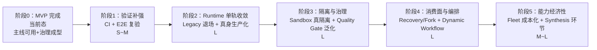

# HelloAI 架构 V2 改造进度与项目质量审计报告

> **审计日期**：2026-09-29
> **审计基线**：工作区 HEAD = `01aaf47`（2026-09-28「修复状态机回滚/并发生成/L3 孤儿巡检三处缺陷」）
> **审计组织**：software-company 专家团（主理人齐活林 · 交付总监 / 架构师 高见远 / QA 工程师 严过关）
> **审计性质**：**只读审计** —— 未修改任何业务代码、配置、迁移文件
> **证据优先级**（依《HelloAI_AI开发协作规约》事实源）：代码与运行行为 > Flyway/库结构 > 可复现验证 > 差距表 > 基线文档 > 历史文档
> **产出**：本报告 + `tmp/v2-review/architect-report.md`（架构师明细）+ `tmp/v2-review/qa-report.md`（QA 明细）
> **后续状态**：§7 建议中的 **S 成本项已于同日全部落地**（CI / JDK 固定 / 架构冻结守卫 / 差距表口径订正 / 漂移补登记），状态登记见 **§9**。

---

## 0. 结论速览（TL;DR）

| # | 问题 | 结论 |
|---|---|---|
| 1 | **V2 改造总进度** | **加权 ≈70%**（P0 75% / P1 80% / P2 55% / P3 15%）。**管道层（契约/事件/八件套）接近收官；语义层（Runtime 成为唯一执行路径）仅 60%** |
| 2 | **是否有偏离** | **是，四类偏离全部成立**：范围偏离（RBAC 扩张，全期峰值提交日属之）、重心偏离（P1 剩余项零推进）、**口径偏离（最重：目标架构自己禁止的「Dual Executor 永久双轨」正是当前生产态）**、文档-实现漂移（2 处） |
| 3 | **V2 还差哪些** | **阻断项 5 项**：Runtime 单轨收敛+Legacy 退场 / Sandbox 真实隔离 / Event Recovery·Fork / Quality Gate 统一决策 / Agent Fleet 成本观测。重要 4 项、可延后 5 项 |
| 4 | **最大工程风险** | **零 CI**（无 `.github/workflows` / `.gitlab-ci.yml` / `Jenkinsfile`）——所有「单测全绿」靠人工执行，且根 POM 默认 `skipTests=true`（**默认跑 0 用例的假绿陷阱**） |
| 5 | **MVP 定性** | **可称「V2 的 MVP 完成」，但边界是「A2A 协作主线 + 单机/小规模异构 Agent 编排」**；距 V2 目标态**还差 5 个阶段** |

**一句话**：HelloAI 的**业务主线端到端可用、可靠性治理成型**，但**架构收敛性目标（唯一执行路径 / 隔离 / 治理 / 消费面完整）尚未达成**；当前最短板不是功能，而是**验证与工程化基础设施**。

---

## 1. 项目现状画像（代码事实）

### 1.1 规模与技术栈

| 模块 | main 源文件 | 测试类 | `@Test` 方法 | 备注 |
|---|---|---|---|---|
| helloai-core | 450 | 150 | 1598 | 领域主体，~10.6 用例/类 |
| helloai-api | 146 | 13 | 70 | 40 个 Controller |
| helloai-job | 21 | 11 | 85 | 测试密度最高 |
| helloai-common | 61 | **0** | 0 | 含全部配置 Properties / 常量 / 加密服务 |
| helloai-mq | 5 | **0** | 0 | 幂等消费 / 死信关键路径 |
| helloai-start | 10 | 0 | 0 | 装配层 |
| helloai-ui | — | **0** | 0 | 36 个 views，无前端测试框架 |

技术栈：JDK 17 / Spring Boot 3.4.x / Spring AI 1.1.x / PostgreSQL 16 / Redis 7 / RabbitMQ / Flyway / MyBatis-Plus 3.5.12 / Vue 3 + TS + Element Plus。

Flyway 迁移 **85 个**（V1,V2,V13~V95；**V3~V12 缺号**，为历史合并所致）。

### 1.2 结构与耦合

| 项 | 实测 |
|---|---|
| core 顶层域 | 仅 7 个：agent / dlx / planner / review / shared / system / task |
| runtime 实现位置 | `com.helloai.core.agent.runtime`（19 类）——**归属 agent 域，未独立成域** |
| 跨域反向依赖 | agent → task **68 处**；planner → agent **34 处** |
| 架构约束手段 | **无 ArchUnit**；仅 `scripts/powershell/verify-dependency-direction.ps1`（且该脚本**不禁止** agent→task），靠《CODE_STYLE》§6.1 文档豁免 |
| 最大源文件（上帝类） | `RequirementClarifyServiceImpl` **1547** / `SubTaskServiceImpl` **1310** / `McpToolServiceImpl` **1108** / `SubTaskExecutionServiceImpl` 905 / `TaskFinalReportServiceImpl` 850 |

### 1.3 开发活跃度（git，按日提交数）

```text
8/13~8/31   ████████████████  4~17 次/天（持续高强度）
9/4~9/13    ██████████████████  峰值区（17/14/28/9/13/9/13/10/4/34）
9/13        ███████████████████████████████████  34 次 ← 全期峰值（RBAC 批次四）
9/14 之后   ▏  断崖（8 → 1 → 1 → 1 → 6）
9/15~9/27   ·  近乎停滞（仅 9/16、9/21、9/24 各 1 次）
```

**判读**：项目在 9/13~9/14 达到一个自然收敛点（MVP 完成），此后转为**问题驱动的稀疏维护**。

---

## 2. 架构 V2 改造进度

### 2.1 P0~P3 完成度

| 优先级 | 目标态要求 | 实际落地 | 完成度 |
|---|---|---|---|
| **P0** | 统一事件契约；Runtime 成为**唯一执行契约**；八件套落地；外部通道同口径 | Event Stream 全链闭环；**契约层单轨**但 Runtime 真身**默认关闭**；八件套契约全落地；外部通道代码级修复但 **E2E 全 NOT RUN** | **≈75%**（管道 90% / 生产可用性 55%） |
| **P1** | Skill 元数据全量 + 真实任务行使；Sandbox 契约；Replay/Audit；**Recovery/Fork**；RBAC 收口 | Skill 元数据+联动+真实任务实测 ✅；**Sandbox 仅契约无隔离**；Replay/Audit ✅ **Recovery/Fork 未建**；Planner/需求包 ✅；RBAC 四批次 ✅；报告整合 ✅；附件 ✅ | **≈80%** |
| **P2** | Quality Gate 统一决策；Agent Fleet 能力化选人 | Quality Gate **未做**；Agent Fleet 有技能硬门槛+排序，但 **tokens=null（成本观测盲区）**；RBAC ✅ | **≈55%** |
| **P3** | Dynamic Workflow（动态分支/运行期编排） | **未做**（仅模板+实例化+DAG） | **≈15%** |

> **加权总体完成度 ≈ 70%**（权重 4:3:2:1 → `0.75×0.4 + 0.80×0.3 + 0.55×0.2 + 0.15×0.1 ≈ 0.705`）

### 2.2 G-001~G-017 逐项矩阵

| ID | 能力 | 完成度 | 关键证据 |
|---|---|---|---|
| G-001 | Event Stream | **100%** | `AgentEventType.java:22-37`（16 类）；`AgentEventController.java:51/64/77/90`（4 端点） |
| G-002 | Executor 迁移 | **60%** ⚠️ | `AgentExecutionProperties.java:76`=false；`application.yml:196`=false；`LegacyExecutorAdapter` 恒注册 |
| G-003 | AgentRuntime | **95%** | `agent/runtime/` 19 类 + `loop/` + `sandbox/` |
| G-004 | Skill Capability | **85%** | 元数据层 + requiredTools 联动 + 真实任务实测；**Instructions 结构化未做（N5）** |
| G-005 | Sandbox Provider | **25%** | `EnvironmentSandboxProvider.java:23`「一律不标 ISOLATED」 |
| G-006 | Replay / Audit | **70%** | 读侧+API+UI 工作台 ✅；**Recovery/Fork 未建**（消费面缺 2/4） |
| G-007 | Quality Gate | **20%** | 无 `QualityGate` 类；仅报告场景局部机械门 |
| G-008 | Agent Fleet Routing | **50%** | 选人机制已实证；**tokens 未回传** |
| G-009 | Dynamic Workflow | **15%** | 后置 |
| G-010 | Planner 能力感知 | **90%** | S1~S4 + 真实任务实测 |
| G-011 | 需求包/不确定性 | **90%** | S1~S5 + 双轮外部链闭环 |
| G-012 | 登录鉴权 RBAC | **95%** | 底座 + 闭环 |
| G-013 | 基础架构深化 | **95%** | 批次一~四 |
| G-014 | 外部 Agent 通道修复 | **80%（代码）/ 40%（验证）** ⚠️ | 代码 T01~T08 + T04b + T08b 均在位；**E2E 全 NOT RUN** |
| G-015 | 心跳/重派止血 | **75%（代码）/ 35%（验证）** ⚠️ | B1~B4 代码在位；**E2E 与生产复测 NOT RUN** |
| G-016 | 报告整合质量 | **80%** | 阶段二~四 + §12.5 三级容错；**遗留 #4/#5 未修** |
| G-017 | 附件存储一致性 | **75%** | 存储抽象 + 对账巡检；**R7 MinIO 默认凭据待处置** |

### 2.3 关键结论

> **P0 的「已完成」是管道语义上的，不是目标语义上的。**
> 目标架构要求「Runtime 成为唯一执行契约，**旧实现退出**」；实际 `LegacyExecutorAdapter` 恒注册且是**生产默认路径**。
> 差距表状态列已诚实写「默认 Legacy 零变化」，但处置列标「**P0 主线收官 + 真灰度闭环**」，且原文列了「旧实现退出」——**目标与现状自相矛盾且未显式承认**。

---

## 3. 偏离判定

### 3.1 范围偏离（scope creep）—— **成立**

| 证据 | 说明 |
|---|---|
| §12 系 2026-09-12 **新增**章节 | 原 V2 五层（Planning/Orchestration/Runtime/Capability/Provider）**不含 RBAC** |
| 自我声明「与五层正交不冲突」 | `目标架构.md:343-345` |
| 实际消耗全期峰值提交 | **9/13 = 34 次**（全期最高单日）来自 RBAC 批次四 |
| 迁移量占比 | V77~V93 共 **17 个迁移**，占全部 85 个的 **20%** |
| 起点与结果不符 | G-012 标 **P2**、G-013 标 **P1**，实际演化为独立四批次专项 |

**架构师独立判断（不接受「完全正交」）**：

1. **「正交」是理想化的自我声明，非可验证的架构事实**。RBAC 虽不改 Event/状态机，但它：
   - **改写了请求入口的守门语义** —— `AdminOnlyInterceptor` 在 BASE-4.3 后改为「仅判 `StpUtil.isLogin()`」，`CODE_STYLE §43`（`/api/admin/**` 必须经 Admin 授权）被**就地修订**。这是跨切面语义变更，不是「零触碰」。
   - **改动了外部 Agent 通道的边界判定**（`McpAuthFilter` / `AuthInterceptor` 旁路口径），与 Capability/Provider 层有交集。
2. **边界扩张消耗了 V2 主线时间**：9/12~9/13 峰值提交在 RBAC，同期 P1 剩余项**零推进**。
3. 结论：「正交」在**文档层**成立，在**工程关注点层**不成立——二者共享同一请求链路与鉴权切面。

**建议**：把 §12 明确定义为「**非业务五层的支撑底座（foundation）**」而非「与五层正交的第六层」，并把「守门语义变更需回归五层契约」写入红线。

### 3.2 重心偏离 —— **部分成立**

| 日期 | 功能线 | 归属判定 |
|---|---|---|
| 9/13 | 联网搜索三连升级（博查 AI Search + answer 总结 + Deep Research 补搜） | ⚠️ **业务增强，未在任何 GAP 编号登记** |
| 9/13 | 澄清全流式 | 业务增强 |
| 9/14 | 放弃会话 500 修复（jsonb TypeHandler） | 缺陷清偿 |
| 9/14 | README 定位重构（A2A） | 宣传口径 |
| 9/24 | G-014 外部 Agent 通道修复（P0） | ✅ 主线缺陷清偿 |
| 9/26 | G-015 心跳/重派止血（P0/B1~B4） | ✅ 主线缺陷清偿 |
| 9/28 | G-016 报告整合质量（P1） | ✅ 主线缺陷清偿 |
| 9/28 | G-017 附件存储一致性（P1） | ✅ 主线缺陷清偿 |

**判读**：
- **合理性占主导**：9/24~9/28 的 G-014/015/016/017 **全是差距表登记的 P0/P1 主线项**，且都是**生产实测暴露的真实事故**（外部 Agent 被判离线→在飞任务重派→死信→DAG 级联卡死；附件 40.8% 悬空；报告卡「审核中」）。不修则 MVP 不可用。
- **但确有主线欠账**：P1 剩余的 **Sandbox 隔离 / Recovery·Fork / Quality Gate / Agent Fleet**，9/14 后**零推进**。
- **更早的一次未登记漂移**：**9/13 的联网搜索三连升级**——在 P1 剩余项未动的情况下投入业务增强，当时**未登记任何 GAP 编号**（G-008 后来才补记 web_search 能力目录化）。

**关键**：从**主线进度**看是失焦，从**可用性**看是必要清偿。**两者都成立**——取决于是否承认「MVP 可用性优先级高于 P1 剩余项」。**这一取舍当前未在文档中显式声明**，建议补登记。

### 3.3 口径偏离（最重要）—— **成立：名义完成、实质未完成**

**c-1. G-002 的口径问题**

| 事实 | 证据 |
|---|---|
| `runtimeEnabled` 默认 false | `AgentExecutionProperties.java:76` |
| yml 亦 false | `application.yml:196` |
| Legacy 恒注册 | `LegacyExecutorAdapter.java:33`（`@Order(2)`） |
| 真身需 ctx 带 chatModel 才点亮 | `RuntimeAgentRuntimeRouter.java:40-42` |
| 消费侧不注入 chatModel | 实施计划 §3 灰度口径：`LocalExecutionCommandConsumer` 构造 AgentContext **不注入 chatModel/prompt** → **恒回落 Legacy** |
| `v2-enabled: true` 但**代码零读取** | `application.yml:117-121` |

**定性**：**「诚实登记但易误读」+「名义完成、实质未完成」的叠加**
- 诚实面：状态列如实写了「默认 Legacy 零变化」；
- 误导面：处置列「主线收官 + 真灰度闭环」+ 目标列「旧实现退出」制造已完成印象。**「真灰度」是 9/8 一次性联调后回滚，非持续运行态**。

**判定**：G-002 应标为「**契约层收官（60%）/ 生产态未收敛**」，而非「P0 主线收官」。

**c-2. 验证强度不足的完成声明统计**

| 强度 | 定义 | 项 |
|---|---|---|
| S1 生产实测 | 生产/等价环境端到端跑通 | G-002 dev 灰度（**已回滚关闭**） |
| S2 单测 + 等价断言 | 单测全绿 + 手工 curl/浏览器替代 E2E | G-012 / G-013 / G-016 / G-017 |
| S3 单测 only（E2E 明确 NOT RUN） | 仅单测 | **G-014 / G-015** |

- `NOT RUN` 全 doc 计 **24 处**（分散在 log 13 / 差距表 4 / 协约 2 / 实施计划 1 / 项目介绍 1 / 设计文档 2）。
- 「**NOT RUN + 等价断言 PASS**」这类记录出现在 **G-012/G-013/G-014/G-015 至少 4 处**——等价断言是手工抽验，覆盖面远小于脚本化 E2E，却记 PASS。
- **9/14 后的完成声明中，无一达到 S1 持续生产实测水平。**

**c-3. 最有说服力的自证案例**

> G-016 §12.5 宣称「**core+job 全量 1686 用例 0 失败 PASS**」，**之后代码审查仍查出 5 项缺陷**，其中 #1（状态机缺 `FAILED→DONE` 迁移 + 断言在 CAS 之后）是**确定性回归**，会导致「FAILED 且 prev 非空点『恢复上一版』返回 500 且库已静默改」。
>
> **「单测 PASS」与「无缺陷」之间存在已被实证的鸿沟。**

### 3.4 文档-实现漂移 —— **发现 2 处实质不一致**

**❌ 不一致 #1：G-014 的 T04b —— 差距表说「未做」，代码证明「已做」**

| 证据源 | 表述 |
|---|---|
| 差距表 `实现差距表.md:29` | 「**未做（挂起）**：T04b 附件读端**归属授权**……任意有效 Agent Key 可读他人子任务附件正文」 |
| **代码** `AttachmentController.java:124-146` | `assertSubTaskReadable(...)` → 非归属者 `BizException(403)`；四端点（行 52/65/79/106）全部接线 |
| **代码** `SubTaskController.java:113/129` | `listTimeline` / `listConversation` 均调 `assertSubTaskReadableByAgent` |
| **测试** `AttachmentControllerAuthScopeTest.java` | 3 例（平台账号放行 / 归属者放行 / 非归属者 403） |
| 日志 `log/2026-09.md`（9/24 T04b） | **已完成** |
| 复核文档 `HelloAI_外部Agent_v3反馈代码级复核.md:12` | 「P1-4-b 附件读端与越权拦截 ✅ 已修并经真实验证」 |

**结论**：**T04b 实际已完成且已有单测+三方背书**；差距表「未做」是**过期残留**。
> ⚠️ 影响：任何依据差距表评估安全状态的审计者都会**误判存在越权读漏洞**。**安全本体已闭环，文档可信度受损。**

**❌ 不一致 #2：G-014 的 T08b —— 差距表说「未做」，代码证明「部分已做」**

`helloai-core/src/main/resources/onboarding/executor/guide.md` 含 `startSubTask` **9 处**（返工出口文档已同步），log 9/24 记「T08b 文档一致性已完成」。差距表未同步。
（注：G-015 行的 B4.1/B4.5 文档同步**确为未做**，与 T08b 是不同范围。）

**其他数字订正**

| 项 | 文档声称 | 实测 | 判定 |
|---|---|---|---|
| `@SaCheckPermission` 覆盖 | 131 处 / 23 控制器 | **144 处** | 文档滞后 |
| 脚本数量 | 401 个 | **git-tracked 仅 103 个**（余 298 为未跟踪的 jar/class/log 产物） | 「401」**高估治理成本约 4 倍** |

---

## 4. V2 还差哪些

> 工作量：**S** ≤1 人周 / **M** = 1~3 人周 / **L** ≥3 人周

### 4.1 ① 阻断项（不完成则 V2 不成立）

| # | 差距 | 当前证据 | 量 | 风险 |
|---|---|---|---|---|
| **B1** | **Runtime 单轨收敛 + Legacy 退场** | `runtimeEnabled=false`；`LegacyExecutorAdapter` 恒注册；`RuntimeTurnExecutor.java:65` 硬校验 subTaskId/agentId/chatModel/prompt，消费侧不注入 | **L** | **高**：切真身=改生产执行路径；真身 loop **无每轮 checkpoint**（Loop 级失败即整体失败）；tokens 不统计 |
| **B2** | **Sandbox 真实隔离**（文件/网络/进程/资源/凭证五边界） | `EnvironmentSandboxProvider.java:23`「一律不标 ISOLATED」 | **L** | **高**：五边界缺一即非隔离；Credential Boundary 涉密 |
| **B3** | **Event 消费面 Recovery / Fork** | 仅有 `dlx/DeadLetterRecoveryService`（属**命令链**非 Event 消费面） | **M~L** | 中：Recovery 需与状态机/幂等对齐，避免重复副作用 |
| **B4** | **Quality Gate 统一决策**（Rule+Test+LLM） | G-007 未做；仅报告场景局部机械门 | **M~L** | 中：避免为报告单开一套判定 |
| **B5** | **Agent Fleet 能力化选人 + 成本观测（tokens 回传）** | 外部 `tokens=null`；Runtime 不统计 usage | **M** | 中：成本盲区导致选人无成本维度 |

### 4.2 ② 重要但有替代路径

| # | 差距 | 量 | 风险 |
|---|---|---|---|
| I1 | Skill Instructions 结构化（N5）——**属约定反转**，需走架构变更流程 | S~M | 低（Markdown 可作替代） |
| I2 | 技能回流贡献规范（D5-3）——校验脚本已交付，规范未写 | S | 低 |
| I3 | Dynamic Workflow（G-009） | L | 中（P3，目标架构允许后置） |
| I4 | 报告「整合」独立环节（SYNTHESIZER 角色 / Synthesis 阶段） | M~L | 中：报告质量封顶 ≈85 |

### 4.3 ③ 可延后

| # | 差距 | 量 |
|---|---|---|
| D1 | **N1~N6 六项后置**（分章 map-reduce / SYNTHESIZER / 同步 LLM 迁入 Runtime / 通用 Quality Gate / Instructions / final_report 注册 attachment）——**全部未做** | L（合计） |
| D2 | G-016 §12.5 遗留 #4/#5（#4 `AFTER_COMMIT` 未声明 `REQUIRES_NEW`；#5 L2 抢锁失败误 ACK） | S~M |
| D3 | G-017 R7（MinIO 默认凭据 + 端口暴露，运维侧） | S |
| D4 | 架构债：上帝类拆分 / agent→task 解耦 / runtime 独立成域 | L |

### 4.4 从 MVP 到 V2 目标态：还差 5 个阶段



- **阶段 1（验证补强）是当下最短路径且最应优先** —— 无 CI、E2E 大批 NOT RUN 的情况下，任何后续收敛都**缺乏安全网**。
- **阶段 2（Runtime 单轨收敛）是 V2 的「语义完成」分水岭** —— 决定 V2 是「换名的双轨」还是「真正的架构收敛」。

---

## 5. 项目质量评估

### 5.1 测试体系结构：**重单测、轻（几近缺失）集成**

| 层 | 数量 | 证据 |
|---|---|---|
| Spring 上下文测试 | **仅 1~2 个** | `ResilientDispatcherAopIntegrationTest.java:66`（+ `ResilientDispatcherTest`） |
| 该「集成测试」是否真集成 | **否** | 同文件 `:79-94` 连挂 **6 个 `@MockBean`** + `MinimalTestConfig`，**无真实 DB** |
| 真实 DB/Redis/MQ 集成测试 | **0** | `grep Testcontainers\|h2database\|EmbeddedRedis` → **0** |
| Mock 化纯单测 | **112 / 150** core 测试类（**74.7%**） | `grep -rlE "Mockito\|mock\("` |
| 前端行为测试 | **0** | `helloai-ui/package.json` 无 test 脚本，无 vitest/jest |

> **与规约的背离**：`CODE_STYLE.md:2638-2649` §47.2 明确要求「数据库/Redis/MQ/Spring Bean/事务/Mapper 用集成测试」——**全项目没有一个真正连 DB 的集成测试**。

**抽查 5 个测试文件的评价**（断言强度 / 行为 vs 实现 / mock 滥用 / 空转）：

| 文件 | 评价 |
|---|---|
| `AgentHealthCheckTaskTest`（job） | **优秀**——`ArgumentCaptor` 断言 cutoff 落在 29~31 分窗口；且**主动标注免责**（`:479-482` 声明 SQL 时间窗口由 SQL 承担，mock 构造不出，记 NOT RUN） |
| `SubTaskStateMachineTest`（core） | **优秀**——状态迁移表逐条断言，无 mock |
| `RequirementPackageParserTest`（core） | **优秀**——含 null/类型错/元素混杂降级 + 键空间隔离 |
| `AgentEventControllerTest`（api） | 良好——`verifyNoMoreInteractions`，但偏参数透传/实现细节面 |
| `AttachmentControllerAuthScopeTest`（api） | **优秀**——越权边界三态断言 |

> **下限较高**：全仓**无「断言空转」**（`@Test` 却无 assert 的文件 = 0）、`@Disabled` = 0。**问题不在单个测试写法，而在分层缺失与模块空白。**

### 5.2 验证有效性分级（按 G-001~G-017 主结论）

- **A** = 真实端到端（Docker + 真实 DB + 浏览器）→ 约 **35%**（集中在早期 P0 与 G-012/G-013）
- **B** = 服务级集成（Spring 上下文 + 真实 DB/Redis/MQ）→ **0%**
- **C** = 纯单测 + mock → 约 **53%**
- **D** = 仅编译通过 / 等价断言 / 文档声明 → 约 **12%**

> **核心结论**：验证强度集中 C 级，**B 级为 0**；**最近交付的 4 个高风险项（G-014~G-017）全部停留在 C 级**。

### 5.3 高风险项验证强度逐项核查

| 项 | 内容 | 文档状态 | 实际强度 | 判定 |
|---|---|---|---|---|
| G-014 T04b | 附件读端归属授权（越权读） | 差距表标**「未做」** | **代码已修** + 单测 | ⚠️ **文档漂移**（安全本体已闭环） |
| G-015 | 心跳重派止血 | 「E2E 与生产复测 NOT RUN」 | **C 级** | 最关键的「宽限 cutoff 是否真按 SQL 过滤」**未验证** |
| G-016 | 报告审查链三级容错 | 「1686 用例 0 失败」 | **C 级**（`FinalReportPersistService` 被整体 mock） | 「写回/Outbox/事件三者原子」属 **D 级声明** |
| G-017 | 附件存储对账 | 「72 用例 0 失败」 | **C 级** | 真实桶对账（悬空/孤儿/字节不符）**无集成证据** |

### 5.4 未验证风险清单（NOT RUN 归因）

| # | 未执行验证 | 覆盖的风险 | 严重度 |
|---|---|---|---|
| R1 | `verify-*` 系列（admin-authz / dependency-direction / ui-sync / contract-first） | 越权、依赖倒置、前后端路径不同步、DTO 泄漏实体 | **P1** |
| R2 | G-014 E2E（deps-context / tool-matrix / mcp-e2e / agenthub-duty） | 外部 Agent 依赖门禁、13 工具矩阵、MCP 全链、租约在线语义 | **P0** |
| R3 | G-015 心跳/重派 E2E 与生产复测 | **止血是否真生效** | **P0** |
| R4 | G-016 审查异步链 | L1/L2/L3 是否真收敛、无重复审查/无丢事件 | **P1** |
| R5 | G-017 真实桶对账 | 悬空/孤儿/字节不符是否真被检出 | **P1** |
| R6 | RBAC 四角色差异 E2E | 71 动作码授权差异是否真落地 | **P1** |

> **R2/R3 属 P0 且当前完全无 A/B 级证据** —— 「外部 Agent 通道修复」与「心跳重派止血」两项**只有 mock 单测背书**，真实并发/时序行为在证据上处于**空白**。

### 5.5 实测：可构建性与可测试性

| 项 | 命令 | 结果 |
|---|---|---|
| 离线编译（默认 JDK） | `mvn -o -pl helloai-common,helloai-core -am -DskipTests compile` | ❌ JVM **EXCEPTION_ACCESS_VIOLATION**（`jre 17.0.19+10`） |
| 离线编译（换 JDK） | `JAVA_HOME=…ms-17.0.20.1 …` | ✅ **BUILD SUCCESS**，34.5s |
| 单测执行 | `-DskipTests=false -Dtest=SubTaskStateMachineTest test` | ✅ `Tests run: 12, Failures: 0, Errors: 0` |

**关键发现**：
1. **项目默认 `JAVA_HOME=ms-17.0.19` 在本机必然 JVM 崩溃** → 这是「本机无法验证」的**直接技术根因**（且**可一键切换修复**）。
2. **根 POM `pom.xml:42-43` 默认 `<skipTests>true</skipTests>`** → **默认 `mvn test` 跑 0 个用例**。文档中「1686 用例」必须显式加 `-DskipTests=false` 才能复现。**这是一个极易误判的「假绿陷阱」。**

### 5.6 质量风险清单（按严重度）

| 级别 | 风险 | 证据 |
|---|---|---|
| **P0** | **无任何 CI** | 无 `.github/workflows` / `.gitlab-ci.yml` / `Jenkinsfile`；所有「单测全绿」靠人工执行 |
| **P0** | **可靠性关键路径无真实集成验证** | 幂等消费/死信/心跳重派/Outbox 事务仅 mock 单测；0 Testcontainers |
| **P0** | **默认 JDK 导致「不可验证」被长期接受** | `ms-17.0.19` 必崩，24 处 NOT RUN 归因于此 |
| **P0** | **E2E 验证缺口（R2/R3）** | 外部 Agent 通道 + 心跳止血**零 A/B 级证据** |
| **P1** | **文档-实现漂移** | G-014 T04b 代码已修、差距表仍标「未做」 |
| **P1** | **架构红线无编译期保障** | 0 ArchUnit；仅 1 个本机不可运行的 ps1；且该脚本**不禁止** agent→task |
| **P1** | **Legacy + Runtime 双轨长期并存** | 双轨自 9/7 建立，**22 天未收敛**；命中目标架构 §11 非目标 |
| **P1** | **上帝类** | 1547 / 1310 / 1108 行 |
| **P1** | **前端零自动化测试** | 仅 type-check，交互/逻辑缺陷无拦截 |
| **P1** | **迁移演化风险** | 85 个迁移，含 **不可逆 `DROP TABLE`（V85）/ `DROP COLUMN`（V87）**；无迁移基线快照 |
| **P2** | 脚本治理 | 跟踪 **103** 个（76 ps1 + 24 sh + 1 sql + 1 md + 1 java）；另有 298 个 jar/class/log 为**未跟踪**构建产物，已被根 `.gitignore`（`*.jar` / `*.class` / `*.log`）覆盖——**「二进制入库」不成立**（本行 2026-09-29 订正，原表述有误） |
| **P2** | 模块测试空白 | common 61 类 / mq 5 类无模块自有测试 |
| **P2** | 事务语义未被验证 | 测试树 `@Transactional` 仅 2 个文件 |
| **P2** | 技术债不可被工具发现 | 全 main java 仅 **1 处** TODO/FIXME（走文档登记制，优点是零垃圾，风险是**债务全靠人读文档**） |

---

## 6. MVP 定性

> **可以称为「V2 架构改造的 MVP 完成」，但必须以「A2A 协作主线 + 单机/小规模异构 Agent 编排」为边界，且必须承认它不是 V2 目标态。**
>
> 更准确的说法：**「V2 主线（Planner → Scheduler → 异构 Agent → Review → 报告）端到端可用 + 可靠性治理成型；但目标架构的收敛性目标（唯一执行路径 / 隔离 / 治理 / 消费面完整）尚未达成。」**

**属于 MVP 内（已达成）**：需求澄清→需求包→能力感知拆解→子任务契约 ✅ / 分布式调度 + 异构 Agent 接入 ✅ / 统一 Event Stream + Replay·Audit ✅ / 子任务状态机 + Review 返工闭环 ✅ / 可靠性治理（Outbox·DLQ·Lease·Heartbeat·Reconcile·三级容错）✅ / RBAC + 管理面 ✅ / 最终报告生成+审查+版本回滚 ✅ / 产物存储+对账 ✅

**不属于 MVP（属 V2 目标态，未达成）**：Runtime 真身成为生产唯一执行路径 ❌ / Sandbox 真实隔离 ❌ / Event Recovery·Fork ❌ / 通用 Quality Gate ❌ / Agent Fleet 成本观测 ❌ / Dynamic Workflow ❌ / 报告「整合」独立角色 ❌ / N1~N6 ❌

---

## 7. 建议行动（按优先级）

| # | 行动 | 成本 | 收益 | 关联 |
|---|---|---|---|---|
| 1 | **建立 CI**（`mvn -B verify` + 前端 `type-check && build`），并把「用例数 >0」设为门禁 | S | **最高**——当前最大工程成熟度缺口；杜绝「零用例假绿」 | P0 |
| 2 | **固定 `JAVA_HOME=ms-17.0.20.1`**（写入 CI / wrapper / README） | S | 直接消除「JVM 崩溃」类 NOT RUN，恢复本机编译+单测能力 | P0 |
| 3 | **修正差距表两处过期登记**（G-014 T04b/T08b）+ 订正 `@SaCheckPermission`=144、脚本=103 | S | 恢复文档作为事实源的可信度 | P1 |
| 4 | **显式承认 G-002 现状**：改标「契约层收官 60% / 生产态未收敛」，并为双轨设**明确收敛时点**（或登记 WONTFIX 并撤销「旧实现退出」目标） | S | 消除目标与现状的自相矛盾 | P1 |
| 5 | **引入 Testcontainers**（PG+Redis+RabbitMQ）补 B 级集成：幂等消费 / Outbox 事务边界 / 状态机 CAS / 迁移全量 apply | L | 把可靠性关键路径从 C 级提到 B 级，CI 内可回归 | P0 |
| 6 | **补 R2/R3 的 E2E 证据**（外部 Agent 通道 + 心跳止血） | M | 闭环两个 P0 项的验证空白 | P0 |
| 7 | **引入 ArchUnit** 替代不可运行的 ps1；对 agent→task 设「只降不升」阈值 | M | 架构红线自动拦截 | P1 |
| 8 | **上帝类拆分**（`RequirementClarifyServiceImpl` 优先按「澄清轮/终稿轮/package 装配/搜索编排」拆分） | L | 降低变更风险、提升可测性 | P1 |
| 9 | **补登记 9/13 联网搜索的范围漂移** + 显式声明「MVP 可用性优先于 P1 剩余项」的取舍 | S | 让重心偏离成为**已决策**而非**未察觉** | P1 |
| 10 | **前端引入 Vitest**（先覆盖 store/utils/paths/request 拦截器） | M | 前端从 0 行为测试起步 | P2 |

---

## 8. 审计方法与局限

**方法**：文档-代码对照审计。主理人前置勘察（模块规模 / 活跃度 / 结构）→ 两位成员独立深挖（架构师 17 项逐条核验 + 文档一致性抽查；QA 5 个测试文件实读 + 最小构建实测）→ 主理人对成员的关键反驳结论**逐条独立复核**。

**已复核确认的成员结论**（复核方式：命令直查）

| 成员论断 | 复核结果 |
|---|---|
| T04b 代码已实现 | ✅ `AttachmentController.java:141/146` 有 403 归属校验 |
| 无任何 CI | ✅ 三个 CI 配置文件均不存在 |
| `@SaCheckPermission` = 144 | ✅ 实测 144 |
| 脚本跟踪 103 / 磁盘 401 | ✅ 103 / 401 |
| `skipTests=true` | ✅ `pom.xml:42-43` |
| 0 Testcontainers / Mockito 112-150 | ✅ 实测一致 |
| 迁移缺号 V3~V12 | ✅ 实测确认 |

**局限与未确认项**：

1. **本机无 Docker / 无 PG 客户端** → 所有 E2E 与真实 DB 集成**在本机不可复现**，相关结论沿用文档登记（NOT RUN 状态本身已被证实）。
2. **未跑全量测试**（1686 用例耗时长，且违反审计红线）→ 「core 全量 0 失败」这一文档声称**未被本次独立验证**，仅验证了单类 12 例通过。
3. **测试覆盖率无量化数据** → 项目未接入 JaCoCo 等覆盖率工具，**无法给出精确覆盖率**；本报告以「分层结构 + 抽查质量」替代。
4. `@SpringBootTest` 文件数存在 **1~2 的统计口径差**（架构师记 1，主理人实测 2：`ResilientDispatcherAopIntegrationTest` + `ResilientDispatcherTest`）——不影响结论（均为重度 mock、无真实 DB）。

---

## 附：证据索引

| 证据 | 位置 |
|---|---|
| `runtimeEnabled` 默认 false | `helloai-common/.../config/AgentExecutionProperties.java:76` |
| yml `runtime-enabled: false` / `v2-enabled: true`(不读) | `helloai-start/src/main/resources/application.yml:196` / `:117-121` |
| Router 驱动性判断 | `helloai-core/.../agent/runtime/RuntimeAgentRuntimeRouter.java:40-42` |
| Legacy 恒注册 `@Order(2)` | `helloai-core/.../agent/runtime/LegacyExecutorAdapter.java:33` |
| Sandbox 无 ISOLATED | `.../runtime/sandbox/impl/EnvironmentSandboxProvider.java:23/46`；`SandboxProvider.java:8` |
| Event 四端点 | `helloai-api/.../controller/AgentEventController.java:51/64/77/90` |
| 16 事件类型 | `helloai-common/.../constant/AgentEventType.java:22-37` |
| T04b 已实现 | `helloai-api/.../controller/AttachmentController.java:124-146`；`SubTaskController.java:113/129`；`AttachmentControllerAuthScopeTest.java` |
| T08b 已做 | `helloai-core/src/main/resources/onboarding/executor/guide.md`（startSubTask ×9） |
| 默认跳过测试 | `pom.xml:42-43` |
| 依赖方向脚本白名单 | `scripts/powershell/verify-dependency-direction.ps1:51-60` |
| CODE_STYLE agent→task 豁免 | `doc/HelloAI_CODE_STYLE.md:633-640` |
| 集成测试规约 | `doc/HelloAI_CODE_STYLE.md:2638-2649` §47.2 |
| G-014「未做」残留 | `doc/HelloAI 实现差距表.md:29` |
| G-002「P0 主线收官」 | `doc/HelloAI 实现差距表.md:17` |
| §12 新增于 09-12 | `doc/HelloAI 目标架构.md:7, 343-345` |
| v3 复核（T04b 已修） | `doc/review/HelloAI_外部Agent_v3反馈代码级复核.md:12/136` |

---

## 9. 建议落地状态（2026-09-29 同日更新）

> 本报告 §7 的 10 条建议中，**S 成本项已全部落地**（#1/#2/#3/#4/#9）；落地过程与实测证据见 `doc/log/2026-09.md`（2026-09-29 条目）。
> 本节仅登记状态，**不修改 §1~§8 的审计结论**（那些是审计当时的时点快照）。

| # | §7 建议 | 成本 | 状态 | 落地物 / 阻塞原因 |
|---|---|---|---|---|
| 1 | 建立 CI + 「用例数 >0」门禁 | S | ✅ **已落地** | `scripts/ci/ci-gate.sh`（4 道门禁）+ `.workflow/helloai-ci.yml`（Gitee Go，对应本仓库远程）+ `.github/workflows/ci.yml`（GitHub Actions 备援）；**实测退出码 0** |
| 2 | 固定 `JAVA_HOME=ms-17.0.20.1` | S | ✅ **已落地** | `scripts/ci/lib-jdk.sh`（黑名单排除 ms-17.0.19，支持 `$HELLOAI_JAVA_HOME` 覆盖）+ README「方式 C」 |
| 3 | 修正差距表过期登记 + 订正数字 | S | ✅ **已落地** | `差距表 §0.1`（C-1~C-6）；G-002 口径、G-014 T04b/T08b、`@SaCheckPermission` 144、scripts 103 均已订正 |
| 4 | 显式承认 G-002 现状 + 设收敛时点 | S | 🟡 **部分落地** | 口径已改为「契约层收官 60% / 生产态未收敛」；**「设定退场时点 或 登记 WONTFIX」仍待用户决策**（见下方） |
| 5 | Testcontainers 补 B 级集成 | L | ✅ **已落地**（同日增补） | `helloai-start/src/test/java/com/helloai/it/`：B1 Flyway 迁移全量 apply / B2 MQ 幂等消费 / B3 Outbox 事务边界+Relay 闭环 / B4 状态机 CAS 并发；`ci-gate.sh` 门禁 5（无 Docker 则 [NOT RUN]，协作规约 §27 语义）；**已在本机 Docker 实跑 8/8 全绿**（一键复跑 `scripts/run-it-local.ps1`，详见 log 2026-09-29 实跑条目） |
| 6 | 补 R2/R3 的 E2E 证据 | M | ⛔ **受环境阻塞** | 本机无 Docker / 无 PG 客户端；需在具备中间件的服务器执行 |
| 7 | ArchUnit 编译期断言 | M | 🟡 **已用零依赖方案替代** | `scripts/ci/check-arch-freeze.sh` 实现「只降不升」计数冻结（含**反例验证**：基线压到 67 后正确失败）；**编译期 ArchUnit 仍为后续项**（本地 `.m2` 无该依赖，需联网拉取） |
| 8 | 上帝类拆分 | L | ⏳ **待排期** | 建议 `RequirementClarifyServiceImpl`（1547 行）优先 |
| 9 | 补登记 9/13 漂移 + MVP 取舍声明 | S | ✅ **已落地** | `差距表 §0.2`（S-1/S-2/S-3 漂移补登记 + 决策 D-2026-09-29-1 / D-2，含复审触发条件） |
| 10 | 前端引入 Vitest | M | ⏳ **待排期** | — |

**⚠️ 仍为空白或未验证的两项（不要因「建议已落地」而误以为验证已补齐）**

- **B 级集成测试已建成并已在本机 Docker 实跑 8/8 全绿**（4 个 IT + 门禁 5 已入 CI；一键复跑 `scripts/run-it-local.ps1`）；
- **R2/R3 仍无 A 级 E2E 证据**（外部 Agent 通道 + 心跳重派止血）。

本批落地的 CI 覆盖「可编译 + 单测 + 依赖方向增量 + 前端 + **B 级集成（门禁 5，已本机实跑 8/8）**」五类校验；§5.2「验证强度集中 C 级、B 级为 0」的结论已随同日实跑更新（见差距表 §0.3 与 log 2026-09-29 实跑条目）。

**唯一必须由用户决策才能闭环的项**：§7-4 后半段 —— G-002 双轨的**明确收敛时点**。是**设定退场时点**（推荐，与「Runtime 成为唯一执行契约」目标一致），还是**登记 WONTFIX 并撤销「旧实现退出」目标**（承认双轨长期化）？二者必选其一，否则该目标会一直悬着。

---

> **报告完** —— 本报告为只读审计产物，未改动任何业务代码 / 配置 / 迁移文件。
> **§9 为 2026-09-29 同日追加的落地状态登记；§1~§8 保持审计时点原貌。**
> 明细见：`tmp/v2-review/architect-report.md`、`tmp/v2-review/qa-report.md`
